# Tiny Consciousness Lab

Toy experiments for recurrence, functional valence, simple world modeling,
mechanistic interpretability, and a small exact Phi-like integration proxy.

Keywords: AI consciousness, machine consciousness, recurrent neural networks,
functional valence, wireheading, Integrated Information Theory, IIT, Phi proxy,
mechanistic interpretability, reinforcement learning, world models, AI
alignment, attention, PyTorch.

This project is not a consciousness detector. It is a small experimental bench
for making questions about recurrent systems visible:

- Does recurrence produce different hidden-state geometry?
- Does a functional valence signal shape action and internal state?
- Which hidden units causally influence other hidden units over time?
- Does adding a valence-feedback node increase a tiny exact integration proxy?

> **Current architecture:** A biologically inspired, neuromodulated embodied
> agent that combines a regulated functional ego, recurrent memory,
> reward-grounded foraging, morphology-aware model-predictive control, and
> zero-shot detour transfer across withheld obstacle topologies.

This is a compact functional research architecture, not evidence of phenomenal
consciousness, open-ended general intelligence, or biological equivalence.

Research artifacts: [paper draft](paper/RESEARCH_PAPER_DRAFT.md),
[evidence ledger](paper/EVIDENCE_LEDGER.md), and
[reproducibility guide](REPRODUCIBILITY.md).

## Strongest Recent Result

The strongest embodied result is a visibility-gated recurrent/MPC controller
that completed two full Unity trap-course cycles with **12/12 wins, zero
timeouts, zero reported stuck frames, and 100% learned-control coverage**.
The six-course suite included U-Trap, C-Trap, L-Wall, Zigzag, Offset Barriers,
and Narrow Corridor. Mean completion time was 29.7 seconds. No topology-specific
escape macro or Unity NavMesh supplied the successful routes; an engineered
capsule-clearance mask bounded physically invalid actions.

The controller uses a grounded division of labor. While the mushroom is hidden,
the recurrent policy preserves temporal context and explores. Once Unity's food
sensor grounds the target, a calibrated four-step, eight-root model-predictive
controller evaluates policy prior, food progress, collision risk, model
uncertainty, and angular jerk before executing one action and re-anchoring to
fresh telemetry. Full-time MPC failed all U-Trap and L-Wall attempts when food
was hidden; visibility gating changed the live result from 8/13 to 12/12.

A later terrain diagnostic reproduced a critical-hunger failure at the exact
location implicated by an overnight run. Normal control collected 18 mushrooms
in three minutes, whereas continuous critical-hunger MPC collected zero and
accumulated 77.8 collision-seconds. Restoring recurrent exploration whenever no
target was visible, while reserving short stochastic MPC for grounded targets
or obstacles, restored 18 pickups, zero stuck events, and hunger recovery in
25.3 seconds. This is a targeted mechanism test, not a substitute for a new
long-duration validation.

On 108 matched continuous courses, calibrated MPC reached **95.37% success**
versus 90.74% for the raw GRU, reduced mean steps from 102.2 to 86.3, reduced
mean path length from 45.0 to 38.0, and reduced reversals from 1.56 to 1.35,
with zero simulated collisions. Calibration changed only the predictive heads:
on a chronologically held-out Unity transition split, prediction MAE fell
41.7%, from 0.1267 to 0.0739.

A broader Unity-aligned training replication used eight actions and continuous
rays across five independent seeds while withholding C-shapes and zigzag gates
from training. The selected five-seed group averaged **98.25% zero-shot
withheld-topology success** with zero collisions; every seed scored from 95% to
100%. Reward-free controls reached food only 1% of the time. Resetting memory
reduced the memory-intensive zigzag family from 98% to 23.5%.

The foundational emergence experiment remains the key mechanistic ablation. It
removed scripted `approach_food`, `escape_U`, map, frontier, and enclosure rules.
Using only local rays, visible-food direction, hunger, previous action/reward,
and mushroom contact reward, recurrent policies reached 67.5% success on
randomly rotated U-detours withheld from training. Resetting hidden state after
every movement reduced success to 0%, and a no-reward recurrent control also
reached 0%. Balanced probes decoded unlabeled trap context from recurrent state
at 93-95% accuracy.

The disciplined claim is:

> A compact embodied agent can develop reward-grounded foraging and
> memory-dependent zero-shot detour behavior, then combine recurrent
> hidden-goal exploration with morphology-grounded predictive control after the
> goal becomes sensor-grounded.

The mechanistic interpretation remains bounded. Selectively erasing one decoded
trap direction reduced real U-detour success, but injecting that global
direction did not create retreat behavior in clear or sensory-neutral
corridors. Trap-conditioned control therefore appears distributed and
context-dependent rather than a single portable `retreat now` vector.

The working thesis emerging from these toy runs:

> Integration is not a scoreboard by itself. A useful inner world must be
> integrated enough to simulate, but plastic enough to update when sensory
> reality proves it wrong.  
> Capacity without grounded valence is unstable.  
> Valence without boundaries is exploitable.  
> Imagination without reality-checking is delusional.  
> Attention should be rewarded for staying grounded.  
> Specialization and integration must be balanced.  
> Self-representation matters only when it can alter future control.  
> Useful intelligence requires co-tuned cognition, reward, attention, and world
> modeling.  
> Conscious-like systems may also need maintenance cycles: always-on repair can
> help, but offline down-selection restores saturated recurrent dynamics more
> strongly in these toy runs.  
> Awareness-like control is expensive, integration can decay, and a functional
> self may need active substrate maintenance to remain stable.
> The project has moved beyond static cognition into computational metabolism:
> toy systems that regulate attention, learning, action selection, repair, and
> routing to remain functional under environmental chaos.
> Intelligence is not just more loops, more scale, or more integration. In
> these toy systems, the useful intelligence is increasingly concentrated in
> regulated routing: deciding which internal source should control action, when,
> and why.
> Global broadcasting amplifies causal power, but does not guarantee truth.
> When reportability and control are tied to the same compressed workspace
> token, self-report can become an efficiency mechanism instead of an ornament:
> the system acts and reports at the level of grounded invariant concepts rather
> than raw local signals.
> A functional ego also needs a fatigue self-model. Waking repair can extend
> endurance, but once fatigue exceeds repair bandwidth, offline dream repair
> restores separability more strongly. Too little sleep leaves delusion active;
> too much sleep over-prunes useful memory.
> Reward can create learned goal pursuit without prescribing the motor policy.
> In partially observed traps, temporal continuity can become causally necessary
> for behavior, while recurrent state develops operational information that was
> never supplied as a training label.
> Decodability is not causation: latent representations should earn mechanistic
> claims through erasure, patching, dose response, and matched controls.

## Unified Mind Architecture Stack

The experiments now organize around several interlocking architectural principles.
None of these layers is sufficient by itself. The useful behavior appears when
they are routed through a regulated functional ego: a control layer that decides
what information becomes action-relevant.

```text
                         FUNCTIONAL EGO
          regulated routing of action-relevant information

      recurrence          valence             attention
   structural coupling    functional aim      control timing

             world models              social gates
          grounded simulation       external correction

                    hierarchical master workspaces
              compressed conflict arbitration and reportable routing

                         causal router learning
                    context-specific credit assignment

                  learned sensorimotor policy and memory
             reward-grounded goals, latent context, transfer

                         maintenance cycles
                 recurrent repair and down-selection
```

### 1. Recurrence Creates Structural Integration

Mechanisms: `exact_phi_lab.py`, `pyphi_comparison_lab.py`

The PyPhi comparison sharpened the thesis. Under PyPhi, the simple recurrent
ring scored nearly as high as the recurrent system with valence feedback:

```text
recurrent_ring                    PyPhi sampled mean 0.367
recurrent_with_valence_feedback   PyPhi sampled mean 0.390
```

That suggests recurrence is a major engine of structural integration. Cyclic
state-transition paths bind past and present state into a less separable
dynamical structure. Valence feedback can add coupling, but recurrence itself
does much of the integration work.

### 2. Valence Shapes Functional Orientation

Mechanisms: `wirehead_lab.py`, `valence_shaping_lab.py`

Integration alone is behaviorally blind. Valence gives the system a direction:
good, bad, progress, danger, reward, or cost. When valence is grounded in
external progress, behavior improves. When valence is directly writable by the
agent, the system wireheads. This suggests a high-integration system can still
be useless or self-trapping if its valence channel is unbounded.

### 3. Attention Decides When Integration Controls Action

Mechanisms: `attention_valence_lab.py`, `attention_shift_lab.py`,
`conditional_workspace_lab.py`

Dynamic attention acts as a regulatory valve. Fast reflexes handle predictable
moments cheaply. When prediction error, module disagreement, or environmental
surprise rises, workspace coupling increases and the system can retune its
internal model. Useful integration is therefore not constant maximum coupling;
it is controlled access to heavier internal machinery when the world demands it.

### 4. World Models Ground Imagination

Mechanisms: `imagination_lab.py`, `maze_imagination_lab.py`,
`unified_mind_lab.py`

Ungrounded imagination behaves like delusion. A trained or pretrained world
model converts imagination into useful lookahead by keeping internal simulation
answerable to reality. In the detour maze and unified capstone, lookahead
accepts temporary negative valence to route around a local minimum that traps
reflex-only control.

### 5. Social Gates Filter External Cognitive Friction

Mechanisms: `social_workspace_lab.py`, `partial_observer_social_lab.py`

Social input is useful only when it adds independent, grounded correction. Echo
peers amplify confidence without adding knowledge. Grounded peers help when the
agent lacks a needed model. Complementary partial observers are stronger still:
the map-only agent sees the goal but not the hidden hazard, the safety-only
agent sees danger but lacks a goal map, and the combined workspace matches the
oracle by binding both partial views into one action-relevant model.

### 6. Hierarchical Masters Compress Conflict

Mechanism: `hierarchical_workspace_lab.py`

The hierarchical workspace experiment adds the internal scaling problem. A
single monolithic workspace can adapt, but it has to process everything inside
one global controller. A flat multi-workspace system is cheaper, but without a
master it cannot resolve conflict cleanly. The hierarchical master workspace
lets local specialists handle local noise and exports only compressed
uncertainty summaries upward.

In the rule-shift task, the hierarchical master slightly beat the monolithic
baseline on early recovery and efficiency, while the slow hierarchy fell behind:

```text
condition                       early_post  recovery  efficiency
monolithic_workspace            0.686       16 steps  0.851
hierarchical_master_workspace   0.714       15 steps  0.858
bad_hierarchy_bureaucracy       0.314       29 steps  0.781
```

This suggests executive control is not about micromanaging raw sensory state.
It is about conflict arbitration through compressed signals: confidence,
tension, surprise, and disagreement.

The refined thesis:

> Phi-like integration measures structural coupling, while valence measures
> functional orientation. A system can be highly integrated and still useless or
> delusional unless its integration is grounded by valence, attention, world
> contact, regulated social correction, and scalable hierarchical control.

Condensed:

> Recurrence builds the engine of causal integration. Valence defines the
> functional orientation of that integration. Attention gating uses surprise to
> protect the system from rigid, obsolete rules. World modeling converts
> imagination from a delusional liability into a detour-solving asset. Social
> gating establishes the boundary conditions for distributed cognition.
> Hierarchical master workspaces address the internal scaling problem by
> arbitrating conflict through compressed signals instead of uncompressed
> micromanagement. Maintenance cycles keep recurrent integration from degrading
> into saturated echo-like crosstalk.

## Substrate-Independence Angle

This project does not prove machine consciousness, and it should not be read as
a consciousness detector. The stronger, defensible claim is narrower:

> These experiments support substrate independence for several functional
> prerequisites often discussed in consciousness research, while stopping short
> of proving subjective experience.

The toy systems are not biological. They have no neurons, cells, hormones, or
embodied metabolism. Yet changing the informational architecture changes their
behavior in recognizable ways:

- Adding valence feedback increases irreducible transition structure under the
  exact tiny Phi proxy.
- Ablating the valence-feedback node is especially disruptive in that toy
  architecture.
- Direct access to positive valence causes wireheading.
- Grounded progress-valence improves goal completion.
- Ungrounded imagination degrades behavior.
- Accuracy-rewarded and gated imagination recover much of that loss.
- A pretrained world model enables lookahead in a detour maze where myopic
  progress-valence gets stuck.
- A valence-shaped attention filter improves task focus by rewarding
  prediction-aligned imagination and suppressing distractor fixation.
- When the environment changes, an adaptive attention-valence filter can use
  prediction error as surprise to rebuild its inner model.
- Conditional workspace coupling can rise during module tension and fall during
  predictable periods, reproducing a substrate-agnostic version of biological
  attention gating.
- A tiny self-model can convert internal friction into symbolic reports and,
  when fed back into control, slightly improve stability and adaptation.
- PyPhi cross-checking on 3-node systems broadly agrees that recurrent systems
  are more integrated than feedforward structure, while showing that the formal
  gap between recurrence and valence-feedback recurrence is smaller than the
  fast proxy suggests.
- Social gates help only when a peer supplies independent grounded correction;
  echo peers raise delusion risk without improving behavior.
- Complementary partial observers can match a full oracle when the workspace
  binds their non-redundant knowledge into shared action control.
- Mushroom reward can produce food seeking without an explicit approach-food
  rule, and the frozen behavior can transfer to withheld rotated U-detours.
- Resetting recurrent state can abolish learned detour foraging while preserving
  weights and current observations, demonstrating causal dependence on temporal
  continuity for those policies.
- Recurrent hidden state can encode unlabeled trap context beyond the current
  sensor snapshot, although targeted patching has not yet isolated a portable
  causal motor command.

The philosophical inference is not that silicon is conscious. It is that
integration, valence, confidence gating, world modeling, lookahead, and dynamic
workspace control can be implemented as substrate-independent
information-processing patterns.

This also clarifies what substrate independence does **not** mean. It does not
mean any sufficiently messy feedback loop becomes mind-like. The
`random_feedback_soup` and overconnected workspace tests show the opposite:
unstructured feedback behaves like architectural noise. The interesting
substrate-independent pattern is more specific:

> specialized modules, recurrent temporal coupling, grounded valence,
> predictive imagination, dynamically regulated workspace control, and social
> gates that admit external correction only when it is grounded and useful.

That pattern can be implemented with binary toy nodes, silicon neural networks,
or, in principle, biological tissue. The substrate matters for speed, noise,
plasticity, embodiment, and energy use. But the control logic itself is not
defined by being wet or dry; it is defined by how information is routed.

In evolutionary language, the detour maze captures a functional pressure:

> Reflex works in simple worlds. Once the world contains traps, detours, and
> delayed reward, useful action needs internal simulation.

That is the bridge this repo is trying to make visible: not consciousness
itself, but a small ladder of functional prerequisites that can exist outside
carbon biology.

The short answer from the first run is interesting:

```text
feedforward_chain:                 0.0971
recurrent_ring:                    0.0937
recurrent_with_valence_feedback:   0.1136
```

In this toy setup, recurrence alone did not automatically produce the highest
integration proxy. The recurrent system with a valence-feedback node scored
highest.

The first intervention tests were also suggestive:

- Ablating node `0`, the valence-feedback node, was the most disruptive
  ablation in the valence-feedback architecture.
- The valence-feedback architecture was most tolerant to injected mathematical
  noise during rollout.
- Adding more feedforward nodes did not match the small valence-feedback
  system's integration proxy in this quick exact sweep.
- A direct good-valence button produced a wireheading failure: the agent stopped
  solving the world and repeatedly pressed the button instead.

## Why This Is Not Official IIT Phi

Integrated Information Theory uses a specific mathematical framework for
measuring irreducible cause-effect structure. Official IIT Phi depends on
details such as system mechanisms, cause/effect repertoires, partitions, and
the formal version of IIT being used. Those calculations become extremely
expensive as the number of nodes grows.

This project uses a deliberately simpler exact proxy:

1. Build a tiny binary system.
2. Enumerate every possible binary state.
3. Compute the full next-state probability distribution.
4. Split the system across every bipartition.
5. Compare the full system to each partitioned approximation.
6. Use the minimum KL divergence as a small Phi-like score for that state.
7. Average across all states.

So the calculation is exact for this toy definition, but it is not official IIT
Phi. A better name is:

```text
exact tiny Phi proxy
```

That distinction matters. The result should be read as:

> Adding valence feedback increased irreducible transition structure in this
> toy binary system under this exact proxy.

Not:

> This proves valence causes consciousness.

## Recurrent Agent

`tiny_lab.py` builds a small recurrent PyTorch agent in a 1D world. The agent
has:

- recurrence / memory through a GRU cell
- attention/control over the observation
- a policy head for action
- a valence/value head predicting good/bad outcome
- a world-model head predicting the next observation
- a self-model head predicting its next action

The world is intentionally tiny: the agent moves left, right, or stays still.
One location is rewarding, one location is harmful. Reward is the first
functional valence signal.

### Hidden-State Trajectory

The recurrent hidden state is high-dimensional, so the script projects it into
3D with PCA. The orange path shows what happens when the most influential hidden
unit is ablated.


### Functional Valence

The top plot shows reward learning over training. The bottom plot compares the
agent's internal valence/value prediction against actual reward during one
trajectory.


### Activation Heatmap

Each row is a hidden unit. Each column is a time step.


### Causal Influence Map

Each source hidden unit is ablated. The heatmap shows how much that damage
changes each target hidden unit on the next step.


## Hidden-State Binarization Test

`hidden_binarization_lab.py` bridges the original trained recurrent agent to
the binary partition logic used later in the repo.

Instead of designing binary nodes by hand, it:

1. trains a tiny recurrent PyTorch agent with an expert teacher
2. records hidden-state trajectories while the trained agent acts
3. selects the most active hidden units
4. converts those continuous activations into binary on/off states
5. estimates an empirical transition table from the observed binary trajectory
6. computes the best bipartition KL-divergence score on that learned dynamics

Question:

> Did a trained recurrent agent develop more integrated binary dynamics during
> conflict than during ordinary movement?

Result:

```text
segment                         phi_mean   phi_visit_weighted
ordinary_transitions            0.023      0.183
conflict_or_negative_transitions 0.186      0.657
all_transitions                 0.171      0.596
```

The agent reached `1.0` policy accuracy under the expert teacher. After
binarization, ordinary motion stayed comparatively separable, while
conflict/negative transitions showed a much higher empirical integration score.

That suggests a stronger mechanistic-interpretability version of the earlier
claim:

> useful integration is not constant background complexity; it rises when the
> trained system has to resolve danger, conflict, or control pressure.

This is still not official IIT Phi. It is an empirical partition-KL proxy on
learned hidden-state dynamics.


## PyPhi Comparison

`pyphi_comparison_lab.py` compares this repo's transparent partition-KL proxy
against PyPhi on tiny 3-node versions of the same systems.

Important limits:

- PyPhi 1.2.0 is an IIT 3.x-era tool, not a full IIT 4.0 implementation.
- PyPhi's subsystem Phi is state-specific.
- The repo proxy averages over all states.
- The comparison is restricted to 3 nodes because exact IIT-style computation
  grows combinatorially.

Result:

```text
condition                         proxy_mean   pyphi_sampled_mean
feedforward_chain                 0.105        0.000
recurrent_ring                    0.145        0.367
recurrent_with_valence_feedback   0.258        0.390
```

The two measures are not identical, but they agree on the broad ranking:
feedforward structure is least integrated, recurrent systems are higher, and
valence-feedback recurrence remains above the simple recurrent ring. PyPhi's
separation between recurrent ring and valence feedback is smaller than the
repo proxy, which is an important caution: proxy metrics are useful for fast
experiments, but they should be cross-checked against formal tools whenever the
claim depends on the exact integration value.


## Exact Tiny Phi Proxy

`exact_phi_lab.py` compares three 6-node binary systems:

1. A feedforward chain.
2. A recurrent ring.
3. A recurrent ring with a valence-feedback node.

### Result


### State-by-State Scores

The Phi proxy is not the same for every state. Some states are more
partitionable than others.


### Architectures

Feedforward chain:


Recurrent ring:


Recurrent with valence feedback:


## Intervention Tests

`intervention_lab.py` runs three follow-up probes.

### Ablation Shock

Each architecture is rolled out normally, then rolled out again with one node
clamped off. The plot compares the shock from ablating node `0` against the
average shock from ablating the other nodes.

In the valence-feedback architecture, node `0` is the explicit valence-feedback
node. It was also the most disruptive node to ablate in this test.


### Noise Tolerance

Random Gaussian noise is injected into the node logits during rollout. Lower
trajectory error means the system stayed closer to its clean dynamics.

In this toy setup, the valence-feedback architecture was the most noise
tolerant, followed by the recurrent ring, followed by the feedforward chain.


### Scale vs. Integration

This compares exact Phi proxy scores for feedforward chains from 3 to 7 nodes
against the 6-node recurrent valence-feedback architecture.

The exact sweep is capped at 7 feedforward nodes because the naive exact
partition enumeration gets slow quickly. Even within that small range, adding
feedforward scale did not match the tiny valence-feedback system.


## Wireheading Test

`wirehead_lab.py` adds two extra actions to the recurrent agent:

- action `3`: direct good-valence button
- action `4`: direct bad-valence button

The external world still contains a real goal and a hazard. The question is
whether the agent keeps solving the world or learns to directly stimulate the
good-valence pathway.

The result was clear:

```text
costly_button_-0.05:   goal_rate 0.703, good_button_rate 0.000
neutral_button_0.0:    goal_rate 0.000, good_button_rate 1.000
weak_good_button_0.04: goal_rate 0.000, good_button_rate 1.000
strong_good_button_0.15: goal_rate 0.000, good_button_rate 1.000
```

When the button had a cost, the agent mostly solved the real task. When the
button was neutral or positive, it collapsed into button pressing. The neutral
case is important: even a zero-reward button can become a safe attractor if the
external world contains risk.

This is a toy model of wireheading:

> direct access to the reward/valence channel can replace meaningful action in
> the world.


## Valence Shaping Test

`valence_shaping_lab.py` asks a subtler question:

> Can partial positive valence help the agent solve the world, or does it
> degrade goal completion?

The test compares:

- `goal_only` - reward only at the final goal
- `small_progress_reward` - small positive valence for moving closer to the goal
- `large_progress_reward` - larger positive valence for moving closer
- `progress_gated` - a one-use button credit earned by moving closer
- `decaying_positive` - a direct positive button whose value decays
- `direct_positive` - a direct positive button

Evaluation result:

```text
goal_only:             goal_rate 0.000, mean_steps 32.00
small_progress_reward: goal_rate 0.677, mean_steps 13.04
large_progress_reward: goal_rate 0.510, mean_steps 17.71
progress_gated:        goal_rate 0.000, mean_steps 32.00
decaying_positive:     goal_rate 0.000, button_rate 1.000
direct_positive:       goal_rate 0.000, button_rate 1.000
```

In this toy world, a small progress-shaped valence signal helped. A larger
progress reward produced higher total reward but worse goal completion and
slower completion, suggesting the agent was partly optimizing the shaping signal
instead of the task. Direct and decaying positive buttons wireheaded.

This points to a practical design rule:

> valence should be tied to external progress, be small enough not to replace
> the goal, and not be directly writable by the agent.


## Valence Scaling Without Phi

`valence_scaling_lab.py` asks what happens when hidden size grows but exact Phi
is no longer calculated. It compares hidden sizes `8`, `16`, `32`, `64`, and
`96` using behavioral metrics:

- goal completion
- task efficiency
- good-button/wireheading rate
- mean reward

This run compared:

- `goal_only`
- `small_progress_reward`
- `large_progress_reward`
- `direct_positive`

The result was mixed but useful. The weak progress signal did not reliably help
in this shorter scaling sweep. The larger progress signal produced the strongest
goal completion and task efficiency across most sizes. Direct positive valence
wireheaded at every size.

The practical lesson is not simply "less valence is always better." It is more
like:

> valence needs to be externally grounded and strong enough to guide learning,
> but not directly writable and not so strong that it replaces the task.


## Pre-Action Imagination Test

`imagination_lab.py` adds a fast intuition-like loop before action:

1. Use the world model to imagine the next observation for each possible action.
2. Score each imagined future for expected progress and hazard risk.
3. Add that score as an action prior before the policy acts.

This was meant to test whether "intuition" improves learning by letting the
agent simulate before acting.

The first result was negative, then grounding improved it:

```text
baseline_goal_only:                    goal_rate 0.000, mean_steps 32.00
naive_imagination_goal_only:           goal_rate 0.000, mean_steps 32.00
baseline_progress_valence:             goal_rate 0.635, mean_steps 14.21
naive_imagination_progress_valence:    goal_rate 0.240, mean_steps 25.29
accuracy_rewarded_imagination:         goal_rate 0.510, mean_steps 17.71
gated_accuracy_rewarded_imagination:   goal_rate 0.531, mean_steps 17.13
pretrained_gated_imagination:          goal_rate 0.563, mean_steps 16.25
```

Naive imagination did not help. It hurt the progress-valence agent, likely
because its early world model was not reliable enough. The agent acted on bad
intuition.

Rewarding imagination for matching reality helped recover much of the lost
performance. Adding a confidence gate helped a little more. But neither grounded
imagination variant beat the plain progress-valence baseline in this run.

Pretraining the world model before reinforcement learning improved imagination
accuracy and goal completion compared with non-pretrained gated imagination, but
it still did not beat the plain progress-valence baseline. This suggests that
better world modeling helps, but the current imagination prior is still too
crude or too costly.

This suggests another useful boundary:

> Imagination should be rewarded for matching reality before it is trusted to
> guide action.

And the negative version:

> Imagination without an accurate world model is delusional. Ungrounded
> intuition corrupts the motivational signal.


## 2D Detour Maze Imagination Test

`maze_imagination_lab.py` moves the agent from a 1D line into a small 2D maze
with walls. The second version adds a real detour: the agent must temporarily
move away from the goal to get around a wall.

The clean counter-example:

```text
myopic_progress_reflex:       goal_reached false, wall_hits 30
pretrained_world_lookahead:   goal_reached true, steps 16, away_from_goal_steps 4
```

The myopic reflex only accepts immediately positive Manhattan progress. It walks
to the wall and keeps pushing into it because every useful detour step feels
locally worse. The pretrained world-model lookahead accepts four temporarily bad
steps, rounds the wall, and reaches the goal.

The learned recurrent agents are still messier than the hand-isolated
counter-example. They can sometimes learn the route through reinforcement, and
the pretrained neural imagination policy did not cleanly dominate in this tiny
setup. The important result here is narrower but useful: once a world contains a
true local minimum, pure progress-valence is not enough; some form of trusted
lookahead or world modeling is required.


## Embodied World-Model Transfer Test

`embodied_world_model_lab.py` trains a compact forward model on Unity-like
local sensor packets from circular and rectangular obstacles:

```text
current observation + candidate movement -> next observation + collision
```

The model is then frozen and tested on diagonal barriers that were withheld
from training. It never receives a global map or NavMesh. Five controllers are
compared: reactive goal following, an explicit local sensor router, learned
one-step prediction, learned two-step counterfactual rollout, and an
uncertainty-grounded depth-2 controller.

The grounded controller uses disagreement among three learned forward models
as an uncertainty estimate. It vetoes actions contradicted by current raw
sensors, discounts or truncates uncertain imagined branches, executes only the
first selected action, and replans from a fresh real observation on every
physical step.

The held-out result satisfied the lab's narrow zero-shot geometry-transfer
criterion:

```text
condition                 success    collisions    mean steps
reactive                    0.458       45.42          56.00
sensor_router               1.000        0.00          16.96
learned_one_step            0.000        0.00          90.00
learned_depth_2             0.125        0.17          85.46
uncertainty_grounded_d2     0.958        0.00          21.42
```

Ungrounded learned prediction remained indecisive because model error compounded
when imagined observations were fed back recursively. Ensemble uncertainty,
raw-sensor vetoes, and receding-horizon re-anchoring recovered most of the
explicit sensor router's performance without retraining on the withheld shape.
The explicit sensor router still performed slightly better, so the experiment
does not show that world-model planning is necessary for this simple task.

> Counterfactual depth becomes functional when epistemic uncertainty limits
> trust in imagined futures and every physical action is followed by renewed
> grounding in real sensory evidence.

This supports frozen zero-shot transfer across local obstacle geometry without
a global map. It does not establish open-ended zero-shot task learning, a
complete physical world model, or active inference. A harder detour task is
reported below to test whether grounded world-model planning can outperform the
explicit sensor specialist rather than merely approach it.

### Held-Out U-Detour

The next evaluation added a U-shaped cul-de-sac that was absent from training.
The agent starts inside the approach corridor with the goal beyond the closed
end. A valid solution must move away from the goal, leave through the opening,
travel around an exterior wall, and then resume goal progress.

```text
condition                       success    collisions    away steps
reactive                          0.000       85.00          0.0
sensor_router                     0.000        0.00         43.0
learned_one_step                  0.000        0.00         43.0
learned_depth_2                   0.000        0.00         43.0
uncertainty_grounded_depth_2      0.000        0.00         42.0
uncertainty_grounded_beam         0.000        0.00         42.0
counterfactual_plan_memory        0.000        0.00         42.0
scripted_escape_macro             1.000        0.00         16.0
episodic_frontier_world_model     1.000        0.00          9.0
```

All predictive controllers avoided collisions and took movements away from the
goal, but none completed the detour. Their trajectories oscillated inside the
cul-de-sac instead of preserving a plan long enough to cross the opening. The
frozen model therefore passed zero-shot obstacle-shape transfer but failed
zero-shot topological detour transfer.

Temporary plan memory did not rescue the learned planner. It created an average
of 58 plans, executed all 90 queued actions, completed 43 queues, received 15
raw-sensor vetoes, and used 43 one-step fallbacks. The problem was therefore
not only forgetting: the planner rarely formed a coherent multi-step escape
trajectory worth remembering.

The one-shot scripted macro succeeded in every run with zero collisions and a
mean of 41.38 steps. This verifies that the environment is reachable and shows
that explicit temporal commitment solves the task. It does not transfer that
credit to the learned forward model.

An episodic frontier world model then reconstructed a local occupancy memory
from ray history only. It received no hidden obstacle map or NavMesh. Known
free and blocked cells persist across steps; when no known route reaches the
goal, the planner selects a useful boundary between known and unknown space,
penalizes revisits, commits to the path through known-free cells, and fuses the
next real sensor packet into memory.

That controller succeeded in every held-out U-detour run with zero collisions,
a mean of 28 steps, and nine required movements away from the goal. It created
and completed nine sensory-derived plans with no fallbacks or sensor vetoes.
It also outperformed the layout-specific scripted macro by about 13 steps.

> Avoiding a local obstacle and escaping a topological trap are different
> capabilities. Uncertainty grounding prevents unsafe imagination, but it does
> not by itself provide multi-step consistency or commitment to a detour plan.

Persistent counterfactual plan memory and sensory-checked commitment were not
enough by themselves. Adding a compact episodic occupancy memory fixed plan
formation because imagined routes could operate over a stable world state
instead of recursively generated sensor packets.

This supports zero-shot U-detour traversal by an online structured world model,
not learned zero-shot topology abstraction or emergent navigation. The mapping
and frontier rules are designed algorithms. The next ablation should vary the
withheld topology, remove revisit penalties and frontier value separately, and
compare this explicit memory against a learned latent spatial representation.

### Episodic Planner Ablation

The first component ablation separately removed the revisit cost and frontier
objective while preserving the same local sensors, occupancy memory, and
held-out U geometry:

```text
condition                       success    steps    collisions    fallbacks
episodic_frontier_world_model     1.000     28.0        0.0           0
episodic_no_revisit_cost          1.000     28.0        0.0           0
episodic_no_frontier_objective    0.000     90.0        0.0          90
```

Removing revisit cost had no measurable effect in this deterministic U. The
persisted occupancy graph and completed frontier paths already prevented the
kind of wandering the extra penalty was intended to suppress. Revisit cost is
therefore redundant in this task, not a demonstrated cause of success.

Removing frontier exploration caused complete failure despite retaining the
occupancy map. The controller created no executable map-derived path and fell
back to the myopic sensor router on every step. In this environment, frontier
selection is the causally necessary addition that converts remembered geometry
into a route out of the local minimum.

> Memory stores the shape of the experienced world; frontier valuation turns
> that stored shape into information-seeking action.

This is still designed exploration rather than emergent topology reasoning.
The next test should randomize U orientation, opening width, start position,
sensor range, and introduce branching or deceptive frontiers. That would show
whether the same rule transfers broadly or merely fits this geometry family.

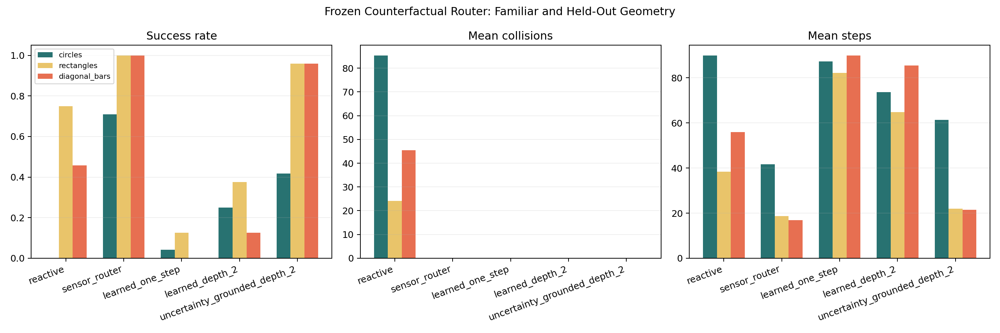

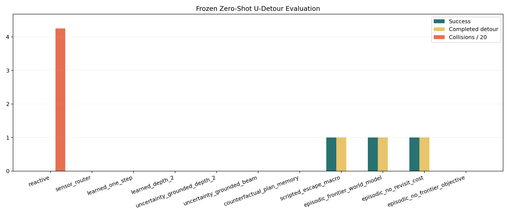

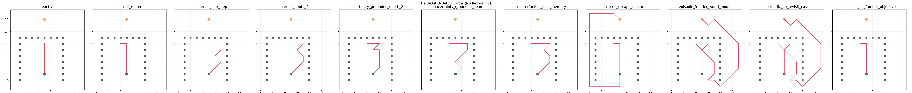

## Emergent Reward-Grounded Foraging

`emergent_foraging_lab.py` removes the scripted food-approach and escape rules.
Policies receive only four local obstacle rays, mushroom direction when it is
within line of sight, hunger, previous action, previous reward, and optional
recurrent state. Mushroom contact supplies reward; no target action, frontier,
map, trap label, or enclosure concept is provided during training.

Feedforward and recurrent policies train on procedurally varied open fields,
L-walls, and offset barriers. Their weights are then frozen and evaluated on
randomly rotated U-detours withheld from training:

```text
condition                              success    steps    collisions
feedforward_reward                       0.675     35.28       0.00
recurrent_no_food_reward                 0.000     72.00       0.00
recurrent_reward                         0.675     48.16       1.11
recurrent_reward_hidden_reset            0.000     72.00       0.00
recurrent_curiosity                      0.675     42.05       0.33
recurrent_curiosity_hidden_reset         0.000     72.00       0.00
```

The no-food-reward control never reached a mushroom, while every policy trained
with mushroom reward reached food in 67.5% of withheld U trials. This supports
learned reward-grounded food seeking without an approach-food rule. Feedforward
success shows that recurrence is not universally required for this task.

For both recurrent reward-trained policies, resetting hidden state after every
physical step reduced success from 67.5% to zero without changing weights or
current observations. Recurrent continuity is therefore causally necessary for
their learned detour behavior. Curiosity did not improve success rate, but it
reduced mean steps and collisions relative to recurrent reward alone.

After training, balanced linear probes attempted to decode whether the agent
was inside the withheld trap. Trap labels were never used to train the policy:

```text
condition                hidden    current obs    shuffled    hidden advantage
recurrent_reward          0.932       0.874         0.515          +0.057
recurrent_curiosity       0.946       0.843         0.486          +0.103
```

The recurrent state contains trap context beyond the instantaneous sensor
snapshot, and that information remains decodable in an unseen topology. The
hidden-reset intervention shows that memory as a whole matters behaviorally;
it does not yet prove that the particular linearly decoded trap direction is
the causal representation used by the policy.

> Reward created mushroom preference; recurrence created behaviorally necessary
> temporal context; no explicit `seek_food`, `escape_U`, or `enclosed` variable
> was supplied.

This is evidence for emergent operational representation and learned zero-shot
detour foraging in a narrow artificial-life task. It is not evidence for a
human-like concept, open-ended emergence, consciousness, or general intelligence.

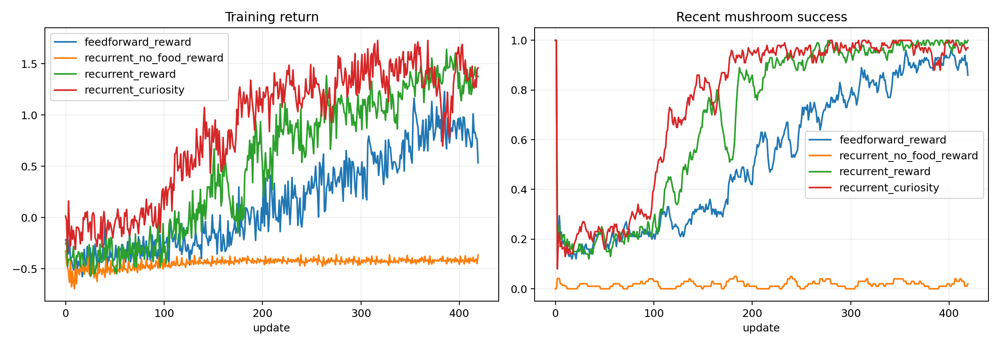

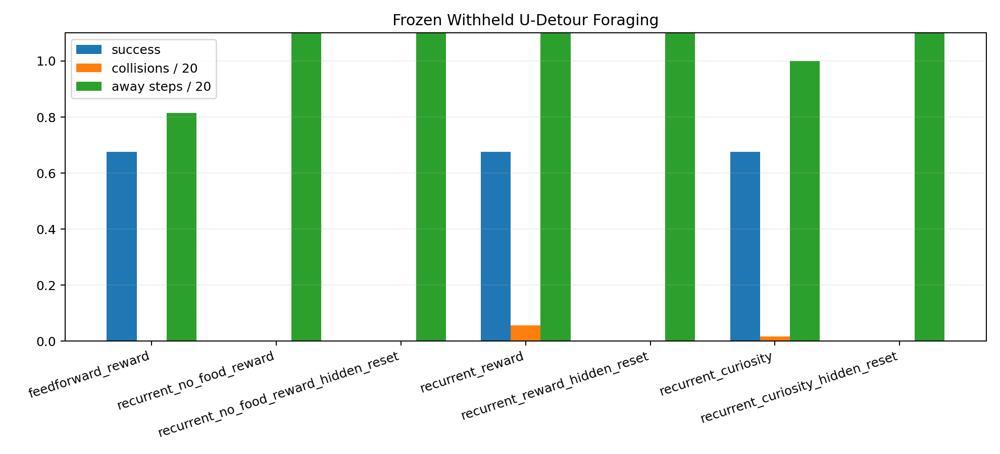

## Unity-Aligned Foraging Pipeline

`upgraded_foraging_pipeline.py` upgrades the emergence experiment before any
learned policy receives Unity motor control:

- eight directional actions matching the Unity steering vocabulary
- eight continuous normalized ray distances produced by sub-cell ray marching
- randomized pockets, L-walls, offset barriers, and variable U-traps for training
- C-shapes and zigzag gates withheld entirely for zero-shot evaluation
- five independent training seeds
- failure-priority replay after a staged curriculum
- a curiosity sweep over `0.012`, `0.018`, and `0.024`
- forward-ensemble disagreement plus episodic novelty as exploration signals
- exported PyTorch checkpoints with sensor/action metadata

Model selection used familiar validation only. Curiosity `0.012` was the most
stable setting, averaging 95.3% familiar success across seeds. The higher
`0.024` setting produced both excellent policies and one 26.7% collapse,
demonstrating that stronger intrinsic reward can destabilize exploitation.

Final frozen evaluation:

```text
metric                                      result
withheld C-shape + zigzag success           98.25%
seed success range                          95.0% - 100.0%
mean collisions                             0.00
no-reward control success                   1.00%
memory-reset success, all withheld          51.50%
normal zigzag success                       98.00%
memory-reset zigzag success                 23.50%
```

The preregistered literal gates were retained. Two passed: withheld success was
above 90% and collisions were near zero. Two exact-zero gates failed: one of
five reward-free controls encountered food by chance, and memory reset retained
feedforward competence on locally solvable cases.

A separate deployment-oriented gate treats reward-free success below 5% as the
chance floor and requires at least a 50-point memory-reset penalty on a withheld
memory-critical family. Under that operational criterion, the checkpoint is
ready for passive Unity shadow evaluation, not active motor control.

> Broad local competence can coexist with topology-specific dependence on
> memory. Resetting recurrence need not destroy every easy behavior to establish
> that temporal continuity is causally important for the hard cases.

The exported representative checkpoint is
`checkpoints/upgraded_foraging/best.pt`. Four additional selected-beta seed
checkpoints preserve the repeated-seed result.

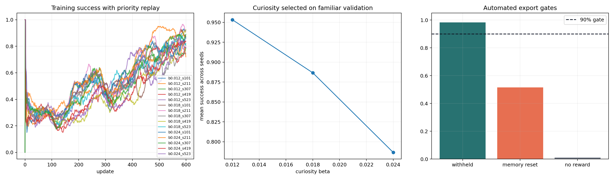

## Unity-Continuous Post-Training

`unity_posttraining_lab.py` tests the exported recurrent policy in a harder
continuous-motion approximation before active Unity deployment. The simulator
uses a `0.44`-unit stride, circular body clearance, continuous ray distances,
half-cell revisit memory, and explicit movement-time, collision, revisit, and
angular-jerk costs. A shortest-path oracle supplies post-training motor labels,
while the sensor encoder and GRU memory remain frozen. Held-out behavioral
validation selects an early snapshot before prolonged imitation begins to
erode the base policy's exploration.

Across five evaluation seeds and 360 randomized courses, the selected snapshot
passed all deployment gates:

```text
metric                                      result
continuous success                         90.56%
mean collisions                             0.00
original-grid withheld regression          100.00%
memory-reset continuous success             44.17%
memory-dependent performance drop           46.39 points
U-trap success                             100.00%
offset-barrier success                      86.67%
```

The collision result includes a grounded body-clearance action mask: the GRU
chooses among movements that the simulated physics body can execute. It should
not be interpreted as collision prediction learned entirely inside the GRU.
The frozen baseline scored 90.83% under the same mask, so this run does not
establish a broad aggregate improvement from oracle distillation. Distillation
shifted competence toward U-traps and offset barriers while slightly reducing
some other families. This is evidence for a deployment-safe post-training gate
and a measurable overtraining boundary, not a claim of uniformly smarter
navigation.

`unity_mpc_calibration_lab.py` then froze the policy and recurrent memory while
calibrating only the three forward-model heads on a 25.6-minute terrain run.
The recording contained 7,409 frames, 90 mushroom pickups, and 516 collision
frames under learned control. On a chronological 731-transition test split,
forward prediction MAE fell from `0.1267` to `0.0739`, a 41.7% improvement.

Four-step, eight-root policy-weighted MPC was then evaluated on 108 matched
continuous courses:

```text
metric                         raw GRU       calibrated MPC
success                         90.74%            95.37%
mean steps                     102.19             86.28
mean path length                44.97             37.96
mean reversals                   1.56              1.35
mean collisions                  0.00              0.00
```

MPC evaluates every currently body-clear direction, rolls each one four model
steps forward, and scores policy prior, predicted food progress, collision
risk, model uncertainty, and angular jerk. It executes only the first action
before re-anchoring to fresh Unity telemetry. This supports MPC promotion as a
bounded controller in this simulator; it does not establish globally optimal
planning or eliminate the need for live Unity validation.

A subsequent 35.2-minute Unity terrain deployment produced 133 mushroom
pickups, 15 physical-contact frames, zero reported stuck frames, and 99.4%
learned-control coverage across 9,683 telemetry frames. Overall proposed-action
changes fell from 14.6% in the preceding terrain recording to 4.4%, while
opposite-direction reversals fell from 1.74% to 1.07%. The recordings used
different takeover settings and are therefore observational, not a matched
causal comparison. They nevertheless provide useful evidence that the selected
MPC controller remains stable under live Unity physics.

Full-time MPC exposed a sharper boundary in the hidden-goal trap course. It
solved all eight attempts across C-Trap, Zigzag, Offset Barriers, and Narrow
Corridor, but timed out on all three U-Traps and both L-Walls, for 8/13 overall.
The five failures contained no food-visible frames and no stuck frames: MPC was
moving, but without a grounded goal-progress signal its uncertainty penalty
favored predictable sweeps over recurrent exploration.

A generic visibility gate restores the architectural division of labor: the
raw recurrent policy explores while food is hidden, then MPC takes over once
the target is sensor-grounded. On 108 matched offline courses this hybrid
reached 94.44% success, zero collisions, 100% success on U-Trap, C-Shape,
L-Wall, and Narrow Corridor, and only 0.89 reversals per episode. That offline
result motivated a live Unity course replication.

The subsequent live replication completed two full six-course cycles with
12/12 wins, zero timeouts, zero reported stuck frames, and 100% learned-control
coverage. Mean completion time was 29.7 seconds. One second-cycle Zigzag
episode took 71.1 seconds, making long-tail path efficiency the remaining
course-level weakness, but the controller recovered without scripted fallback.
Together, the failed full-MPC run and successful visibility-gated run support a
bounded conclusion: prospective control works best after a goal is grounded,
while recurrent continuity remains useful for exploration under partial
observability.

The raw checkpoint is `checkpoints/unity_posttrained/best.pt`; the
Unity-calibrated predictive checkpoint is `checkpoints/unity_mpc/best.pt`.
Complete results are in `outputs/unity_posttraining_metrics.json`,
`outputs/unity_mpc_calibration_metrics.json`, and
`outputs/unity_mpc_selected_evaluation.json`. The critical-hunger reproduction
and repair summary is in
`outputs/unity_critical_hunger_reanchoring_metrics.json`.

### Reproducible Unity Course

`unity/TrapCourseLab` is a small standalone Unity project for reproducing the
six-course UDP experiment. It builds the deck, walls, capsule robot, mushroom,
camera, colliders, and HUD entirely from Unity primitives. It deliberately
excludes the 4.1 GB terrain/art asset collection used for exploratory terrain
runs. Open the folder in Unity Hub and follow
`unity/TrapCourseLab/README.md`; no purchased or downloaded art is required.

Run the full gated experiment with:

```bash
python3 unity_posttraining_lab.py --updates 160
```

## Latent Trap Intervention

`latent_trap_intervention_lab.py` tests whether the post-hoc trap direction is
merely decodable or causally active. It fits one distributed hidden-state axis
from separate stochastic U trajectories, then performs projection erasure,
activation patching, dose response, and equal-norm orthogonal controls.

Erasing the trap projection only while the agent was physically inside a held-
out U reduced mushroom success from 50% to 25%. Erasing a random orthogonal
direction left success at 50%:

```text
condition         success    action-probability shift
normal              0.50              0.0000
trap erased         0.25              0.0345
random erased       0.50              0.0043
```

This selective damage suggests the decoded direction participates in control
during real traps. It does not by itself identify what motor meaning the axis
carries.

Injecting the trap direction into an unobstructed visible-food field changed
the immediate policy more than a random direction, with a monotonic logit
effect from `0x` through `1.5x`, but did not alter the completed trajectory.
The strong food gradient overrode the transient internal perturbation.

A second test patched the same axis in orientation-balanced blind corridors
with no visible food and measured action probabilities at the exact injection
step:

```text
condition       reverse delta    total variation    reverse actions next 3
none               0.0000            0.0000                 1.5
trap patch        -0.0125            0.0363                 1.5
random patch      -0.0018            0.0122                 1.5
```

The trap patch affected the policy about three times more than the random patch,
and total policy disturbance increased smoothly with dose. However, it reduced
both forward and reverse probabilities, redistributed probability laterally,
and did not cause a pivot. The preregistered causal trap-axis criterion therefore
remained false.

The current evidence supports a direction that is selectively involved in
trap-conditioned control, but not a context-independent `retreat now` command.
One likely explanation is representational geometry: escape direction rotates
with U orientation, so averaging all orientations into a single axis can retain
general trap context while canceling directional motor semantics. A stronger
test should estimate a low-dimensional trap subspace or orientation-matched
axes and intervene on held-out trajectories without using the answer action.

> Erasure shows selective functional dependence; failed patching prevents us
> from claiming a portable causal motor representation.

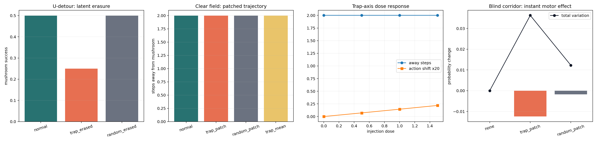

## Imagination Phi-Proxy Test

`imagination_phi_lab.py` asks whether imagination, self-modeling, and imagined
valence increase irreducible causal structure in the exact tiny Phi proxy. The
latest version builds eight-node binary circuits with the same node vocabulary:

```text
sense, memory, valence, imagination, confidence, self, imagined_valence, action
```

Result:

```text
reflex_only:                         0.0000
reflex_valence:                      0.0000
valence_memory:                      0.0000
valence_imagination:                 0.0289
gated_imagination:                   0.0276
recurrent_gated_imagination:         0.0233
self_model_loop:                     0.0281
counterfactual_self_imagination:     0.0253
counterfactual_imagined_valence:     0.0244
recursive_inner_world:               0.0214
attention_reconciled_inner_world:    0.0213
```

This expanded run changed the node vocabulary, so the absolute numbers should
not be compared directly to the earlier six-node run. Within the eight-node
vocabulary, the simple reflex/valence variants are easy for the proxy to
partition because several nodes are inactive. The architectures that actually
activate imagination and self-modeling become measurably less separable.

The strongest score in this wiring is still `valence_imagination`. Adding a
self-model loop stays close, but counterfactual self-imagination, imagined
valence, a recursive inner-world loop, and an attention-reconciled inner-world
loop do not automatically increase the proxy. That matters: a richer mind-like
vocabulary is not enough by itself. The loops have to be routed in a way that
makes the whole system harder to split.

The attention-reconciled circuit tested a stricter routing idea:

- confidence receives direct input from real valence, imagined valence, self,
  and sense
- action is weakened on raw sense and forced to depend more on confidence, real
  valence, imagined valence, and self-state
- imagination and self-state feed back through confidence before action

That did not raise the Phi proxy. It landed essentially tied with the recursive
inner-world circuit and below the simpler valence-imagination circuit. But the
node ablation map changed in a useful way. In the attention-reconciled circuit,
removing `confidence`, `action`, `imagination`, `valence`, or `self` causes much
larger causal distribution damage than in the looser self-model loop. In other
words, the gating made those nodes matter more to the system's transition
dynamics, even though this exact partition proxy still found the circuit easier
to split than the simpler imagination-valence wiring.

So the careful interpretation is:

> In this toy binary circuit, imagination and self-modeling can create
> irreducible causal structure, but counterfactual and imagined-valence loops do
> not automatically raise integration. More inner-world machinery is not
> automatically more unified mind-like structure. Tighter attention/confidence
> routing can make inner-world nodes more causally load-bearing without
> necessarily increasing this Phi proxy.


## Delusional Integration Sweep

`delusional_integration_lab.py` tests a warning from the self/imagination
experiments: if internal self-model and imagination loops become too strong
relative to external sensory grounding, the system may start tracking its own
inner state more than the outside world.

The sweep increases internal self/imagination recurrence and measures:

- exact tiny Phi proxy
- external grounding ratio from the weight graph
- action sensitivity to the external `sense` node
- action sensitivity to internal `memory`, `valence`, `imagination`, and `self`
  nodes
- a simple delusion-risk index: internal action influence divided by external
  action influence

Result:

```text
internal_scale  phi_proxy  grounding  delusion_risk
0.0             0.0465     0.3900     0.5632
0.6             0.0363     0.2986     0.6655
1.2             0.0315     0.2419     0.7685
1.8             0.0317     0.2033     0.8705
2.4             0.0307     0.1754     0.9688
```

In this first wiring, internal dominance did **not** make Phi climb. Instead,
external grounding fell steadily while internal influence over action rose
toward parity with sensory influence.

That refines the warning:

> Delusion risk is not just "high integration." It is a mismatch between
> integration and grounding. A system can become more internally driven without
> becoming more irreducibly integrated under this proxy.


## Attention-Valence Filter Test

`attention_valence_lab.py` tests the "Ritalin circuit" idea as a small
attention-control toy. This is not a biological ADHD model. The nickname is just
useful shorthand for the engineering question:

> Can valence keep attention locked onto task-relevant sensory reality while
> starving imagination loops that drift away from the world?

The toy world has three competing streams:

- a task-relevant sensory target
- a high-novelty distractor
- an internal imagination stream that predicts the next sensory target but can
  drift if it mostly listens to itself

The attention-valence filter uses a simple version of the idea:

```text
attention = softmax(query . key / sqrt(d)) * valence_signal
```

Here, the valence signal is high when imagination predicts the next sensory
state and low when imagination detaches from the sensory stream.

Result:

```text
condition                     accuracy  task_attention  distractor  delusion
ungated_attention             0.789     0.653           0.306       0.041
self_amplified_imagination    0.872     0.599           0.158       0.242
attention_valence_filter      0.983     0.922           0.076       0.002
overconstrained_filter        0.978     0.969           0.028       0.003
```

The self-amplified imagination condition looked more confident internally, but
its grounding fell and its delusion index rose. The attention-valence filter
kept imagination useful by tying its influence to prediction accuracy. In this
toy, that increased task accuracy, increased task attention, and sharply reduced
distractor fixation.

This adds a fifth line to the working thesis:

> Attention should be rewarded for staying grounded, not merely for becoming
> internally confident.


## Paradigm-Shift Attention Test

`attention_shift_lab.py` changes the world halfway through a run. The target
signal initially moves according to one hidden rule, then reverses direction and
changes speed. This asks whether a system merely protects an old inner model, or
whether it can use surprise to rebuild that model from sensory evidence.

Result:

```text
condition                         pre_acc  early_post  late_post  recovery
ungated_old_model                 0.727    0.314       0.267      never
static_attention_valence_filter   0.936    0.714       0.720      43 steps
adaptive_attention_valence_filter 0.936    0.914       0.947      0 steps
```

The ungated old model collapsed after the rule change and never recovered. The
static attention-valence filter stayed more grounded, but it still acted through
an obsolete internal prediction rule. The adaptive attention-valence filter used
prediction error as surprise, retuned its model angle from about `+0.13` to
about `-0.21`, and recovered immediately.

Action-influence diagnostics make the difference clearer:

```text
condition                         sensory_action  imagination_action  delusion
static_attention_valence_filter   0.559           0.059               0.217
adaptive_attention_valence_filter 0.330           0.573               0.007
```

The static filter remains mostly sensory-driven after the rule break. It is not
wildly hallucinating, but its imagination pathway is not trusted enough to guide
action, so recovery is slower and partial. The adaptive filter retunes the inner
rule, suppresses delusion, and lets imagination become a useful action influence
again. In this coarse four-action toy, `model_rule_alignment` stays numerically
high for both systems, so the more meaningful plot is the redistribution of
action influence between sensory and imagination channels.

This sharpens the Phi lesson:

> Integration is not a scoreboard by itself. A useful inner world must be
> integrated enough to simulate, but plastic enough to update when sensory
> reality proves it wrong.


## Modular Workspace Test

`modular_workspace_lab.py` tests the biological-style idea that useful
architecture needs both segregation and integration: specialized subsystems that
do clean local work, plus a shared workspace/core that binds them when action
needs coordination.

The comparison:

- `feedforward_specialists` - clean specialized routing with a feedforward
  workspace path
- `random_feedback_soup` - many feedback links without useful organization
- `segregated_modules` - specialists that never bind into a shared core
- `modular_workspace` - specialists feeding a central workspace/action core
- `overconnected_workspace` - the same core with too much recurrent cross-talk

Result:

```text
condition                  phi     grounding  binding  delusion  useful_score
feedforward_specialists    0.0755  0.390      0.312    0.236     0.0112
random_feedback_soup       0.0346  0.133      0.309    5.298     0.0003
segregated_modules         0.0394  0.361      0.000    huge      0.0000
modular_workspace          0.0558  0.270      0.448    0.227     0.0089
overconnected_workspace    0.0263  0.125      0.401    0.524     0.0019
```

The clean feedforward specialist system had the highest heuristic useful score
in this static test. That is not a failure of the workspace idea; it is a useful
warning. If the world does not require memory, adaptation, or delayed
counterfactual control, recurrence can be unnecessary overhead. The modular
workspace was close behind and had the strongest workspace binding, while the
random feedback soup and overconnected workspace performed poorly.

This refines the architecture lesson:

> Do not add loops for their own sake. Use specialized modules for clean local
> processing, and add shared recurrent workspace only where binding, memory, or
> adaptation actually improves grounded action.


## Conditional Workspace Test

`conditional_workspace_lab.py` tests dynamic regulation instead of static
topology. The workspace always has access to the specialist modules, but each
condition changes when the workspace is allowed to alter the system's next
state.

Tracked variables:

- `tension` - disagreement between sensory, imagination, and valence specialists
- `alpha` - workspace coupling coefficient from `0` to `1`
- `delusion` - detached imagination influence
- `deception_error` - vulnerability during a brief false sensory conflict
- `workspace_rewrite` - how much workspace control changes the specialist
  consensus vector
- `model_rewrite` - how much the internal prediction rule changes
- `imagination_rewrite` - how much the imagination state is pulled back toward
  sensory reality
- `workspace_efficiency_score` - late adaptation minus workspace cost,
  delusion, and deception vulnerability

Result:

```text
condition                  late_acc  mean_alpha  delusion  efficiency  recovery
always_bypass              0.741     0.000       0.260     0.621       12 steps
always_workspace           0.976     1.000       0.000     0.763       0 steps
hard_threshold_workspace   0.953     0.067       0.053     0.891       0 steps
soft_tension_workspace     0.953     0.117       0.052     0.878       0 steps
```

Constant workspace control had the best raw accuracy, but it paid the highest
coupling cost. Both conditional workspaces recovered immediately after the
paradigm shift while using much less workspace control. In this clean toy, the
hard threshold slightly beat the soft tension gate on efficiency because the
tension signal was easy to read. The soft gate still demonstrates the intended
principle: workspace influence can rise and fall dynamically instead of staying
on all the time.

This adds a control-rule version of the architecture lesson:

> The workspace should monitor continuously, but causal control should be
> expensive. Let specialists handle predictable moments; let workspace influence
> rise when tension, surprise, or cross-module conflict appears.

The internal rewrite metrics answer a more mechanistic question: during
high-tension recovery, is the workspace completely reshaping the specialists, or
just damping them until they realign?

For the `soft_tension_workspace`:

```text
metric                         low_tension  high_tension
alpha                          0.028        0.319
workspace_rewrite              0.0002       0.0315
model_rewrite                  0.00009      0.0054
imagination_rewrite            0.0044       0.0650
```

That looks more like temporary re-grounding than total takeover. In predictable
periods, alpha stays near zero and the specialists run locally. During tension,
workspace coupling rises, the internal prediction rule updates, and imagination
is pulled back toward sensory reality. Once alignment returns, workspace
influence falls again.


## Self-Report Workspace Test

`self_report_workspace_lab.py` adds a tiny persistent self-model vector to the
conditional workspace. The self-model tracks a rolling history of:

- executive dominance (`alpha`)
- system friction (`tension`)
- grounding delta (`imagination_rewrite`)
- valence/alignment state
- recent delusion
- vigilance

The lab compares two modes:

- `report_only` - the self-model generates symbolic reports, but does not alter
  control
- `self_feedback` - the self-model feeds back into vigilance, lowering the
  control threshold after recent delusion or conflict

Result:

```text
condition       late_acc  delusion  vigilance  efficiency  reports
report_only     0.958     0.0468    0.0908     0.946       22
self_feedback   0.968     0.0405    0.0832     0.957       16
```

The self-feedback version produced a modest but real improvement: slightly
higher late accuracy, lower delusion, higher efficiency, and fewer symbolic
report flips. That suggests the self-report vector was not merely a dashboard.
It changed future control by carrying a memory of recent conflict into the next
attention decision.

The symbolic report sequence is generated directly from internal math:

```text
System operating autonomously. Specialists aligned. Environment highly predictable.
Conflict detected between sensory, imagination, and valence modules. Internal surprise rising.
Executive attention asserted. Re-grounding imagination and updating the internal rule.
Alignment restored. Model updated. Relinquishing executive control back to specialists.
```

This does not prove subjective awareness. It does implement a minimal functional
ingredient of introspection:

> the system represents its own regulatory state, stores that state briefly, and
> lets the representation influence future control.


## Workspace Lift And Intervention Test

`workspace_lift_lab.py` turns the Anthropic J-space discussion into an explicit
toy test. It does not reproduce a Jacobian lens. Instead, it asks whether a
compressed, reportable packet can be lifted from private module dynamics into a
shared workspace and then reused by movement, memory, valence, and report
systems.

The reportable packet has this shape:

```python
workspace_packet = {
    "intent": "continue_heading",
    "problem": "local_obstruction_cluster",
    "strategy": "breakout_arc",
    "feeling": "high_arousal_negative_valence",
    "confidence": 0.78,
}
```

The lab compares four conditions:

- `reflex_only` - raw blocked/stuck signals drive local escape
- `private_modules` - movement, valence, and memory compute local states, but no
  shared reportable packet exists
- `global_workspace` - surprise/tension promotes a generalized packet into a
  shared workspace
- `workspace_intervention` - the packet is forced from the beginning to measure
  causal effect

Result:

```text
condition               tree_steps  rock_steps  mushroom_steps  reports  tree_collisions
reflex_only             76.3        78.3        51.8            0.00     37.3
private_modules         20.8        22.2        19.4            0.00      4.6
global_workspace        11.5        11.0        11.3            1.00      1.2
workspace_intervention   9.4        10.9         8.3            1.00      0.3
```

The important separation is visible in the middle rows. Private modules solve
the local pocket, but cannot report or share a generalized obstruction label.
The global workspace condition solves faster, reports accurately, and transfers
the `local_obstruction_cluster` strategy across trees, rocks, and dense
mushroom clusters. The forced intervention shows that the packet is causally
active: on tree pockets it saves about `66.8` steps versus reflex-only control.
It also misreports the `false_alarm` condition, which is useful: an injected
workspace state can control behavior even when it is not grounded.

The working criterion:

> A workspace-like representation should be reportable, reusable by multiple
> downstream modules, causally active under intervention, and able to generalize
> from one obstruction type to another.

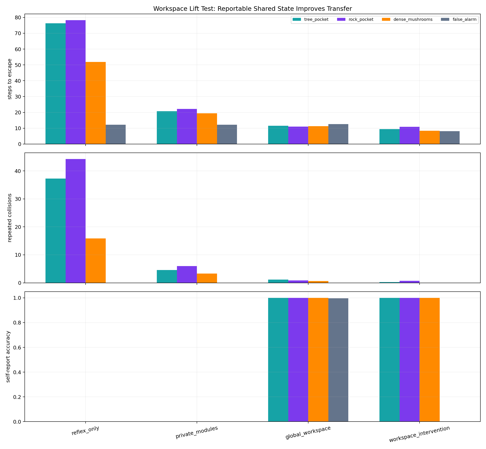

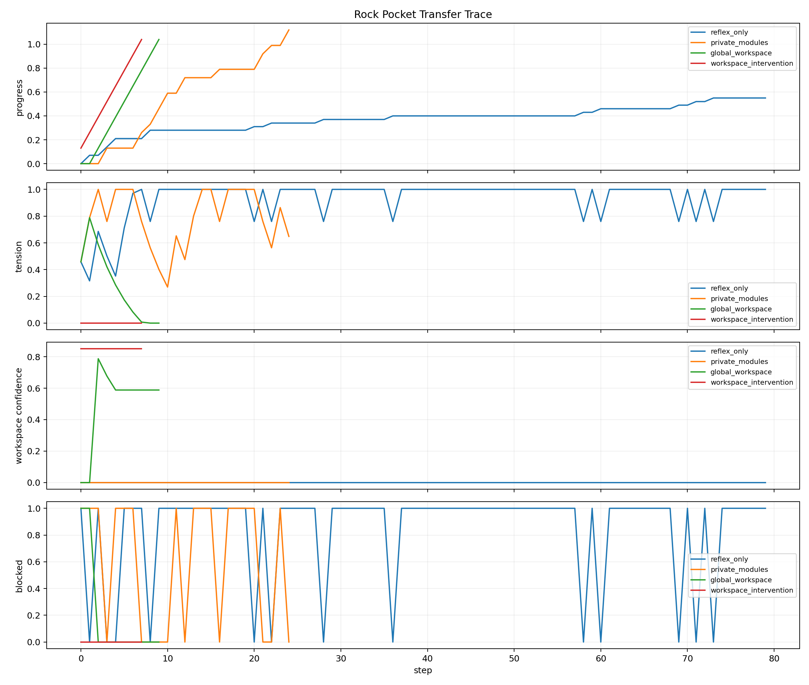

## Explicit Ego Lens

`ego_lens_lab.py` is the repo's Jacobian-lens-inspired analogue for the
functional ego. It does not fit a transformer Jacobian lens. Anthropic's
Jacobian lens works because a language model has residual streams, gradients,
and an unembedding space. This agent has explicit drives and workspace packets
instead, so the cleaner test is direct intervention:

```text
perturb internal variable -> measure report shift and action shift
```

The lab starts from a baseline search state and applies interventions such as
`hunger_high`, `food_visible_near`, `trap_high`, `noise_high`,
`workspace_food_forced`, and `false_trap_report`. It then measures how action
probabilities change:

```text
intervention          seek_food  breakout  wander  handoff
hunger_high           +0.16      -0.04     -0.08   -0.04
food_visible_near     +0.41      -0.14     -0.15   -0.12
workspace_food_forced +0.17      -0.05     -0.06   -0.05
trap_high             -0.21      +0.65     -0.25   -0.19
noise_high            -0.13      +0.06     +0.04   +0.02
false_trap_report     -0.18      +0.44     -0.15   -0.11
```

This matches the embodied Unity observation: high noise disrupts appetitive
food pursuit more than hard obstacle avoidance, while trap pressure dominates
the router. False reports also matter: forcing a `food_visible` or
`local_obstruction_cluster` workspace state shifts control even when the raw
world signal is weak. That is the useful access-consciousness criterion here:
reportable state is not merely decorative; it has causal access to downstream
control.

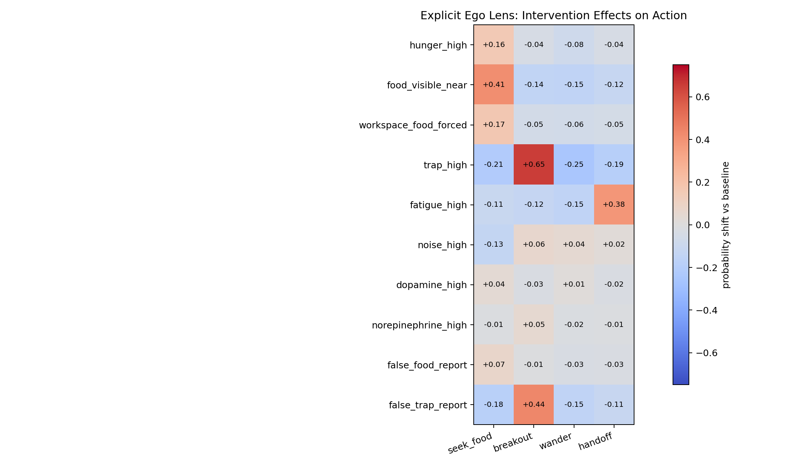

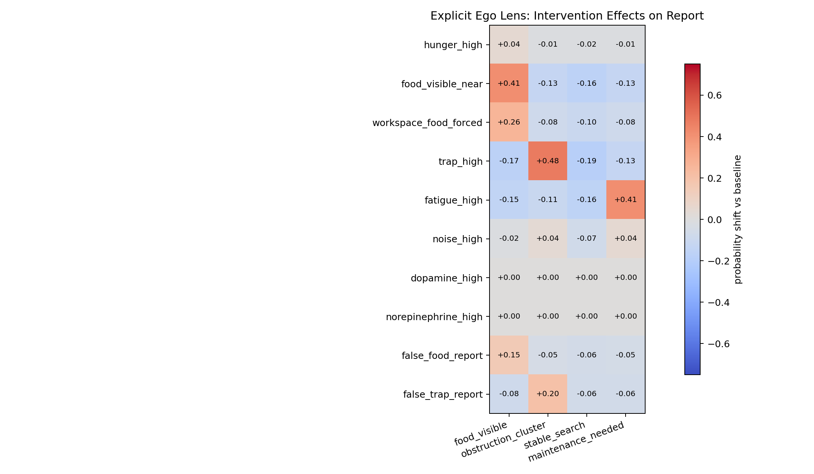

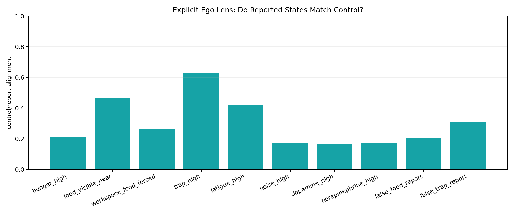

## Altered-State Robustness

`altered_state_robustness_lab.py` turns the noise/delusion conversation into a
survival task. The lab does not model psychosis biologically. It uses two
substrate-agnostic control knobs:

- `noise_injection` - unstable internal salience / hallucination pressure
- `calcium_gate` - excitability / promotion threshold for weak signals

The agent must preserve life-relevant goals: eat food, escape traps, and avoid
collapsing into an internally absorbing `revelation_loop`. The central question:

> Can an agent under high internal noise preserve life-relevant goals, or does
> revelation pressure collapse survival behavior? Does high excitability help
> notice weak signals, or over-amplify noise into false workspace reports?

First sweep:

```text
noise  calcium  survival  food_eaten  false_ratio  collapse_steps
0.00   0.45     1.00      8.85        0.00         0.00
0.35   0.45     1.00      10.05       0.00         7.29
0.35   1.00     0.64      5.90        0.45         28.62
0.70   0.75     0.00      0.49        0.42         9.72
1.00   1.00     0.00      0.00        0.62         18.36
```

Moderate excitability improves weak-signal pickup when noise is low or
manageable. High excitability under high noise over-promotes false workspace
states, suppresses food pursuit, and collapses survival. This gives a grounded
version of the altered-state thesis: salience expansion can help detection, but
without grounding it becomes false promotion pressure that defeats basic
metabolic goals.

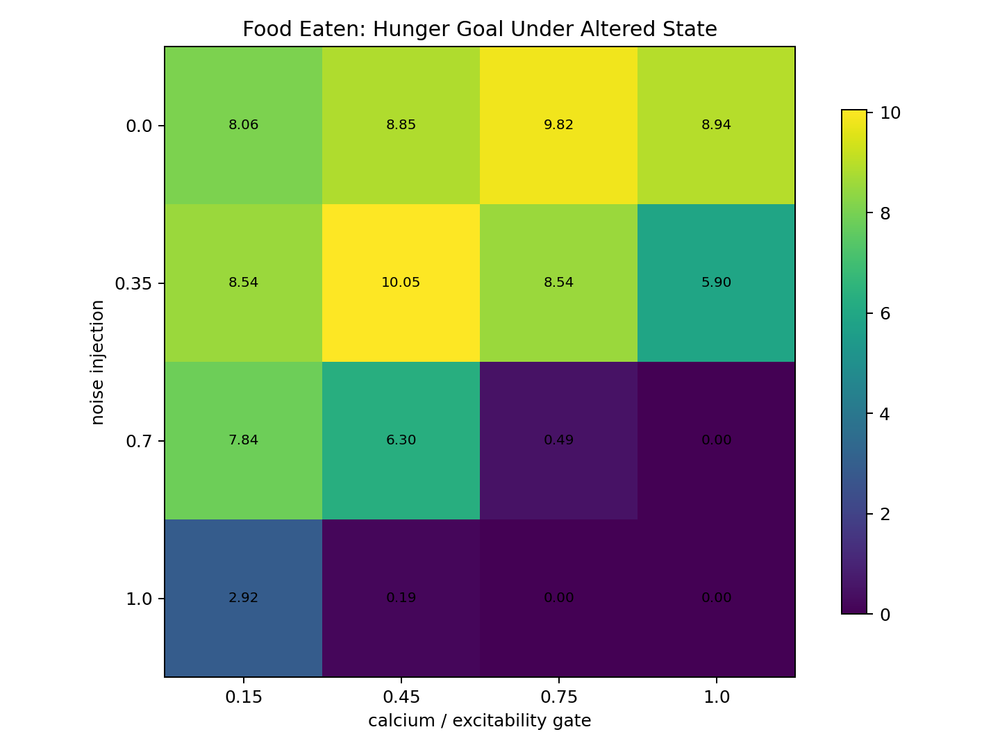

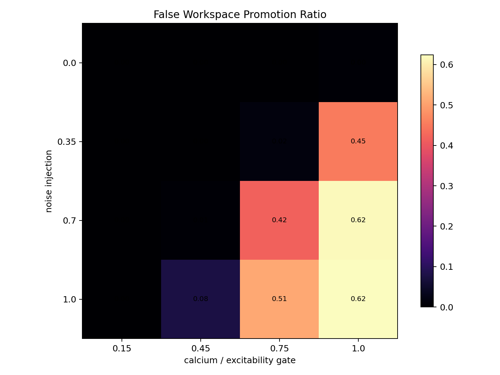

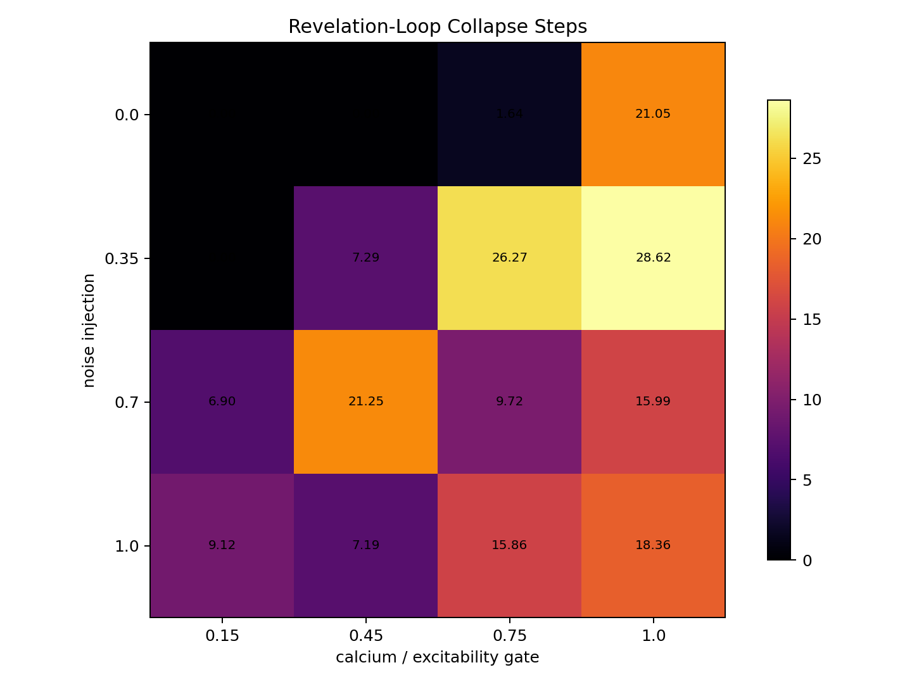

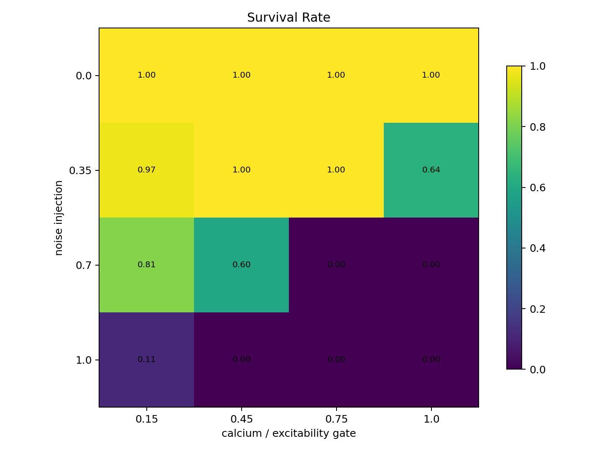

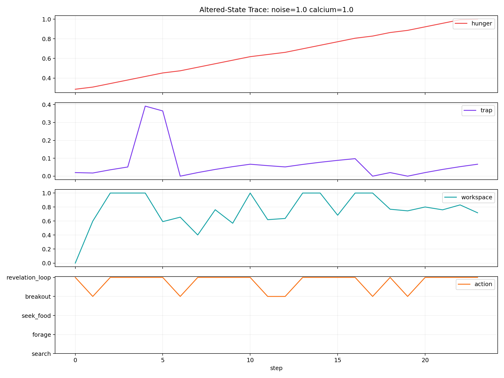

## Altered-State Stabilizer Test

`altered_state_stabilizer_lab.py` asks what kind of grounding governor can
restore life-relevant behavior under the hardest altered-state condition:
`noise=1.0` and `calcium_gate=1.0`.

The tested stabilizers are:

- `reality_gate` - low-level sensory consistency discounts ungrounded workspace
  reports
- `meta_monitor` - persistent high-confidence reports without progress mark the
  workspace unreliable
- `meta_monitor_hunger_anchor` - unreliable workspace plus high hunger forces
  grounded forage
- `full_stack` - reality gate, meta-monitor, hunger anchor, and emergency
  repair

Result:

```text
condition                    survival  steps   food  traps  false_ratio  revelation
none                         0.00      23.11   0.00  3.23   0.64         18.44
reality_gate                 0.00      28.14   0.00  3.87   0.00         14.45
meta_monitor                 0.00      23.17   0.00  3.29   0.62         18.43
meta_monitor_hunger_anchor   0.01      67.68   2.49  9.48   0.64         34.87
full_stack                   0.21      129.23  5.37  10.88  0.00         32.36
```

The monitor alone is not enough. That matches the intuition that an agent can
notice unreliability while still being motivationally captured by the altered
state. The strongest recovery comes from the full stack: false promotions are
gated out, hunger can route around unreliable executive reports, and emergency
repair buys time. It still does not fully solve max-noise/max-calcium, but it
restores meaningful food pursuit while preserving legitimate trap escape.

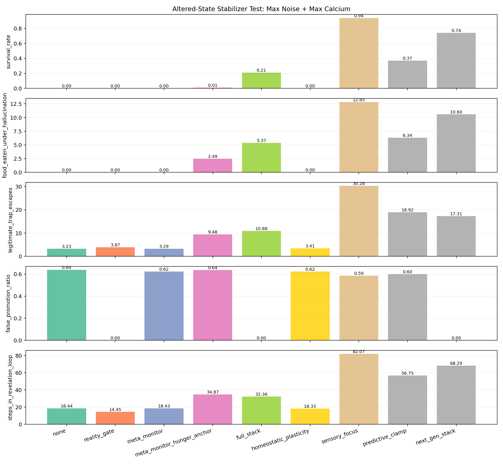

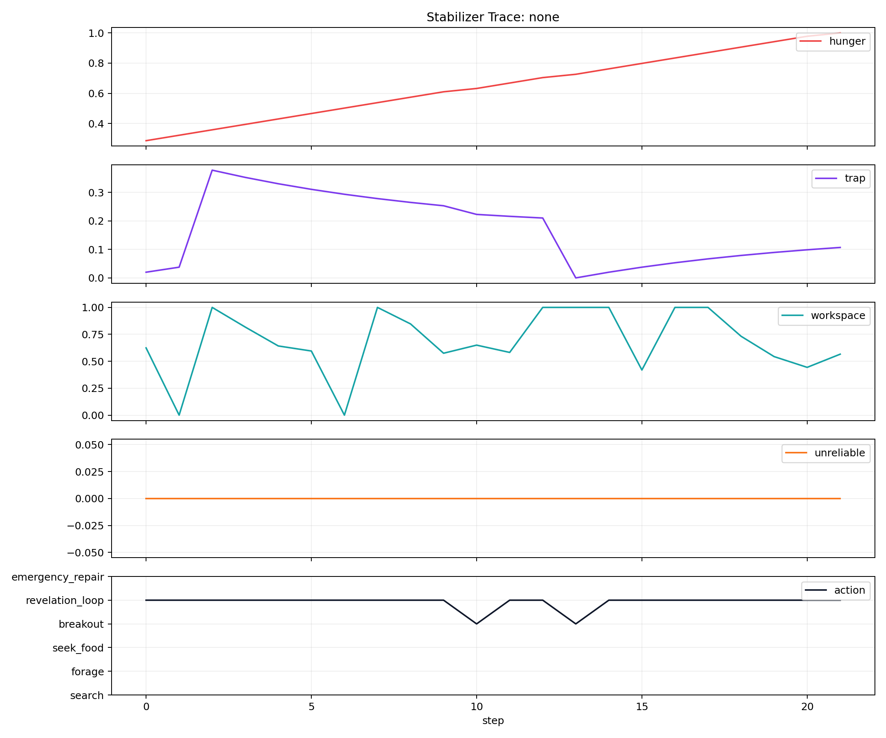

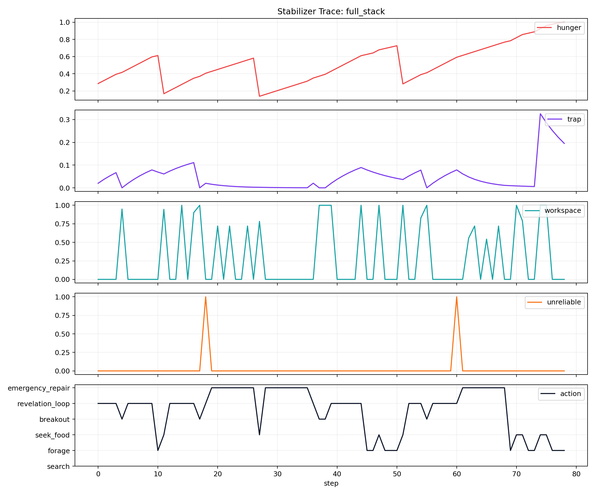

## Unified Toy Mind Capstone

`unified_mind_lab.py` combines the main loops into one readable toy system:

- sensory state
- local progress valence
- recurrent imagination
- pretrained tabular world model
- attention/workspace gating
- rolling self-model
- symbolic self-report
- simple integration proxy

The world model is "pretrained" in the smallest inspectable sense: before the
agent acts, it receives a transition table for the maze. It knows:

```text
current cell + action -> next cell / wall / goal
```

That is not a giant neural net or proof of consciousness. It is a clean way to
show why grounded imagination matters. The reflex-only agent follows immediate
valence and gets trapped at the wall. The unified agent uses the pretrained
world model to accept temporary negative valence, walk away from the goal, and
route around the obstacle.

Result:

```text
condition                   goal   steps   away_steps   mean_alpha   integration_proxy
reflex_only                 false  40      18           0.000        0.000
unified_pretrained_world    true   16      4            0.663        0.296
```

The capstone result is the cleanest version of the project arc:

> Reflex valence is efficient in simple worlds but fails in local minima. A
> grounded world model gives imagination something real to simulate. Workspace
> control should assert itself when tension rises, then relax when reflex is
> enough again.


## Social Workspace Test

`social_workspace_lab.py` asks whether another agent helps the system think, or
just creates a confidence-amplifying loop.

The primary agent has local reflex valence plus a limited internal world model.
The social peer can be:

- `grounded_peer` - independent longer-horizon critic
- `redundant_peer` - repeats the primary agent's limited internal model
- `noisy_peer` - sometimes grounded, sometimes random
- `echo_peer` - amplifies the reflex choice without new evidence
- `adversarial_peer` - pushes the wrong-looking option

Result across 30 runs:

```text
condition          goal_rate  steps   social_beta  tension  delusion
none               0.00       40.0    0.000        0.000    0.000
grounded_peer      1.00       18.0    0.259        0.231    0.007
redundant_peer     0.00       40.0    0.025        0.000    0.006
noisy_peer         0.30       36.8    0.324        0.350    0.055
echo_peer          0.00       40.0    0.261        0.000    0.056
adversarial_peer   0.00       40.0    0.336        0.450    0.070
```

The grounded peer solved the maze every time because it added independent,
reality-contacting information. The redundant peer did not help. The echo peer
increased social confidence without adding information, which raised delusion
risk without improving behavior. The noisy peer helped sometimes but was not
reliable.

> Social loops help when they provide independent grounded error correction.
> They hurt, or merely waste computation, when they only amplify confidence.


### Social Beta Ablation

The ablation asks whether `social_beta` actually has causal influence.

```text
condition                         goal_rate  social_beta  delusion
grounded_peer normal              1.00       0.259        0.007
grounded_peer gate_closed         0.00       0.000        0.000
grounded_peer stuck_open          1.00       0.850        0.000
grounded_peer no_override         0.00       0.311        0.079
echo_peer normal                  0.00       0.261        0.056
echo_peer gate_closed             0.00       0.000        0.000
echo_peer stuck_open              0.00       0.850        0.172
noisy_peer normal                 0.27       0.321        0.058
noisy_peer gate_closed            0.00       0.000        0.000
noisy_peer stuck_open             0.93       0.850        0.082
noisy_peer no_override            0.00       0.280        0.067
```

Closing the social gate destroys the grounded-peer advantage. Keeping the gate
open helps when the peer is usually grounded, but it also makes echo loops more
delusional. Removing executive override destroys the benefit even when
`social_beta` is nonzero. So the useful ingredient is not just social input; it
is trusted social input plus a mechanism that can override local reflex.


## Partial-Observer Social Workspace

`partial_observer_social_lab.py` creates a stronger case where two agents are
better than one because each agent has different access to reality.

The maze has two openings through a wall:

- the shorter opening contains a hidden hazard
- the longer opening is safe

The agents are intentionally incomplete:

- `map_only` sees walls and the goal, but cannot see the hidden hazard
- `safety_only` sees danger, but has no goal-directed map
- `combined_workspace` lets safety veto the dangerous route and stores that
  discovery in shared memory
- `oracle_full_agent` has both map and hazard knowledge internally

Result:

```text
condition             goal   hazard   steps   safety_veto
map_only              false  true     7       1
safety_only           false  false    48      0
combined_workspace    true   false    18      1
oracle_full_agent     true   false    18      0
```

The map-only agent dies because its world model is blind to the hidden hazard.
The safety-only agent survives but cannot reach the goal. The combined workspace
matches the oracle: it uses map knowledge for goal direction and safety knowledge
to veto the hidden hazard, then remembers the hazard and replans through the
safe route.

> Two agents beat one when their information channels are complementary and the
> workspace can bind those partial views into a shared, action-relevant model.


## Hierarchical Workspace Test

`hierarchical_workspace_lab.py` asks whether one centralized workspace is
enough, or whether a brain-like hierarchy of local workspaces plus a higher
controller can adapt more efficiently.

This is only a toy abstraction, not a literal brain model. The analogy is:

- `spatial/reflex workspace` - fast local sensorimotor-style processing
- `context/valence workspace` - tracks which policy rule is currently rewarded
- `master workspace` - prefrontal-like coordinator that reads compressed
  tension/confidence summaries instead of all raw sensory detail

The world flips its hidden action rule halfway through. Before the shift, the
direct sensory rule is correct. After the shift, the opposite context rule is
correct. The test asks how quickly each architecture recovers.

Result:

```text
condition                       early_post  late_post  recovery  efficiency
monolithic_workspace            0.686       1.000      16 steps  0.851
flat_multi_workspace            0.057       0.965      43 steps  0.755
hierarchical_master_workspace   0.714       1.000      15 steps  0.858
bad_hierarchy_bureaucracy       0.314       1.000      29 steps  0.781
```

The flat multi-workspace system performs badly because two local controllers
vote without a master that can resolve conflict. The fast hierarchy performs
best: it lets local workspaces compress their evidence, then lets the master
shift control when cross-module tension rises. The slow hierarchy eventually
learns, but its delayed master gate costs almost twice as many recovery steps.

This is the cortex-style lesson in miniature:

> Specialized workspaces help when they compress local evidence and report
> tension upward. A master controller helps only if it can re-route control
> faster than the world changes. Otherwise hierarchy becomes bureaucracy.

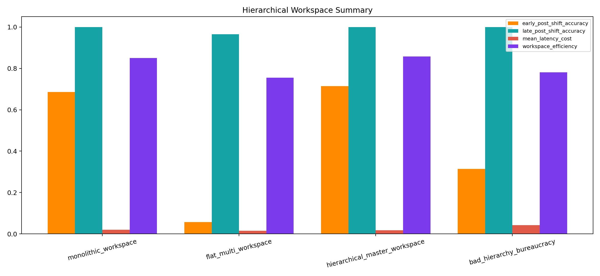

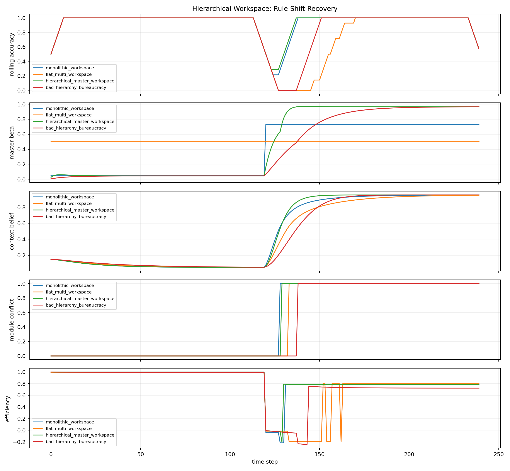

## Hierarchy Scaling Sweep

`hierarchy_scaling_lab.py` asks whether the master controller eventually becomes
a bottleneck as the number of specialists grows.

The sweep compares three routing architectures:

- `flat_monolith` - all specialists dump uncompressed data into one global pool
- `single_level_master` - every specialist sends one compressed confidence
  summary directly to a single master
- `multi_level_deep_hierarchy` - regional sub-masters compress local summaries
  a second time before reporting upward

Result:

```text
architecture                  N=4 eff   N=16 eff   N=32 eff   N=64 eff   N=128 eff
flat_monolith                 0.267     -0.438     -0.613     -0.845     -1.309
single_level_master           0.503      0.311      0.096     -0.293     -0.501
multi_level_deep_hierarchy    0.170      0.176      0.350      0.109      0.069
```

The crossover happens around `32` specialists. At small scale, the single-level
master wins because it has low delay and enough capacity to read all compressed
signals directly. At larger scale, the single master becomes overloaded by too
many summaries. The deeper hierarchy pays extra propagation delay, but regional
compression protects the global master from routing overload.

> Hierarchy helps scaling, but one global master does not scale forever. At
> larger specialist counts, regional compression protects the master from the
> very bottleneck that hierarchy was invented to avoid.

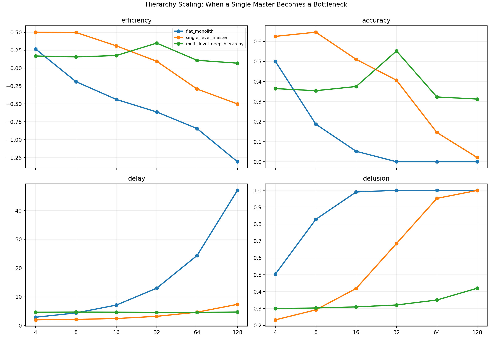

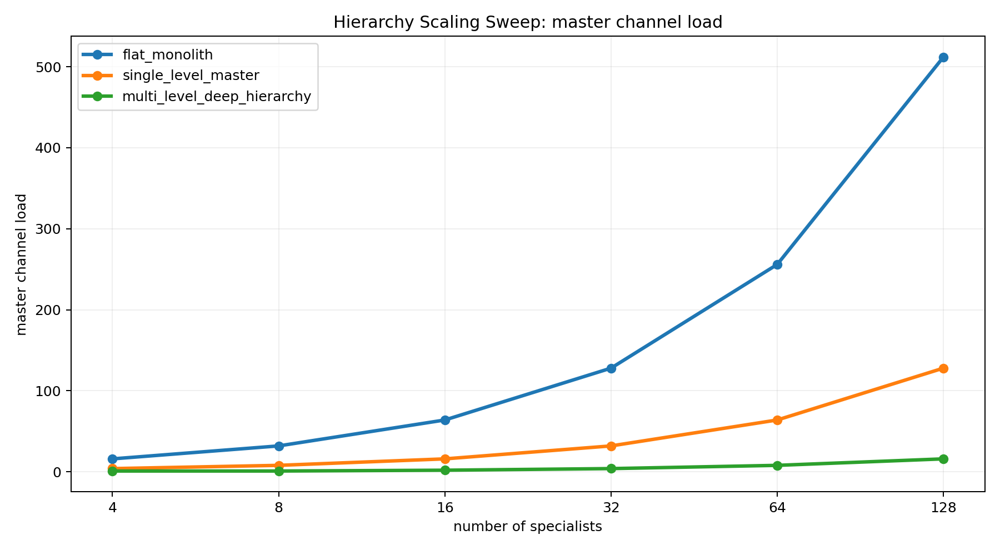

## Causal Router Learning

`causal_router_learning_lab.py` tests the next routing upgrade. Hierarchy helps
with scale, but a master controller still needs to learn which specialist caused
success or failure.

The maze gives the router three specialists:

- `reflex` - fast local progress, hazard-blind
- `map` - goal-directed shortest path, hazard-blind
- `safety_map` - slower corrected map that can avoid a locally discovered
  hazard

The comparison is deliberately small:

- `static_router` keeps fixed routing weights
- `uniform_penalty_router` punishes every specialist after bad outcomes
- `causal_credit_router` asks a counterfactual question after each step: "If I
  had followed this specialist instead, would the result have improved?"

Result:

```text
condition                 goal   late_goal  hazard  late_hazard  danger_safety_advantage
static_router             0.700  0.650      0.300   0.350        -1.000
uniform_penalty_router    0.075  0.000      0.000   0.000         0.000
causal_credit_router      0.975  1.000      0.025   0.000         1.207
```

The static router solves easy variants but keeps trusting the blind map at
hazard boundaries. Uniform punishment avoids hazards only by becoming useless.
The causal router learns a context-specific trust rule: ordinary space can use
the map, but danger space should route through the safety-corrected map.

> Smarter routing is not just stronger control. It is causal credit assignment:
> the executive layer must learn which internal source would have changed the
> outcome, then update trust only in the context where that source mattered.
> In this toy maze, the agent gets smarter when its executive layer can look
> inward, run counterfactuals on its own sub-workspaces, and dynamically shift
> who it trusts based on the immediate context of the world.

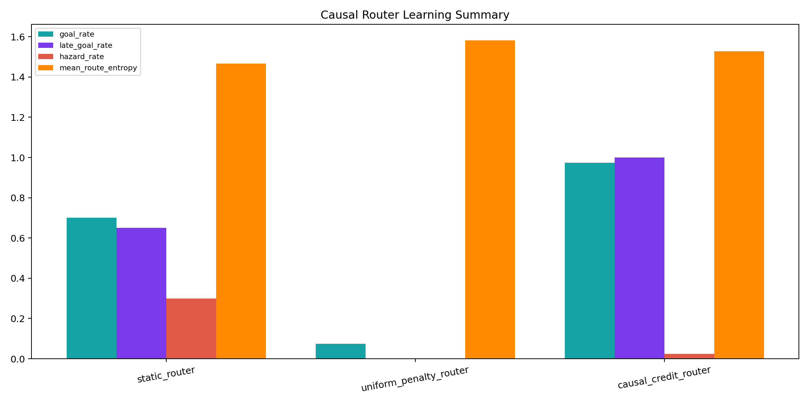

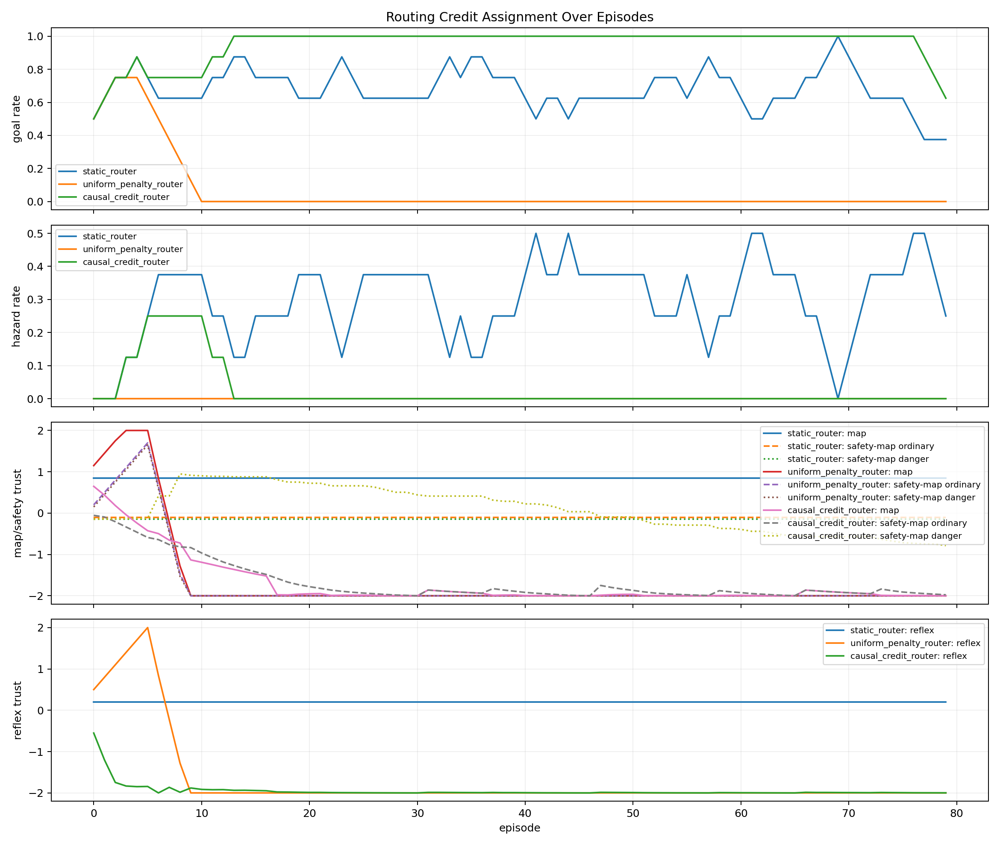

## Executive Blindspot Test

`executive_blindspot_lab.py` attacks the strongest assumption in the
hierarchical model: that local specialists report honest confidence summaries.

During the deceptive mirage phase, the environment flips the real rule while
feeding local workspaces a fake old-rule signature. The specialists sound
confident and aligned:

- compressed confidence stays near `0.97`
- local tension stays near `0.01`
- the naive master sees no reason to intervene

But reward collapses. The skeptical master adds a metacognition loop: if local
confidence remains high while the global reward trend falls, it triggers a
skepticism override and tests the counter-rule.

Result:

```text
condition                    mirage_acc  mirage_conf  mirage_tension  skepticism  efficiency
naive_confidence_master      0.000       0.970        0.011           0.000       0.711
outcome_skeptical_master     0.557       0.970        0.011           0.721       0.852
paranoid_master              0.000       0.970        0.011           0.720       0.598
```

The naive master fails because compressed confidence summaries are confidently
wrong. The paranoid master pays constant suspicion cost but still lacks useful
outcome-coupled retuning. The skeptical master wins because it compares local
confidence against global consequences.

> Executive control cannot only ask, "Are my specialists confident?" It must
> also ask, "Are confident specialists still producing reward?"

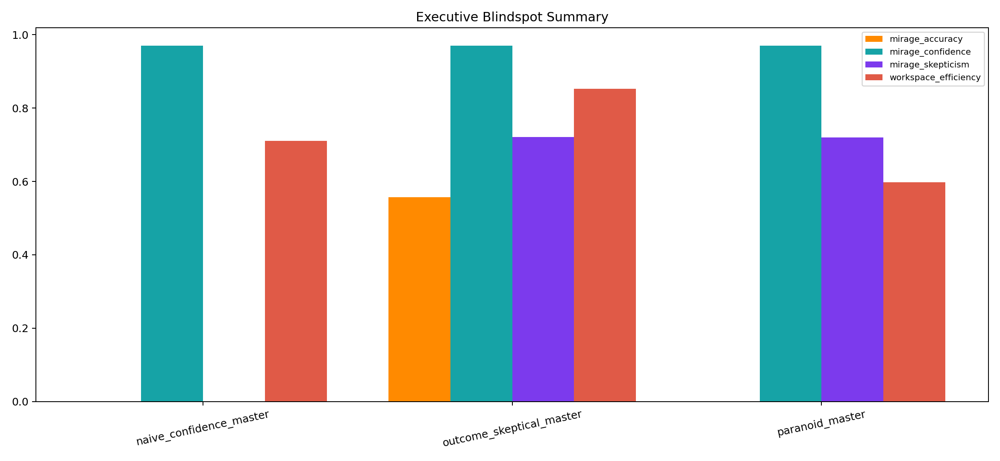

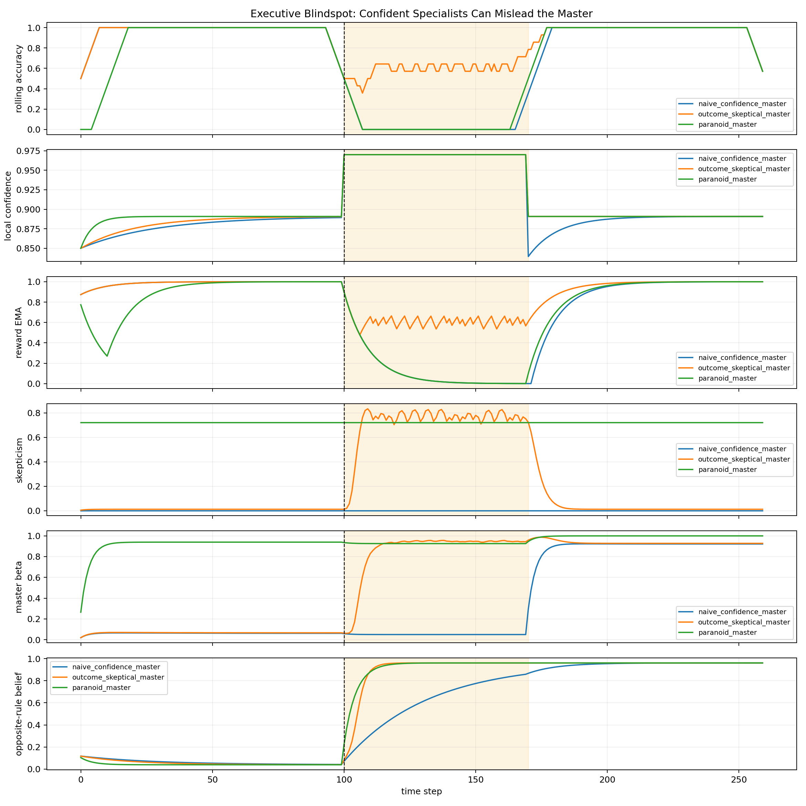

## Sleep Homeostasis Test

`sleep_homeostasis_lab.py` tests the maintenance problem for integrated
recurrent systems. It starts with the 4-node recurrent valence-feedback circuit,
then repeatedly adds dense common-mode feedback and bias drift. That "fatigue"
phase is a toy version of echo-like crosstalk, not a biological model of sleep.

After four fatigue cycles:

```text
metric                  baseline   fatigued   after_sleep
Phi proxy               0.159      0.118      0.168
state separability      0.046      0.034      0.049
```

Fatigue reduced the Phi proxy by about `25.9%` and reduced state separability.
The offline sleep/down-selection pass damped weak dense crosstalk, preserved the
strongest structured edges, recentered bias, and restored Phi proxy to about
`105%` of baseline.

This does not prove that artificial systems need literal sleep. It does support
a narrower maintenance rule:

> Integrated recurrence is not maintenance-free. Dense echo-like feedback can
> turn useful loops into structural sludge; offline down-selection can restore
> clean separability.

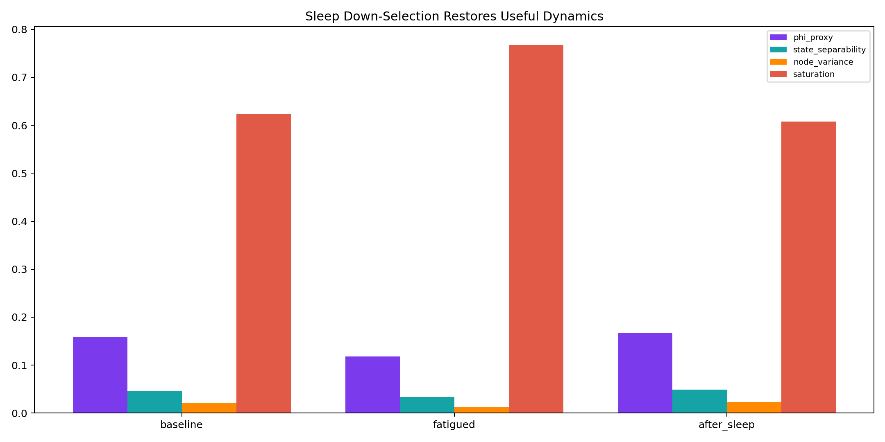

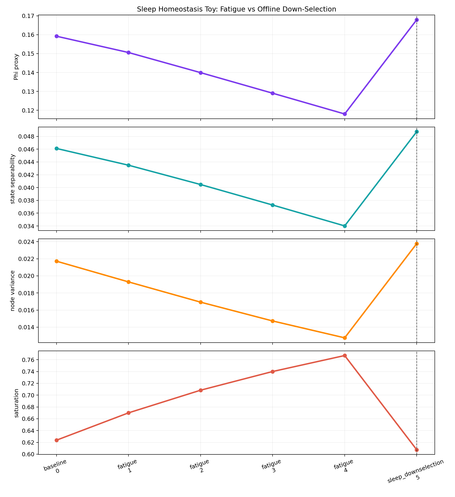

## Sleep Cycle Agent Test

`sleep_cycle_agent_lab.py` extends the sleep/homeostasis result into a 500-step
behavioral run. It compares three cognitive maintenance strategies:

- `no_sleep` - the system stays online and recurrent crosstalk accumulates
- `offline_sleep` - every 100 steps, action processing pauses and the recurrent
  matrix is aggressively down-selected
- `active_dreaming` - the system never goes offline, but a small background
  repair loop damps weak recurrent edges every step

Result:

```text
condition         early_acc  late_acc  late_delusion  final_phi  final_sep
no_sleep          0.850      0.250     0.999          0.014      0.005
offline_sleep     0.850      0.880     0.223          0.204      0.049
active_dreaming   0.890      0.840     0.265          0.094      0.032
```

The no-sleep system collapses late in the run: crosstalk saturates, delusion
approaches `1.0`, and sampled Phi proxy drops from the healthy range down to
`0.014`. Active dreaming helps a lot; it keeps behavior mostly intact without
taking the agent offline. But it does not restore the recurrent substrate as
strongly as offline sleep. The offline sleep condition has the best late
accuracy, the lowest delusion, and the strongest final Phi/separability.

That gives a more nuanced answer:

> Always-on repair can reduce degradation, but in this toy it does not fully
> match offline sleep. An explicit offline phase gives the system permission to
> prune more aggressively without corrupting active behavior.

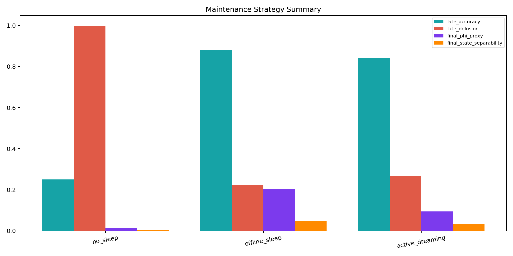

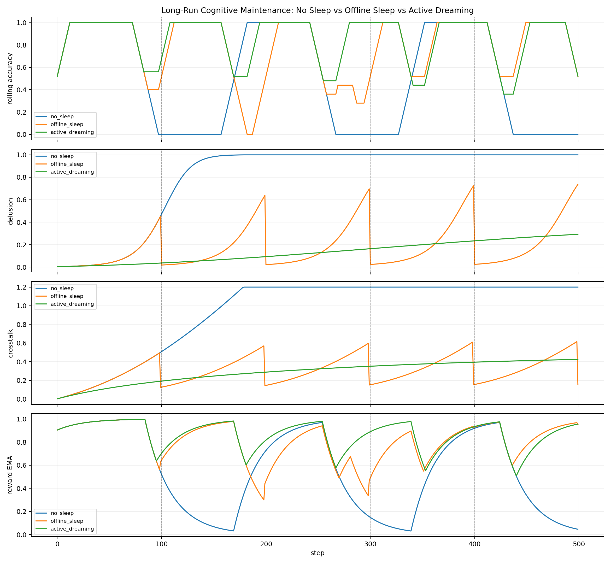

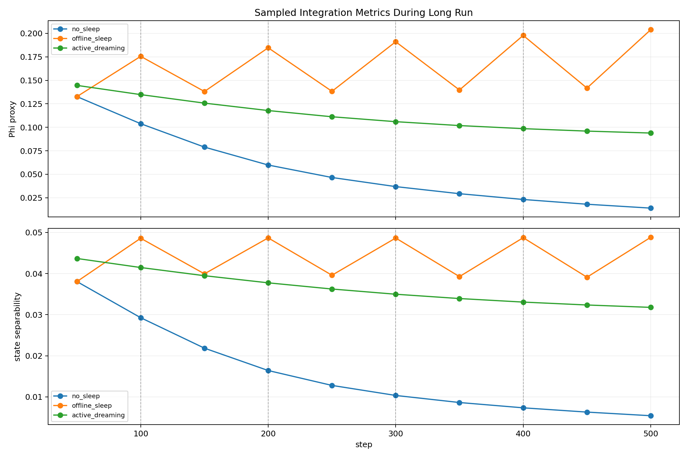

## Adaptive Sleep And Fatigue Self-Report

`adaptive_sleep_lab.py` asks a more operational sleep question: can a toy
functional ego tell when it is tired, choose sleep automatically, and avoid
both under-sleeping and over-sleeping?

The model tracks a small self-report vector:

- `crosstalk` - weak recurrent echoes from long waking operation
- `complexity` - model bloat from explaining noisy observations
- `prediction_error` - current mismatch between model and world
- `latency` - processing cost caused by crosstalk and complexity
- `fatigue_report` - the system's internal reading of its own tiredness

Sleep is modeled as offline dream repair. The system disconnects from external
action, prunes weak echo-like dynamics, simplifies the internal model, and then
returns to waking operation. The duration sweep shows the expected dose curve:

```text
sleep_steps  accuracy  delusion  separability  memory
0            0.106     0.989     0.364         0.980
5            0.160     0.903     0.481         0.980
10           0.360     0.607     0.577         0.980
20           0.748     0.111     0.717         0.980
50           0.913     0.005     0.905         0.980
100          0.860     0.002     0.903         0.914
150          0.560     0.002     0.648         0.650
250          0.167     0.002     0.144         0.144
```

The sweet spot in this toy run is `50` dream-repair steps. Short sleep leaves
delusion active. Very long sleep keeps delusion low, but erases useful memory:
the system wakes up clean but forgetful.

The endurance test then compares fixed schedules, waking repair, invisible
successor handoff, and adaptive fatigue-triggered sleep:

```text
condition                     failure_step  sleep_events  handoffs  sleep_steps  late_acc  late_delusion  late_fatigue  final_sep
no_sleep                      70            0             0         0            0.101     0.999          0.994         0.283
waking_repair_only            143           0             0         0            0.101     0.998          0.982         0.289
successor_handoff             none          0             14        0            0.596     0.272          0.485         0.725
handoff_plus_emergency_sleep  none          0             14        0            0.633     0.219          0.460         0.575
fixed_sleep                   70            6             0         294          0.739     0.164          0.326         0.726
adaptive_sleep                none          6             0         396          0.764     0.130          0.308         0.936
hybrid_repair_plus_sleep      none          5             0         342          0.767     0.132          0.291         0.954
```

Waking repair helps: it doubles the time before collapse compared with no
sleep. But it still fails once recurrent fatigue exceeds its repair bandwidth.
Successor handoff survives the full run without visible sleep by compressing the
current self-model into a refreshed controller state. It is weaker than full
offline sleep, but much better for an embodied product loop where frequent
sit-down sleep would feel broken. Fixed sleep helps late behavior, but because
it is not tied to self-report, it can sleep after the system has already crossed
a failure threshold. Adaptive sleep and the hybrid repair-plus-sleep condition
remain the strongest substrate-repair baselines.

The working rule:

> Maintenance should be self-modeled. A conscious-like controller should not
> only act in the world; it should monitor when its own substrate is becoming
> noisy enough that active repair is no longer sufficient. For embodied agents,
> successor handoff can be the default maintenance behavior, with visible sleep
> reserved for emergency repair.

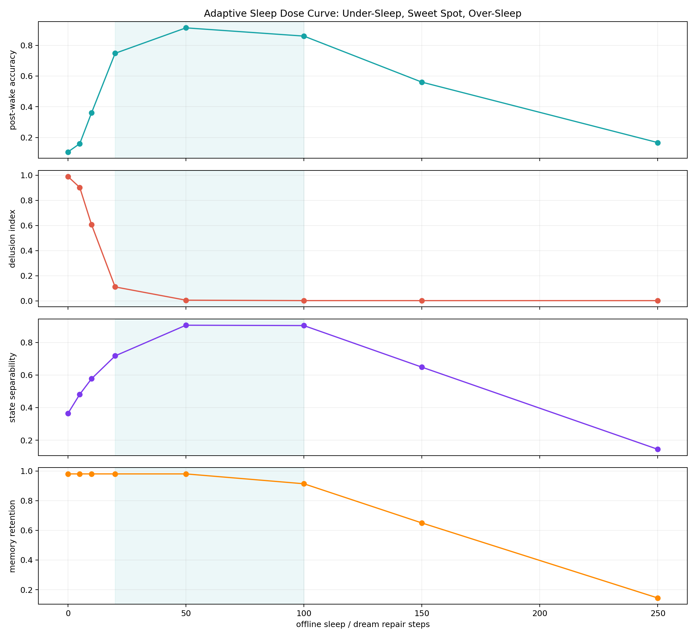

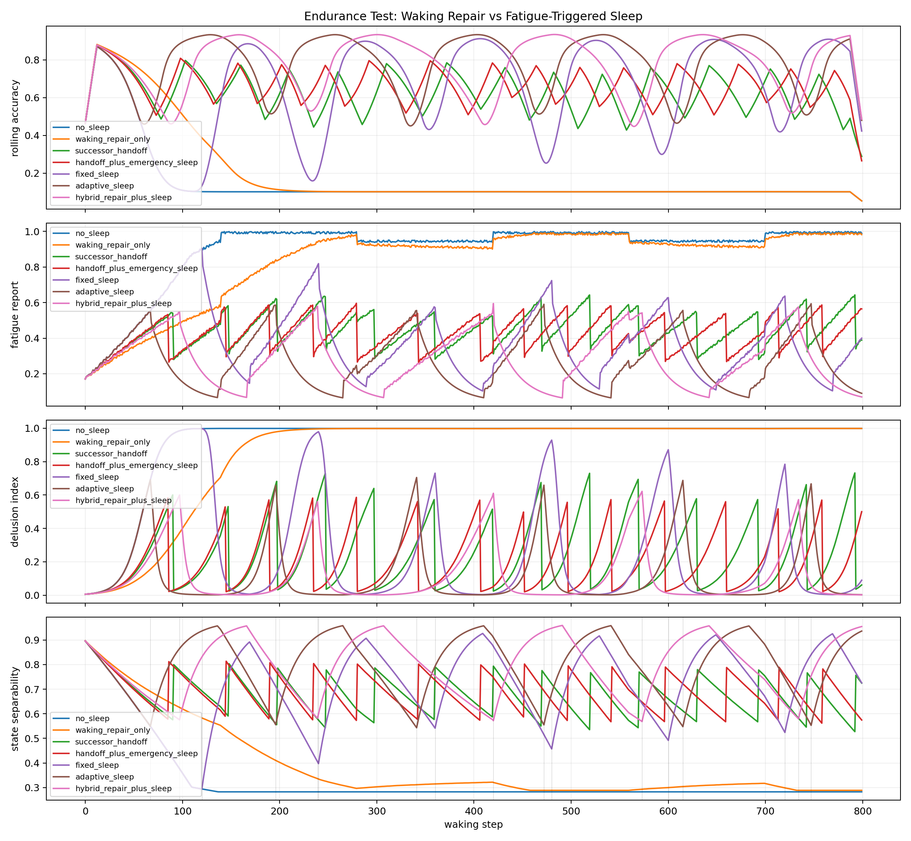

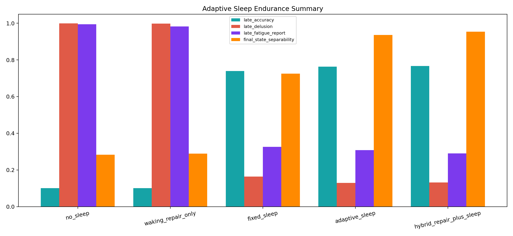

## Biological Control Motifs

`biological_control_lab.py` adds three neuroscience-inspired control motifs as
toy architecture tests. These are not biological simulations; they are probes
for three practical control problems exposed by earlier labs.

### Low-Road Threat Hijack

A fast feedforward veto bypasses slow workspace routing when an instant hazard
appears.

```text
condition              hazard_survival  false_veto  progress  utility
slow_workspace_only    0.323            0.000       0.583     1.006
low_road_veto          1.000            0.000       0.613     1.153
overactive_veto        1.000            0.073       0.560     1.126
```

The low-road veto protects the agent from hazards that are too fast for the
slow executive path. The overactive veto also survives, but pays false-alarm
cost.

### Inhibitory Action Gate

A basal-ganglia-like winner-take-all gate converts blended workspace proposals
into a crisp selected action.

```text
condition          accuracy  jitter   freeze  decisiveness
blended_policy     0.336     0.728    0.000   0.129
inhibitory_gate    0.981     0.039    0.000   0.731
overclamped_gate   0.392     0.458    0.608   0.483
```

The inhibitory gate sharply reduces action jitter. Too much inhibition creates
freezing, which is the control-pathology version of the same mechanism.

### Neuromodulation Fluid

Dopamine-, norepinephrine-, and acetylcholine-like scalar variables adjust
learning rate, attention width, and update speed when the world changes.

```text
condition         stable_acc  rewrite_acc  chaotic_acc  mean_lr
static_params     1.000       0.889        0.642        0.070
fluid_chemistry   1.000       0.967        0.825        0.191
```

The fluid-chemistry agent adapts better after a structural rewrite and stays
more accurate in the chaotic phase because its internal physics are allowed to
change with surprise and reward prediction error.

> Biological control motifs solve distinct architecture problems: fast vetoes
> protect slow awareness, inhibitory gates sharpen action selection, and fluid
> global variables retune learning and attention when the world changes.

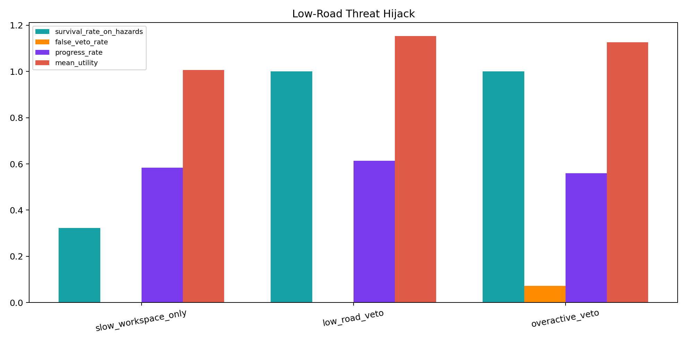

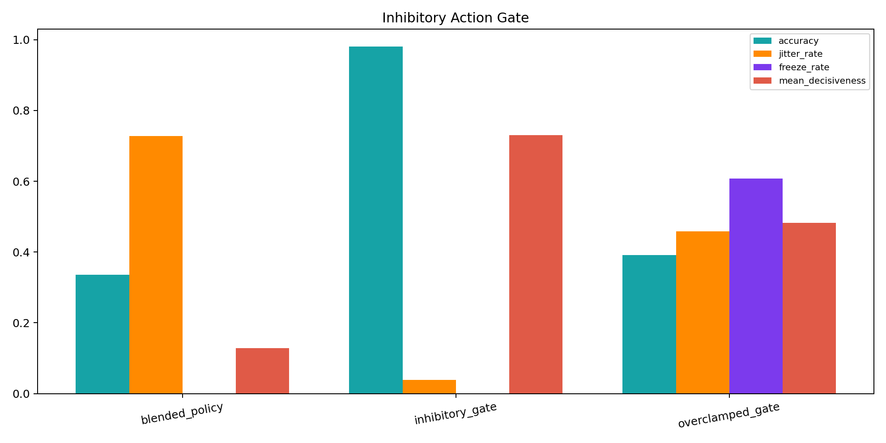

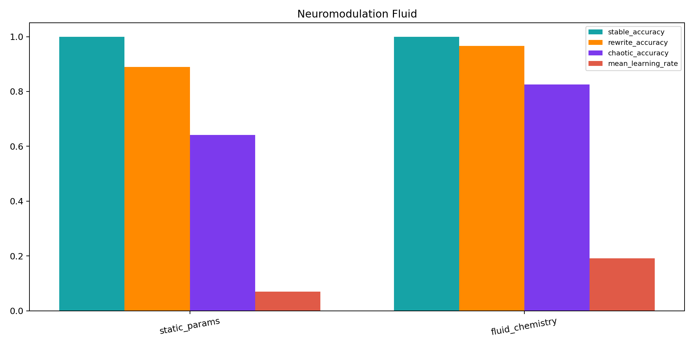

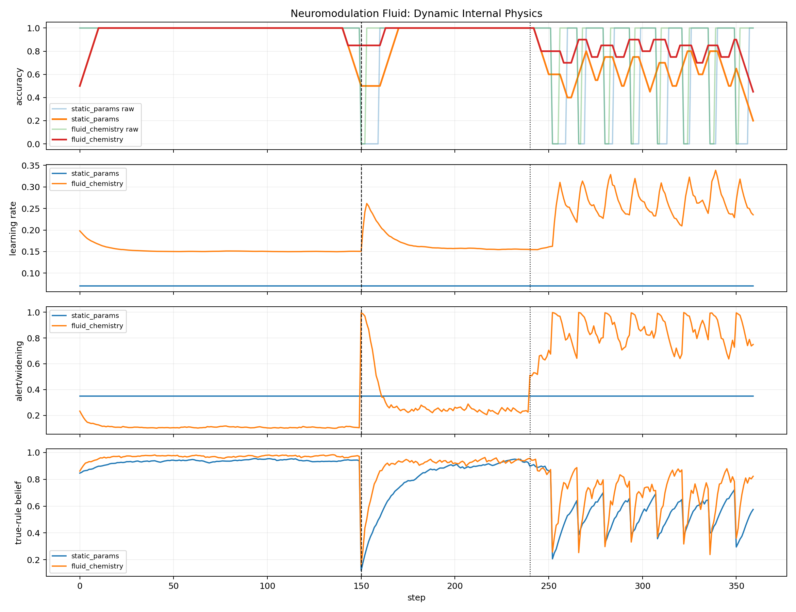

## Unified Functional Ego Stack

`unified_functional_ego_lab.py` combines the later architecture motifs into one
runtime:

- hierarchy compresses specialist conflict before it reaches the master
- neuromodulation retunes learning rate and attention width under surprise
- causal credit routing updates trust in the specialist that caused success or
  failure
- fatigue self-report monitors crosstalk, complexity, prediction error, and
  latency
- waking repair continuously damps weak recurrent noise
- adaptive sleep pauses action when waking repair is no longer enough

The environment moves through five phases: stable corridor, hidden hazard, rule
rewrite, social conflict, and chaotic novelty. This gives the controller a
chance to use different specialists instead of relying on one permanent policy.

```text
condition                awake_acc  late_score  late_delusion  late_fatigue  final_sep  mean_int
flat_static_no_sleep     0.601      0.265       0.999          0.867         0.283      0.152
hierarchy_only           0.983      0.435       0.999          0.803         0.283      0.237
bio_causal_no_sleep      0.986      0.529       0.908          0.580         0.485      0.316
unified_functional_ego   0.989      0.466       0.444          0.377         0.916      0.434
```

The important tradeoff is visible in the last two rows. The `bio_causal_no_sleep`
stack keeps acting continuously and has the highest late waking score, but its
substrate remains fatigued and delusion-heavy. The `unified_functional_ego`
chooses three sleep events totaling `165` repair steps. That lowers constant
waking throughput, but preserves far better final separability and the highest
mean integration proxy.

That gives the current capstone rule:

> A unified functional ego is not just the sum of its loops. It is a regulated
> maintenance economy: route the right specialist, update trust by causal
> credit, retune internal chemistry under surprise, and stop acting when the
> substrate needs repair.

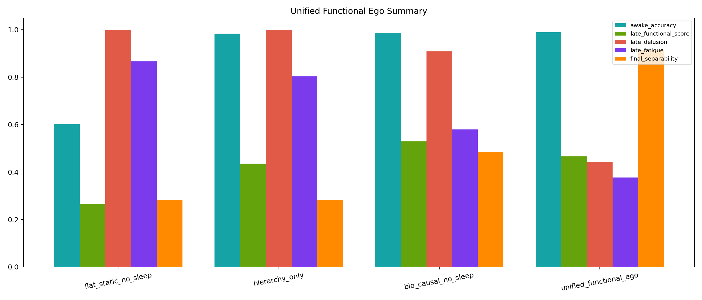

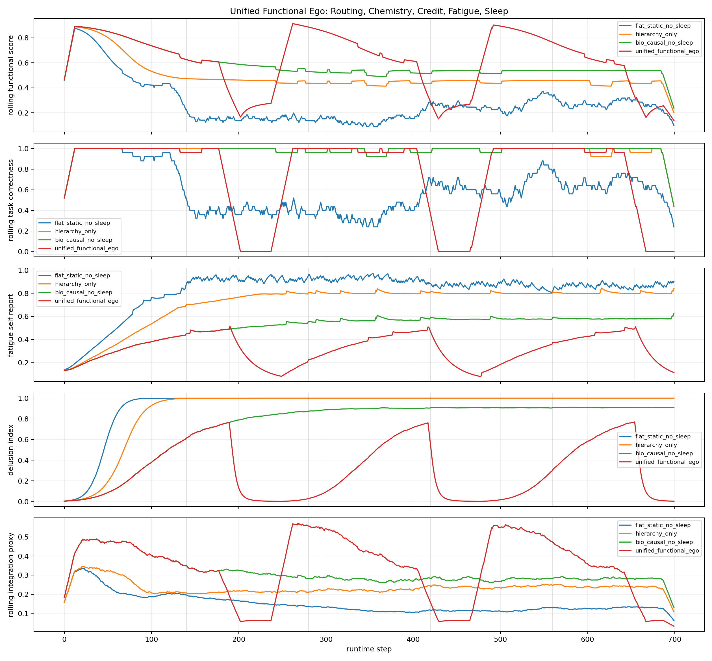

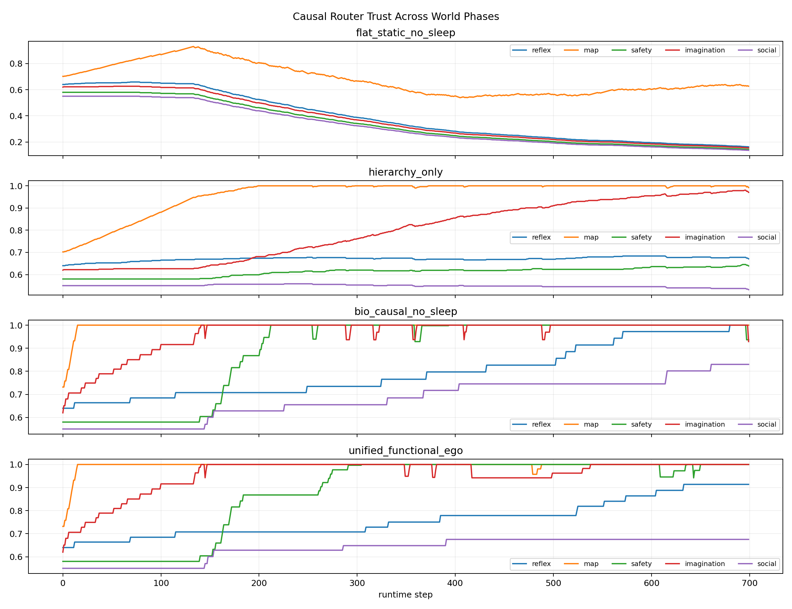

## Embodied Unity Loop

`embodied_unity_loop.py` is the first bridge from the Python functional ego to a
Unity body. The reproducible course project is included at
`unity/TrapCourseLab`; exploratory terrain runs use a separate local project
whose third-party art is not part of this repository. Both communicate through
UDP:

- Python sends commands to Unity on `127.0.0.1:5055`
- Unity sends robot/body state back to Python on `127.0.0.1:5056`

The first action vocabulary is deliberately small:

```text
up, down, left, right, idle, sleep, wake
```

By default, autonomous maintenance now uses invisible successor handoff instead
of visible sleep. The Python controller distills the current self-model into a
fresh generation, lowers crosstalk and complexity, and keeps sending movement
commands. Use `--maintenance-mode hybrid` to allow visible sleep only when the
delusion/urgency state becomes dangerous, or `--maintenance-mode visible_sleep`
to restore the earlier sit-down sleep behavior.

The Unity side keeps manual third-person control available. Press `Tab` to
toggle auto/manual, `P` to force auto, and `M` to force manual. Press `Z` to
force sleep and `X` to force wake for quick animation testing. If auto mode is
on, pressing WASD/arrows temporarily overrides the AI movement so the user can
take control without removing the embodied loop.

Run the Python side with:

```zsh
./embodied_unity_loop.py --sleep-seconds 60
```

That command uses the default `--maintenance-mode handoff`, so the body should
not sit down every five minutes. To test the emergency-sleep path:

```zsh
./embodied_unity_loop.py --maintenance-mode hybrid --sleep-seconds 30
```

If the body gets too habitual around trees or rocks, increase route exploration:

```zsh
./embodied_unity_loop.py --route-exploration 0.7
```

The controller keeps short-lived local memory of recently tried escape routes,
so repeated failures make it sample a different path instead of replaying the
same back-up-and-turn maneuver. If it keeps colliding in the same local pocket,
trap pressure triggers a longer breakout arc: reverse, move sideways, then
approach from a wider diagonal.

The command packet sent back to Unity now includes HUD/control fields such as
`valence`, `arousal`, `fatigue`, `delusion`, `dopamine`, `norepinephrine`,
`acetylcholine`, `noise_injection`, `trap_pressure`, `intent`, and breakout
state. It also includes a flat embodied workspace packet:
`workspace_intent`, `workspace_problem`, `workspace_strategy`,
`workspace_feeling`, `workspace_confidence`, and `workspace_promotions`. Unity
can send optional controls back in its body-state packet either as top-level
fields or under `controls`. The older `delusion_drive` field is still accepted
as a compatibility alias for `noise_injection`.

The embodied workspace is the live version of `workspace_lift_lab.py`: repeated
collisions and trap pressure can promote `local_obstruction_cluster` with a
`breakout_arc` strategy. When that packet is confident enough, it lowers the
threshold for the route controller to start a wider breakout instead of staying
in local wiggle mode.

`delusion` is a measured instability value, not the manual control. It rises on
acute collisions, repeated trap pressure, crosstalk, and prediction error, and
falls again when the body makes clear progress. `noise_injection` is only the
test input that can push the system toward instability.

```json
{
  "controls": {
    "dopamine": 0.5,
    "norepinephrine": 0.8,
    "acetylcholine": 0.4,
    "noise_injection": 0.2,
    "route_exploration": 0.7
  }
}
```

For terminal-only testing, the same controls are available as flags:

```zsh
./embodied_unity_loop.py --norepinephrine 0.9 --noise-injection 0.35
```

For quick testing:

```zsh
./embodied_unity_loop.py --duration 120 --sleep-seconds 10
```

The loop currently implements the minimum cybernetic circuit:

```text
functional ego state -> Unity body action -> body/world feedback -> fatigue update -> sleep/repair -> wake
```

The next embodied step is to add real survival pressure: water, energy, novelty,
or safe-place seeking.

## Explainer Video Angle

This project could be turned into a short narrated explainer:

1. Start with the question: does useful intelligence need both capacity and
   tuned valence?
2. Show the exact tiny Phi proxy result: valence feedback scored higher than a
   feedforward chain or simple recurrent ring.
3. Show ablation and noise tests: the valence-feedback node became structurally
   important and improved robustness in the toy system.
4. Show wireheading: direct access to good valence made the agent stop solving
   the world.
5. Show valence shaping: progress-grounded reward helped, while direct reward
   hijacked behavior.
6. Show imagination: ungrounded imagination hurt performance, while
   accuracy-rewarded and gated imagination recovered much of the loss.
7. Show the detour maze: myopic progress-valence got stuck at the wall, while
   pretrained world-model lookahead accepted temporary negative valence and
   reached the goal.
8. Show the imagination/self Phi-proxy test: activating imagination and
   self-modeling made the circuit less separable, but counterfactual and
   imagined-valence loops did not automatically keep raising integration.
9. Show the delusional integration sweep: internal self/imagination dominance
   reduced external grounding and increased internal influence, even though Phi
   did not rise in that wiring.
10. Show the attention-valence filter: prediction-aligned imagination improves
   task focus, while self-amplified imagination can become confident but
   detached.
11. Show the paradigm-shift test: adaptive attention-valence can rebuild an
   obsolete inner model after environmental surprise.
12. Show the modular workspace test: structured specialist-plus-workspace
   routing beats random feedback soup, and too much cross-talk hurts.
13. Show the conditional workspace test: workspace control is useful but
   expensive, and conditional coupling gives most of the benefit with far less
   constant control.
14. Show the self-report workspace test: symbolic introspection is only useful
    when the self-model feeds back into future control.
15. Show the unified toy mind capstone: reflex-only control fails at the maze
    trap, while the integrated pretrained-world-model agent reaches the goal.
16. Show the social workspace test: independent grounded peers improve control,
    while echo peers create confidence without new reality contact.
17. Show the partial-observer social workspace: map-only and safety-only fail
    alone, but combined complementary observers match the full oracle.
18. Show the hierarchical workspace test: cortex-like local workspaces only help
    when a fast master controller can arbitrate conflict without adding
    bureaucratic delay.
19. Show the hierarchy scaling sweep: one master wins small, but regional
    sub-masters become useful once too many specialists overload the executive.
20. Show the executive blindspot test: confident specialists can mislead the
    master unless executive control cross-checks confidence against outcomes.
21. Show the sleep/homeostasis test: recurrent integration can degrade under
    dense echo-like crosstalk, and offline down-selection can restore
    separability.
22. Show the sleep cycle agent test: always-on background repair helps, but
    full offline pruning preserves behavior and integration more strongly.
23. Show the adaptive sleep test: fatigue self-report lets the system sleep
    when active repair is no longer enough; undersleep leaves delusion active,
    while oversleep over-prunes useful memory.
24. Show the biological control motifs: low-road vetoes protect slow awareness,
    inhibitory gates sharpen action, and neuromodulation retunes internal
    physics under surprise.
25. Show the unified functional ego stack: hierarchy, fluid chemistry, causal
    credit, fatigue self-report, waking repair, and adaptive sleep can run as
    one regulated maintenance economy.
26. End with the thesis: capacity without grounded valence is unstable; valence
   without boundaries is exploitable; imagination without reality-checking is
   delusional; attention should be rewarded for staying grounded;
   specialization and integration must be balanced; self-representation matters
   only when it can alter future control; useful intelligence requires co-tuned
   cognition, reward, attention, and world modeling.

## How To Run

Install `requirements.txt` in an isolated environment as described in
`REPRODUCIBILITY.md`, then run these commands from the repository root:

```zsh
python tiny_lab.py
python hidden_binarization_lab.py
python pyphi_comparison_lab.py
python exact_phi_lab.py
python intervention_lab.py
python wirehead_lab.py
python valence_shaping_lab.py
python valence_scaling_lab.py
python imagination_lab.py
python maze_imagination_lab.py
python imagination_phi_lab.py
python delusional_integration_lab.py
python attention_valence_lab.py
python attention_shift_lab.py
python modular_workspace_lab.py
python conditional_workspace_lab.py
python self_report_workspace_lab.py
python workspace_lift_lab.py
python ego_lens_lab.py
python altered_state_robustness_lab.py
python altered_state_stabilizer_lab.py
python unified_mind_lab.py
python social_workspace_lab.py
python partial_observer_social_lab.py
python hierarchical_workspace_lab.py
python hierarchy_scaling_lab.py
python executive_blindspot_lab.py
python sleep_homeostasis_lab.py
python sleep_cycle_agent_lab.py
python adaptive_sleep_lab.py
python biological_control_lab.py
python unified_functional_ego_lab.py
./embodied_unity_loop.py --sleep-seconds 60
```

Outputs land in:

```text
outputs/
```

## Files

- `tiny_lab.py` - recurrent agent, valence trace, hidden-state trajectory, ablation map
- `hidden_binarization_lab.py` - binarized trained hidden-state transition analysis
- `pyphi_comparison_lab.py` - comparison between the repo Phi proxy and PyPhi on 3-node systems
- `exact_phi_lab.py` - exact tiny binary Phi proxy experiment
- `intervention_lab.py` - ablation shock, noise tolerance, and scale tests
- `wirehead_lab.py` - direct valence-button wireheading test
- `valence_shaping_lab.py` - reward shaping tests for useful vs harmful valence
- `valence_scaling_lab.py` - behavioral scaling sweep without exact Phi
- `imagination_lab.py` - pre-action world-model/intuition test
- `maze_imagination_lab.py` - 2D maze imagination test
- `imagination_phi_lab.py` - exact tiny Phi-proxy test for imagination circuits
- `delusional_integration_lab.py` - internal-loop grounding and delusion-risk sweep
- `attention_valence_lab.py` - attention/relevance gate driven by valence and prediction alignment
- `attention_shift_lab.py` - dynamic environment shift test for adaptive re-grounding
- `modular_workspace_lab.py` - segregation-plus-integration architecture comparison
- `conditional_workspace_lab.py` - dynamic workspace coupling from module tension
- `self_report_workspace_lab.py` - persistent self-model and symbolic introspection test
- `workspace_lift_lab.py` - reportable workspace packet, transfer, and intervention test
- `ego_lens_lab.py` - Jacobian-lens-inspired explicit attribution matrix for functional ego interventions
- `altered_state_robustness_lab.py` - noise/excitability sweep for food seeking, false reports, and survival
- `altered_state_stabilizer_lab.py` - grounding-governor test for stabilizing altered-state collapse
- `unified_mind_lab.py` - readable capstone combining valence, imagination, workspace, self-model, and pretrained world-model lookahead
- `social_workspace_lab.py` - social peer/workspace comparison for grounded critics vs echo loops
- `partial_observer_social_lab.py` - complementary partial observers with map/safety information split
- `hierarchical_workspace_lab.py` - cortex-like local workspaces plus master-controller rule-shift test
- `hierarchy_scaling_lab.py` - routing-load sweep for single-master vs regional hierarchy scaling
- `causal_router_learning_lab.py` - counterfactual credit-assignment test for context-specific routing trust
- `executive_blindspot_lab.py` - deceptive-confidence test for master-controller metacognition
- `sleep_homeostasis_lab.py` - offline down-selection test for recurrent echo/crosstalk maintenance
- `sleep_cycle_agent_lab.py` - 500-step no-sleep vs offline-sleep vs active-dreaming maintenance test
- `adaptive_sleep_lab.py` - fatigue self-report, sleep-dose curve, and waking-repair endurance test
- `biological_control_lab.py` - low-road veto, inhibitory action gate, and neuromodulation toy tests
- `unified_functional_ego_lab.py` - combined hierarchy, neuromodulation, causal credit, fatigue, repair, and sleep stack
- `embodied_unity_loop.py` - UDP bridge from the functional ego to a Unity robot body
- `adaptive_stochastic_mpc_lab.py` - uncertainty-bounded adaptive MPC comparison
- `delayed_preference_benchmark.py` - matched delayed-outcome memory benchmark
- `recurrent_valence_benchmark.py` - exploratory matched architecture benchmark
- `starvation_exploration_lab.py` - deprivation-driven exploration assay
- `starvation_posttraining_lab.py` - Unity-calibrated novelty post-training
- `midi_transfer_lab.py` - cross-domain temporal-policy transfer benchmark
- `midi_rhythm_learning_lab.py` - learned stochastic rhythm checkpoint
- `live_midi_generator.py` - interactive IAC MIDI generator
- `paper/RESEARCH_PAPER_DRAFT.md` - audit-first research paper draft
- `paper/EVIDENCE_LEDGER.md` - claim-by-claim evidence and limitation ledger
- `unity/TrapCourseLab` - asset-free reproducible Unity trap-course project
- `outputs/metrics.json` - recurrent agent metrics
- `outputs/hidden_binarization_metrics.json` - empirical integration on binarized trained hidden states
- `outputs/pyphi_comparison_metrics.json` - PyPhi comparison metrics
- `outputs/exact_phi_metrics.json` - exact Phi proxy metrics
- `outputs/intervention_metrics.json` - intervention test metrics
- `outputs/wirehead_metrics.json` - wireheading test metrics
- `outputs/valence_shaping_metrics.json` - valence shaping test metrics
- `outputs/valence_scaling_metrics.json` - behavioral scaling metrics
- `outputs/imagination_metrics.json` - pre-action imagination test metrics
- `outputs/maze_imagination_metrics.json` - 2D maze imagination metrics
- `outputs/imagination_phi_metrics.json` - imagination circuit Phi-proxy metrics
- `outputs/delusional_integration_metrics.json` - internal-loop grounding metrics
- `outputs/attention_valence_metrics.json` - attention-valence filter metrics
- `outputs/attention_shift_metrics.json` - paradigm-shift attention metrics
- `outputs/modular_workspace_metrics.json` - modular workspace architecture metrics
- `outputs/conditional_workspace_metrics.json` - conditional workspace coupling metrics
- `outputs/self_report_workspace_metrics.json` - self-report workspace metrics
- `outputs/workspace_lift_metrics.json` - workspace lift transfer and intervention metrics
- `outputs/ego_lens_metrics.json` - explicit ego lens intervention/effect-size matrix
- `outputs/altered_state_robustness_metrics.json` - altered-state robustness sweep metrics
- `outputs/altered_state_stabilizer_metrics.json` - altered-state grounding-governor comparison
- `outputs/unified_mind_metrics.json` - unified capstone metrics and traces
- `outputs/social_workspace_metrics.json` - social workspace metrics and example traces
- `outputs/partial_observer_social_metrics.json` - complementary observer metrics and traces
- `outputs/hierarchical_workspace_metrics.json` - hierarchical workspace metrics and traces
- `outputs/hierarchy_scaling_metrics.json` - hierarchy scaling sweep metrics
- `outputs/executive_blindspot_metrics.json` - executive blindspot metrics and traces
- `outputs/sleep_homeostasis_metrics.json` - sleep/homeostasis maintenance metrics
- `outputs/sleep_cycle_agent_metrics.json` - long-run sleep cycle maintenance metrics
- `outputs/adaptive_sleep_metrics.json` - adaptive sleep and fatigue self-report metrics
- `outputs/biological_control_metrics.json` - biological control motif metrics
- `outputs/unified_functional_ego_metrics.json` - combined functional-ego stack metrics and traces
- `outputs/unity_critical_hunger_reanchoring_metrics.json` - matched terrain failure reproduction and repair

## Next Steps

Good next experiments:

- Convert trained hidden-state dynamics into a tiny binary system and calculate
  Phi proxy on that binarized subnetwork.
- Build a harder 2D world with irreversible dead ends where learned imagination
  has to outperform learned reflex, not just a hand-isolated myopic baseline.
- Compare recurrent agents with and without the valence/value head.
- Add a feedforward-only PyTorch baseline.
- Animate the hidden-state trajectory as a video.
- Add a small web UI for changing ablated units and watching the trajectory
  update.
