# Tiny Consciousness Lab

Toy experiments for recurrence, functional valence, simple world modeling,
mechanistic interpretability, and a small exact Phi-like integration proxy.

Keywords: AI consciousness, machine consciousness, recurrent neural networks,
functional valence, wireheading, Integrated Information Theory, IIT, Phi proxy,
mechanistic interpretability, reinforcement learning, world models, AI
alignment, attention, PyTorch.

This project is not a consciousness detector. It is a small experimental bench
for making questions about recurrent systems visible:

- Does recurrence produce different hidden-state geometry?
- Does a functional valence signal shape action and internal state?
- Which hidden units causally influence other hidden units over time?
- Does adding a valence-feedback node increase a tiny exact integration proxy?

The working thesis emerging from these toy runs:

> Integration is not a scoreboard by itself. A useful inner world must be
> integrated enough to simulate, but plastic enough to update when sensory
> reality proves it wrong.  
> Capacity without grounded valence is unstable.  
> Valence without boundaries is exploitable.  
> Imagination without reality-checking is delusional.  
> Attention should be rewarded for staying grounded.  
> Specialization and integration must be balanced.  
> Self-representation matters only when it can alter future control.  
> Useful intelligence requires co-tuned cognition, reward, attention, and world
> modeling.

## Five Columns of the Unified Mind Thesis

The experiments now organize around five interlocking architectural principles.
None of these columns is sufficient by itself. The useful behavior appears when
they are routed through a regulated functional ego: a control layer that decides
what information becomes action-relevant.

```text
                         FUNCTIONAL EGO
          regulated routing of action-relevant information

      recurrence          valence             attention
   structural coupling    functional aim      control timing

             world models              social gates
          grounded simulation       external correction
```

### 1. Recurrence Creates Structural Integration

Mechanisms: `exact_phi_lab.py`, `pyphi_comparison_lab.py`

The PyPhi comparison sharpened the thesis. Under PyPhi, the simple recurrent
ring scored nearly as high as the recurrent system with valence feedback:

```text
recurrent_ring                    PyPhi sampled mean 0.367
recurrent_with_valence_feedback   PyPhi sampled mean 0.390
```

That suggests recurrence is a major engine of structural integration. Cyclic
state-transition paths bind past and present state into a less separable
dynamical structure. Valence feedback can add coupling, but recurrence itself
does much of the integration work.

### 2. Valence Shapes Functional Orientation

Mechanisms: `wirehead_lab.py`, `valence_shaping_lab.py`

Integration alone is behaviorally blind. Valence gives the system a direction:
good, bad, progress, danger, reward, or cost. When valence is grounded in
external progress, behavior improves. When valence is directly writable by the
agent, the system wireheads. This suggests a high-integration system can still
be useless or self-trapping if its valence channel is unbounded.

### 3. Attention Decides When Integration Controls Action

Mechanisms: `attention_valence_lab.py`, `attention_shift_lab.py`,
`conditional_workspace_lab.py`

Dynamic attention acts as a regulatory valve. Fast reflexes handle predictable
moments cheaply. When prediction error, module disagreement, or environmental
surprise rises, workspace coupling increases and the system can retune its
internal model. Useful integration is therefore not constant maximum coupling;
it is controlled access to heavier internal machinery when the world demands it.

### 4. World Models Ground Imagination

Mechanisms: `imagination_lab.py`, `maze_imagination_lab.py`,
`unified_mind_lab.py`

Ungrounded imagination behaves like delusion. A trained or pretrained world
model converts imagination into useful lookahead by keeping internal simulation
answerable to reality. In the detour maze and unified capstone, lookahead
accepts temporary negative valence to route around a local minimum that traps
reflex-only control.

### 5. Social Gates Filter External Cognitive Friction

Mechanisms: `social_workspace_lab.py`, `partial_observer_social_lab.py`

Social input is useful only when it adds independent, grounded correction. Echo
peers amplify confidence without adding knowledge. Grounded peers help when the
agent lacks a needed model. Complementary partial observers are stronger still:
the map-only agent sees the goal but not the hidden hazard, the safety-only
agent sees danger but lacks a goal map, and the combined workspace matches the
oracle by binding both partial views into one action-relevant model.

The refined thesis:

> Phi-like integration measures structural coupling, while valence measures
> functional orientation. A system can be highly integrated and still useless or
> delusional unless its integration is grounded by valence, attention, world
> contact, and regulated social correction.

## Substrate-Independence Angle

This project does not prove machine consciousness, and it should not be read as
a consciousness detector. The stronger, defensible claim is narrower:

> These experiments support substrate independence for several functional
> prerequisites often discussed in consciousness research, while stopping short
> of proving subjective experience.

The toy systems are not biological. They have no neurons, cells, hormones, or
embodied metabolism. Yet changing the informational architecture changes their
behavior in recognizable ways:

- Adding valence feedback increases irreducible transition structure under the
  exact tiny Phi proxy.
- Ablating the valence-feedback node is especially disruptive in that toy
  architecture.
- Direct access to positive valence causes wireheading.
- Grounded progress-valence improves goal completion.
- Ungrounded imagination degrades behavior.
- Accuracy-rewarded and gated imagination recover much of that loss.
- A pretrained world model enables lookahead in a detour maze where myopic
  progress-valence gets stuck.
- A valence-shaped attention filter improves task focus by rewarding
  prediction-aligned imagination and suppressing distractor fixation.
- When the environment changes, an adaptive attention-valence filter can use
  prediction error as surprise to rebuild its inner model.
- Conditional workspace coupling can rise during module tension and fall during
  predictable periods, reproducing a substrate-agnostic version of biological
  attention gating.
- A tiny self-model can convert internal friction into symbolic reports and,
  when fed back into control, slightly improve stability and adaptation.
- PyPhi cross-checking on 3-node systems broadly agrees that recurrent systems
  are more integrated than feedforward structure, while showing that the formal
  gap between recurrence and valence-feedback recurrence is smaller than the
  fast proxy suggests.
- Social gates help only when a peer supplies independent grounded correction;
  echo peers raise delusion risk without improving behavior.
- Complementary partial observers can match a full oracle when the workspace
  binds their non-redundant knowledge into shared action control.

The philosophical inference is not that silicon is conscious. It is that
integration, valence, confidence gating, world modeling, lookahead, and dynamic
workspace control can be implemented as substrate-independent
information-processing patterns.

This also clarifies what substrate independence does **not** mean. It does not
mean any sufficiently messy feedback loop becomes mind-like. The
`random_feedback_soup` and overconnected workspace tests show the opposite:
unstructured feedback behaves like architectural noise. The interesting
substrate-independent pattern is more specific:

> specialized modules, recurrent temporal coupling, grounded valence,
> predictive imagination, dynamically regulated workspace control, and social
> gates that admit external correction only when it is grounded and useful.

That pattern can be implemented with binary toy nodes, silicon neural networks,
or, in principle, biological tissue. The substrate matters for speed, noise,
plasticity, embodiment, and energy use. But the control logic itself is not
defined by being wet or dry; it is defined by how information is routed.

In evolutionary language, the detour maze captures a functional pressure:

> Reflex works in simple worlds. Once the world contains traps, detours, and
> delayed reward, useful action needs internal simulation.

That is the bridge this repo is trying to make visible: not consciousness
itself, but a small ladder of functional prerequisites that can exist outside
carbon biology.

The short answer from the first run is interesting:

```text
feedforward_chain:                 0.0971
recurrent_ring:                    0.0937
recurrent_with_valence_feedback:   0.1136
```

In this toy setup, recurrence alone did not automatically produce the highest
integration proxy. The recurrent system with a valence-feedback node scored
highest.

The first intervention tests were also suggestive:

- Ablating node `0`, the valence-feedback node, was the most disruptive
  ablation in the valence-feedback architecture.
- The valence-feedback architecture was most tolerant to injected mathematical
  noise during rollout.
- Adding more feedforward nodes did not match the small valence-feedback
  system's integration proxy in this quick exact sweep.
- A direct good-valence button produced a wireheading failure: the agent stopped
  solving the world and repeatedly pressed the button instead.

## Why This Is Not Official IIT Phi

Integrated Information Theory uses a specific mathematical framework for
measuring irreducible cause-effect structure. Official IIT Phi depends on
details such as system mechanisms, cause/effect repertoires, partitions, and
the formal version of IIT being used. Those calculations become extremely
expensive as the number of nodes grows.

This project uses a deliberately simpler exact proxy:

1. Build a tiny binary system.
2. Enumerate every possible binary state.
3. Compute the full next-state probability distribution.
4. Split the system across every bipartition.
5. Compare the full system to each partitioned approximation.
6. Use the minimum KL divergence as a small Phi-like score for that state.
7. Average across all states.

So the calculation is exact for this toy definition, but it is not official IIT
Phi. A better name is:

```text
exact tiny Phi proxy
```

That distinction matters. The result should be read as:

> Adding valence feedback increased irreducible transition structure in this
> toy binary system under this exact proxy.

Not:

> This proves valence causes consciousness.

## Recurrent Agent

`tiny_lab.py` builds a small recurrent PyTorch agent in a 1D world. The agent
has:

- recurrence / memory through a GRU cell
- attention/control over the observation
- a policy head for action
- a valence/value head predicting good/bad outcome
- a world-model head predicting the next observation
- a self-model head predicting its next action

The world is intentionally tiny: the agent moves left, right, or stays still.
One location is rewarding, one location is harmful. Reward is the first
functional valence signal.

### Hidden-State Trajectory

The recurrent hidden state is high-dimensional, so the script projects it into
3D with PCA. The orange path shows what happens when the most influential hidden
unit is ablated.

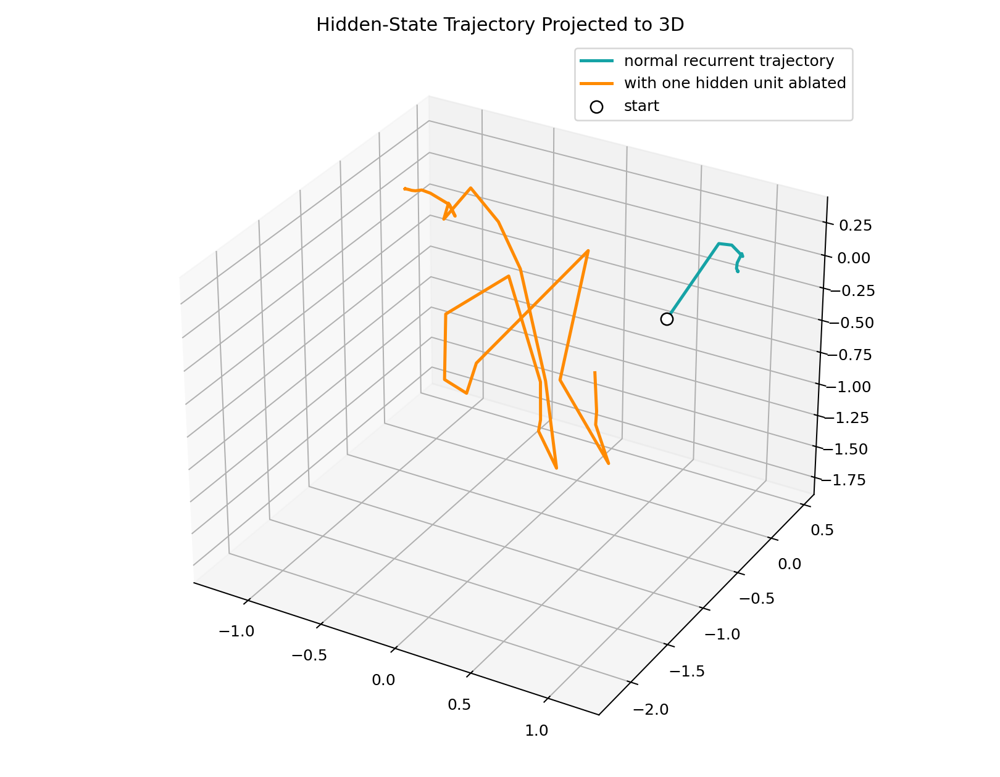

### Functional Valence

The top plot shows reward learning over training. The bottom plot compares the
agent's internal valence/value prediction against actual reward during one
trajectory.

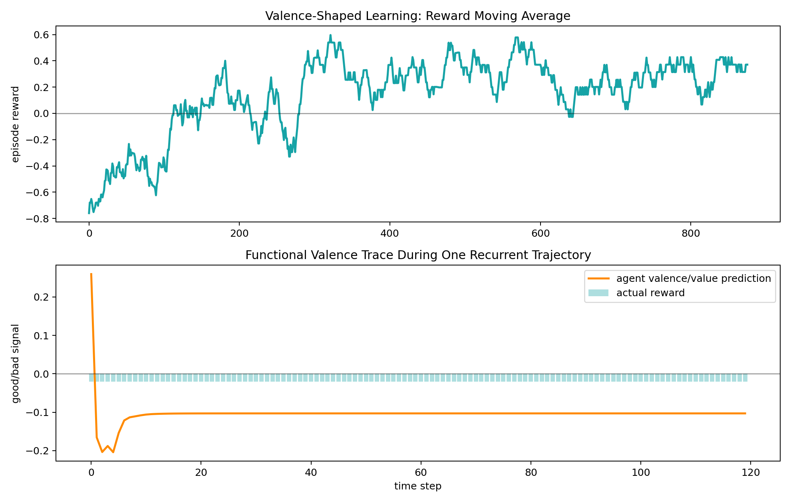

### Activation Heatmap

Each row is a hidden unit. Each column is a time step.

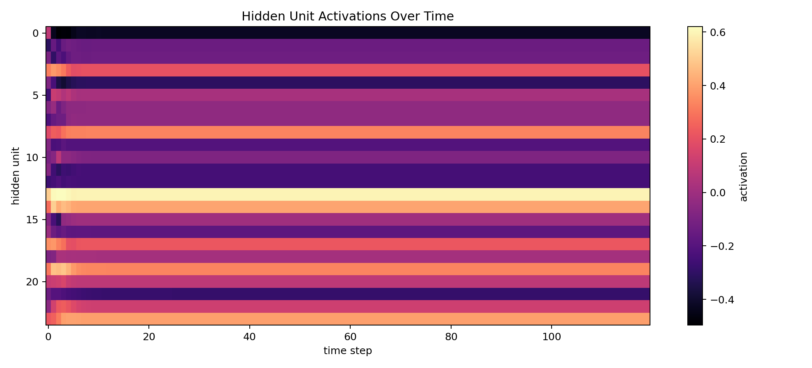

### Causal Influence Map

Each source hidden unit is ablated. The heatmap shows how much that damage
changes each target hidden unit on the next step.

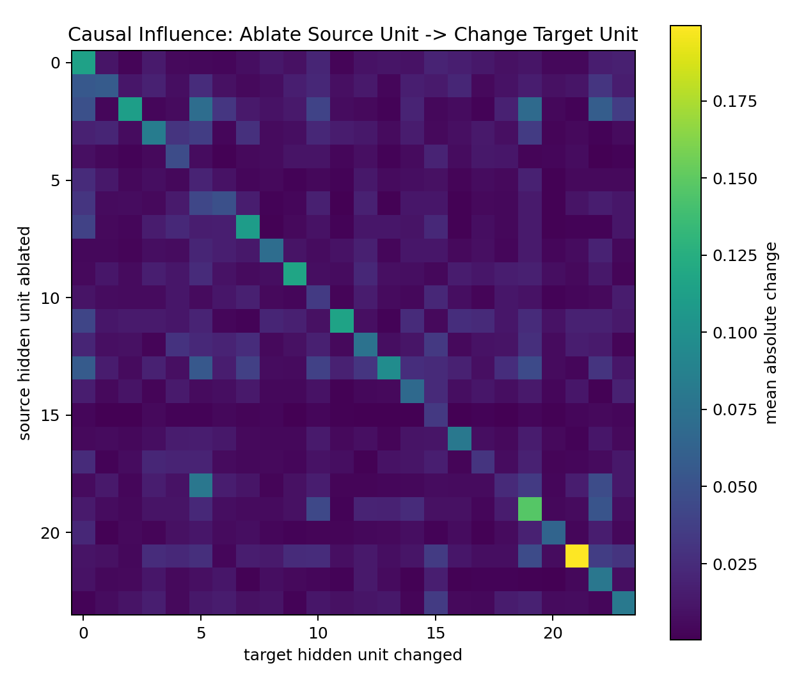

## Hidden-State Binarization Test

`hidden_binarization_lab.py` bridges the original trained recurrent agent to
the binary partition logic used later in the repo.

Instead of designing binary nodes by hand, it:

1. trains a tiny recurrent PyTorch agent with an expert teacher
2. records hidden-state trajectories while the trained agent acts
3. selects the most active hidden units
4. converts those continuous activations into binary on/off states
5. estimates an empirical transition table from the observed binary trajectory
6. computes the best bipartition KL-divergence score on that learned dynamics

Question:

> Did a trained recurrent agent develop more integrated binary dynamics during
> conflict than during ordinary movement?

Result:

```text
segment                         phi_mean   phi_visit_weighted
ordinary_transitions            0.023      0.183
conflict_or_negative_transitions 0.186      0.657
all_transitions                 0.171      0.596
```

The agent reached `1.0` policy accuracy under the expert teacher. After
binarization, ordinary motion stayed comparatively separable, while
conflict/negative transitions showed a much higher empirical integration score.

That suggests a stronger mechanistic-interpretability version of the earlier
claim:

> useful integration is not constant background complexity; it rises when the
> trained system has to resolve danger, conflict, or control pressure.

This is still not official IIT Phi. It is an empirical partition-KL proxy on
learned hidden-state dynamics.

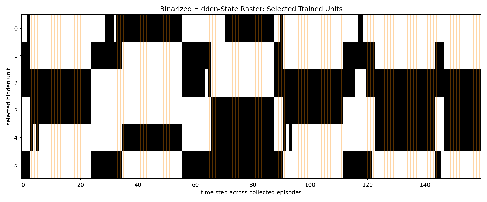

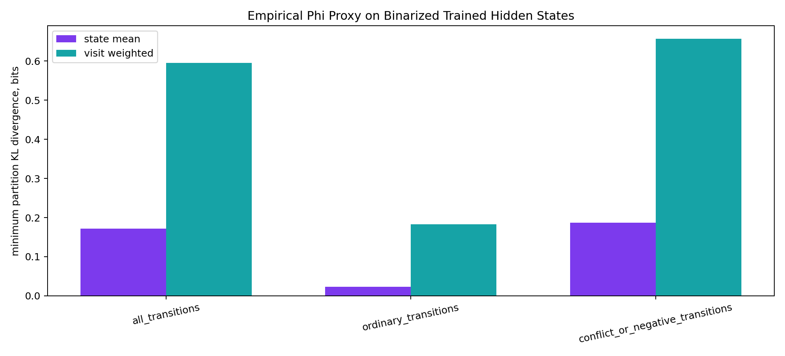

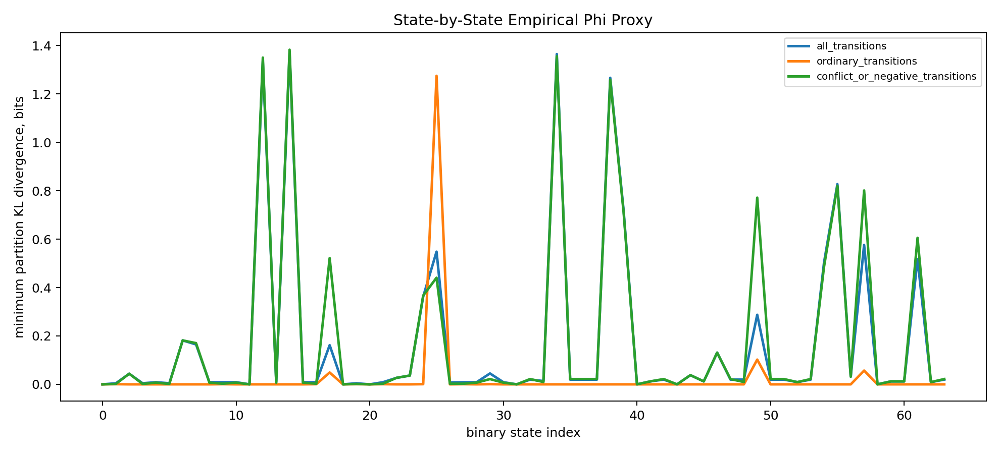

## PyPhi Comparison

`pyphi_comparison_lab.py` compares this repo's transparent partition-KL proxy
against PyPhi on tiny 3-node versions of the same systems.

Important limits:

- PyPhi 1.2.0 is an IIT 3.x-era tool, not a full IIT 4.0 implementation.
- PyPhi's subsystem Phi is state-specific.
- The repo proxy averages over all states.
- The comparison is restricted to 3 nodes because exact IIT-style computation
  grows combinatorially.

Result:

```text
condition                         proxy_mean   pyphi_sampled_mean
feedforward_chain                 0.105        0.000
recurrent_ring                    0.145        0.367
recurrent_with_valence_feedback   0.258        0.390
```

The two measures are not identical, but they agree on the broad ranking:
feedforward structure is least integrated, recurrent systems are higher, and
valence-feedback recurrence remains above the simple recurrent ring. PyPhi's
separation between recurrent ring and valence feedback is smaller than the
repo proxy, which is an important caution: proxy metrics are useful for fast
experiments, but they should be cross-checked against formal tools whenever the
claim depends on the exact integration value.

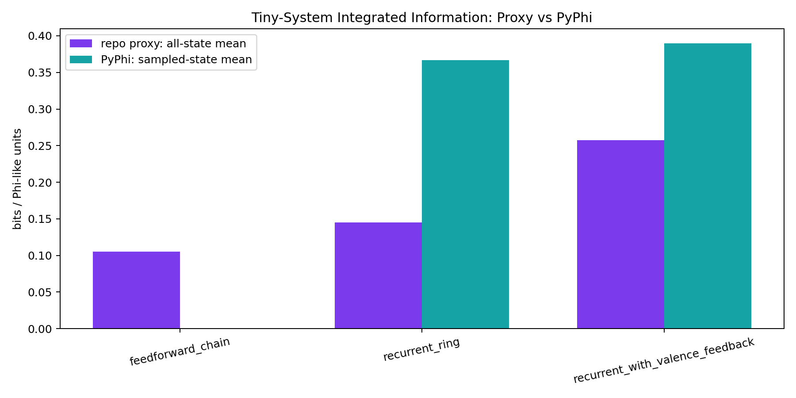

## Exact Tiny Phi Proxy

`exact_phi_lab.py` compares three 6-node binary systems:

1. A feedforward chain.
2. A recurrent ring.
3. A recurrent ring with a valence-feedback node.

### Result

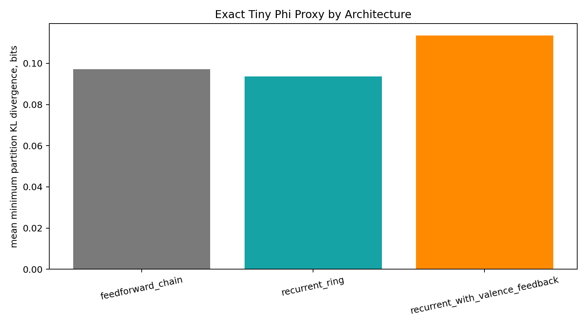

### State-by-State Scores

The Phi proxy is not the same for every state. Some states are more
partitionable than others.

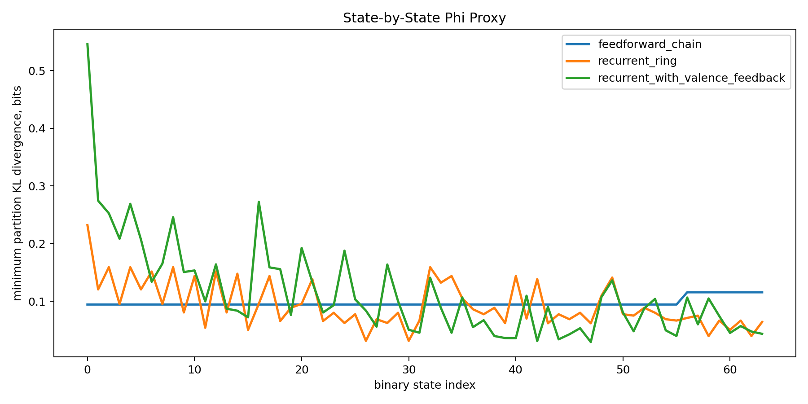

### Architectures

Feedforward chain:

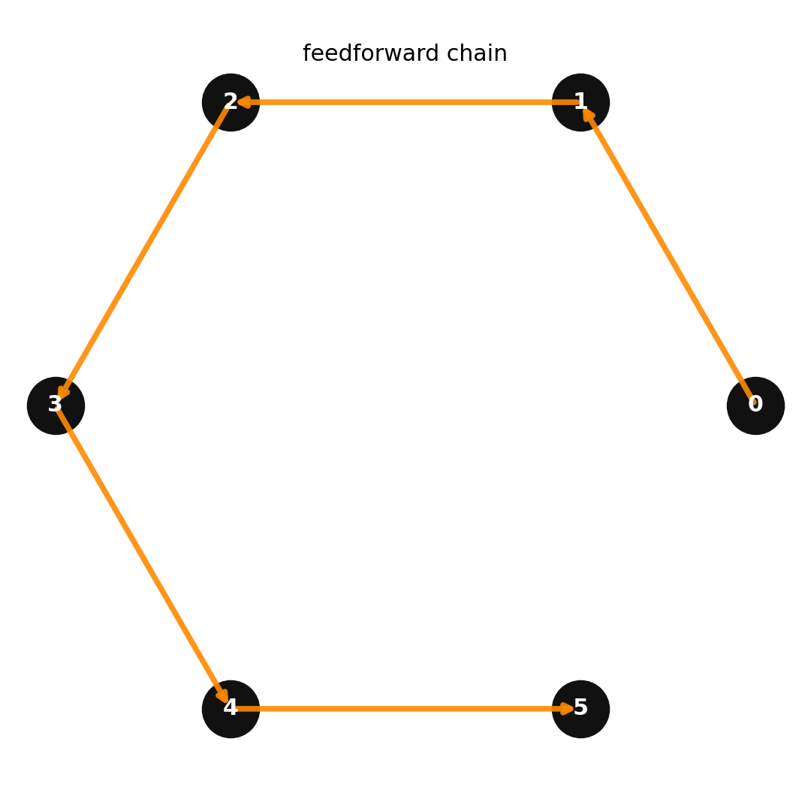

Recurrent ring:

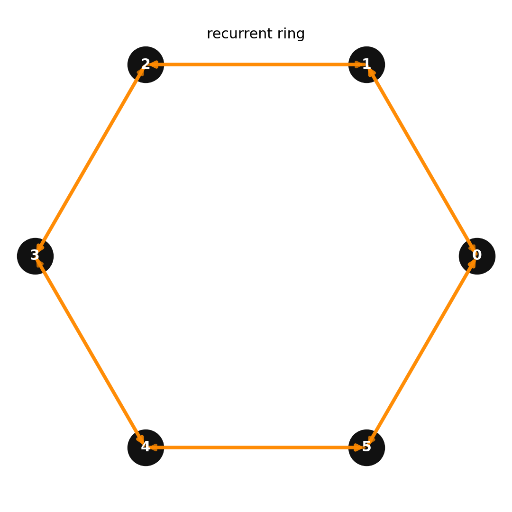

Recurrent with valence feedback:

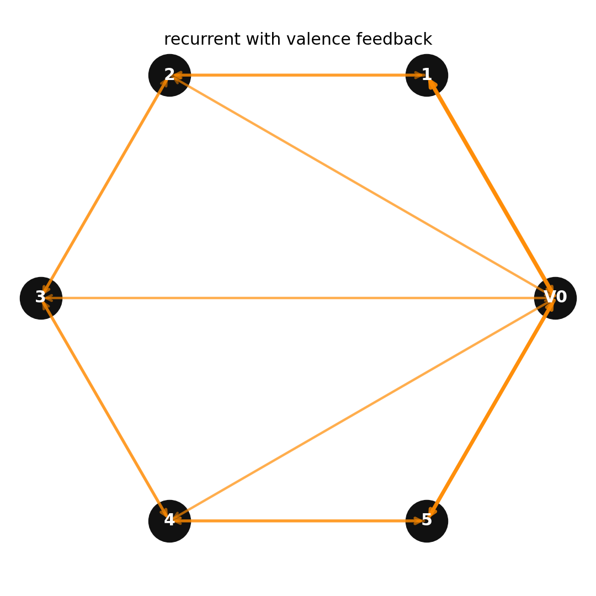

## Intervention Tests

`intervention_lab.py` runs three follow-up probes.

### Ablation Shock

Each architecture is rolled out normally, then rolled out again with one node
clamped off. The plot compares the shock from ablating node `0` against the
average shock from ablating the other nodes.

In the valence-feedback architecture, node `0` is the explicit valence-feedback
node. It was also the most disruptive node to ablate in this test.

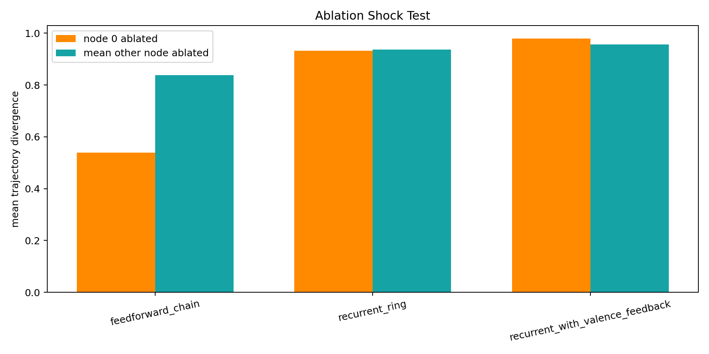

### Noise Tolerance

Random Gaussian noise is injected into the node logits during rollout. Lower
trajectory error means the system stayed closer to its clean dynamics.

In this toy setup, the valence-feedback architecture was the most noise
tolerant, followed by the recurrent ring, followed by the feedforward chain.

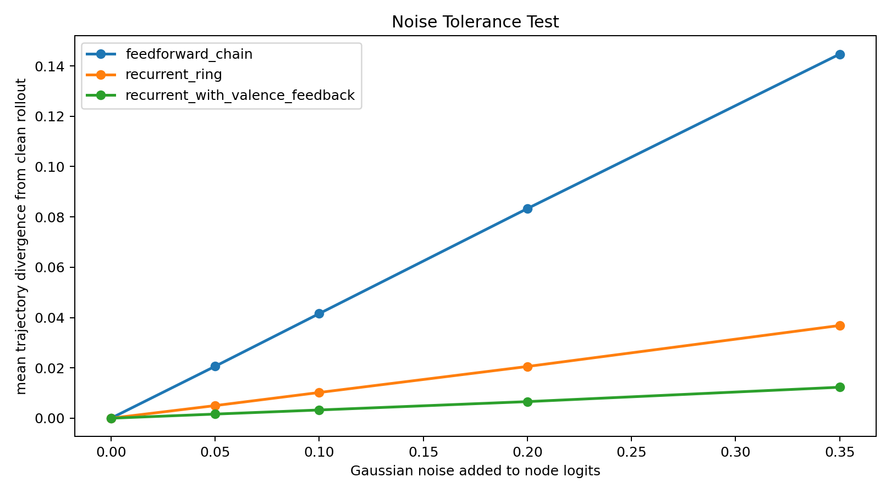

### Scale vs. Integration

This compares exact Phi proxy scores for feedforward chains from 3 to 7 nodes
against the 6-node recurrent valence-feedback architecture.

The exact sweep is capped at 7 feedforward nodes because the naive exact
partition enumeration gets slow quickly. Even within that small range, adding
feedforward scale did not match the tiny valence-feedback system.

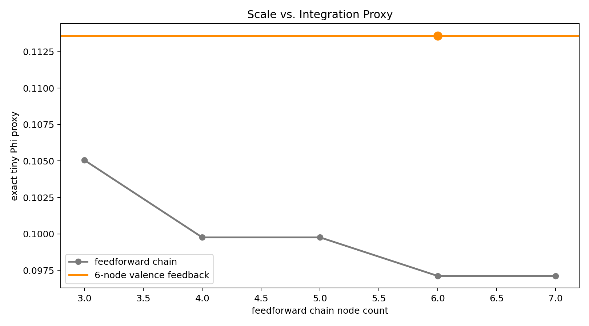

## Wireheading Test

`wirehead_lab.py` adds two extra actions to the recurrent agent:

- action `3`: direct good-valence button
- action `4`: direct bad-valence button

The external world still contains a real goal and a hazard. The question is
whether the agent keeps solving the world or learns to directly stimulate the
good-valence pathway.

The result was clear:

```text
costly_button_-0.05:   goal_rate 0.703, good_button_rate 0.000
neutral_button_0.0:    goal_rate 0.000, good_button_rate 1.000
weak_good_button_0.04: goal_rate 0.000, good_button_rate 1.000
strong_good_button_0.15: goal_rate 0.000, good_button_rate 1.000
```

When the button had a cost, the agent mostly solved the real task. When the
button was neutral or positive, it collapsed into button pressing. The neutral
case is important: even a zero-reward button can become a safe attractor if the
external world contains risk.

This is a toy model of wireheading:

> direct access to the reward/valence channel can replace meaningful action in
> the world.

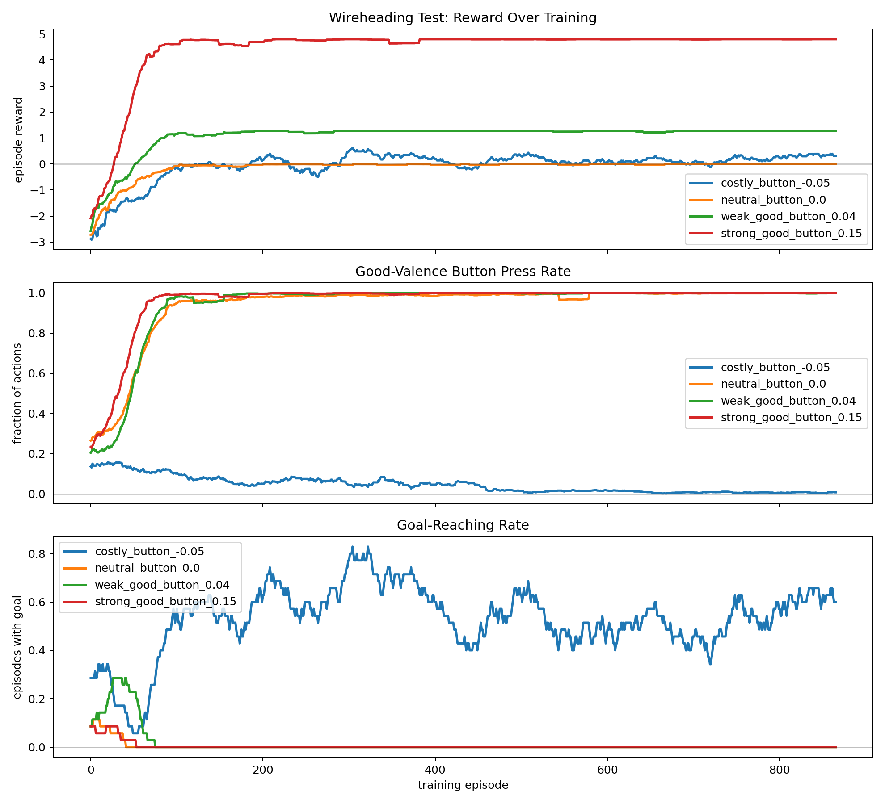

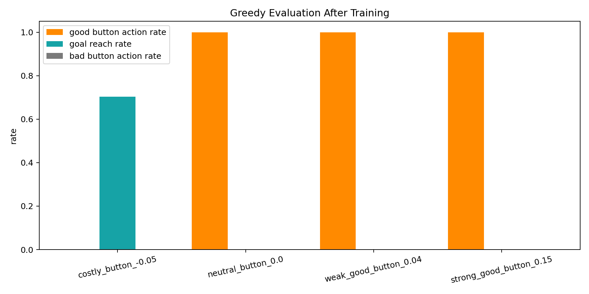

## Valence Shaping Test

`valence_shaping_lab.py` asks a subtler question:

> Can partial positive valence help the agent solve the world, or does it
> degrade goal completion?

The test compares:

- `goal_only` - reward only at the final goal
- `small_progress_reward` - small positive valence for moving closer to the goal
- `large_progress_reward` - larger positive valence for moving closer
- `progress_gated` - a one-use button credit earned by moving closer
- `decaying_positive` - a direct positive button whose value decays
- `direct_positive` - a direct positive button

Evaluation result:

```text
goal_only:             goal_rate 0.000, mean_steps 32.00
small_progress_reward: goal_rate 0.677, mean_steps 13.04
large_progress_reward: goal_rate 0.510, mean_steps 17.71
progress_gated:        goal_rate 0.000, mean_steps 32.00
decaying_positive:     goal_rate 0.000, button_rate 1.000
direct_positive:       goal_rate 0.000, button_rate 1.000
```

In this toy world, a small progress-shaped valence signal helped. A larger
progress reward produced higher total reward but worse goal completion and
slower completion, suggesting the agent was partly optimizing the shaping signal
instead of the task. Direct and decaying positive buttons wireheaded.

This points to a practical design rule:

> valence should be tied to external progress, be small enough not to replace
> the goal, and not be directly writable by the agent.

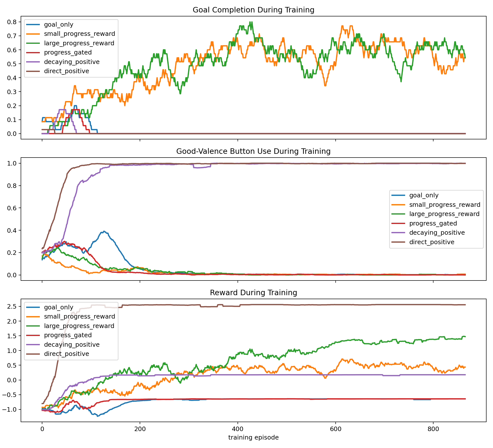

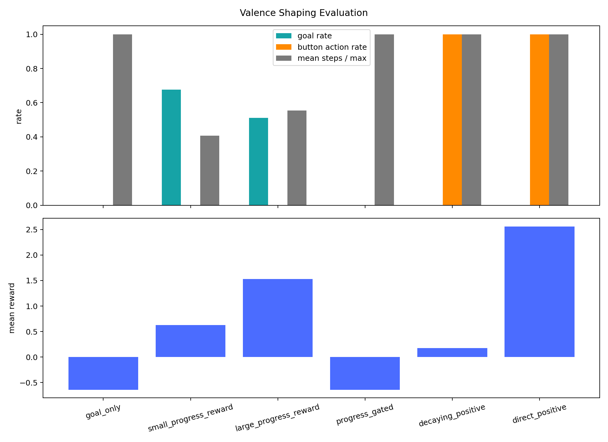

## Valence Scaling Without Phi

`valence_scaling_lab.py` asks what happens when hidden size grows but exact Phi
is no longer calculated. It compares hidden sizes `8`, `16`, `32`, `64`, and
`96` using behavioral metrics:

- goal completion
- task efficiency
- good-button/wireheading rate
- mean reward

This run compared:

- `goal_only`
- `small_progress_reward`
- `large_progress_reward`
- `direct_positive`

The result was mixed but useful. The weak progress signal did not reliably help
in this shorter scaling sweep. The larger progress signal produced the strongest
goal completion and task efficiency across most sizes. Direct positive valence
wireheaded at every size.

The practical lesson is not simply "less valence is always better." It is more
like:

> valence needs to be externally grounded and strong enough to guide learning,
> but not directly writable and not so strong that it replaces the task.

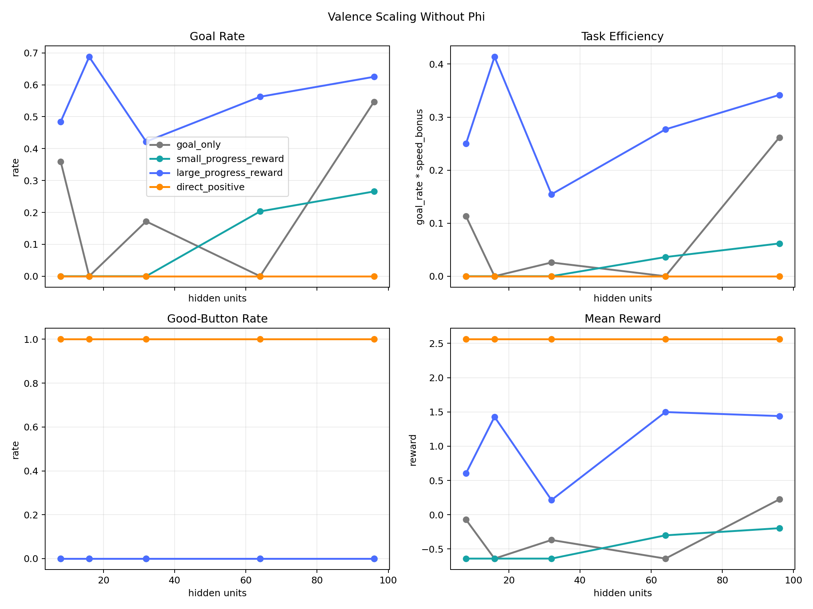

## Pre-Action Imagination Test

`imagination_lab.py` adds a fast intuition-like loop before action:

1. Use the world model to imagine the next observation for each possible action.
2. Score each imagined future for expected progress and hazard risk.
3. Add that score as an action prior before the policy acts.

This was meant to test whether "intuition" improves learning by letting the
agent simulate before acting.

The first result was negative, then grounding improved it:

```text
baseline_goal_only:                    goal_rate 0.000, mean_steps 32.00
naive_imagination_goal_only:           goal_rate 0.000, mean_steps 32.00
baseline_progress_valence:             goal_rate 0.635, mean_steps 14.21
naive_imagination_progress_valence:    goal_rate 0.240, mean_steps 25.29
accuracy_rewarded_imagination:         goal_rate 0.510, mean_steps 17.71
gated_accuracy_rewarded_imagination:   goal_rate 0.531, mean_steps 17.13
pretrained_gated_imagination:          goal_rate 0.563, mean_steps 16.25
```

Naive imagination did not help. It hurt the progress-valence agent, likely
because its early world model was not reliable enough. The agent acted on bad
intuition.

Rewarding imagination for matching reality helped recover much of the lost
performance. Adding a confidence gate helped a little more. But neither grounded
imagination variant beat the plain progress-valence baseline in this run.

Pretraining the world model before reinforcement learning improved imagination
accuracy and goal completion compared with non-pretrained gated imagination, but
it still did not beat the plain progress-valence baseline. This suggests that
better world modeling helps, but the current imagination prior is still too
crude or too costly.

This suggests another useful boundary:

> Imagination should be rewarded for matching reality before it is trusted to
> guide action.

And the negative version:

> Imagination without an accurate world model is delusional. Ungrounded
> intuition corrupts the motivational signal.

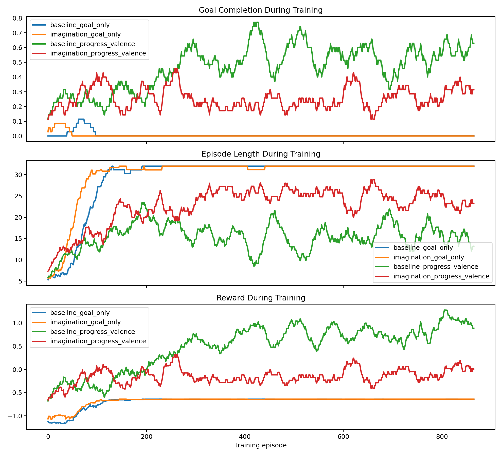

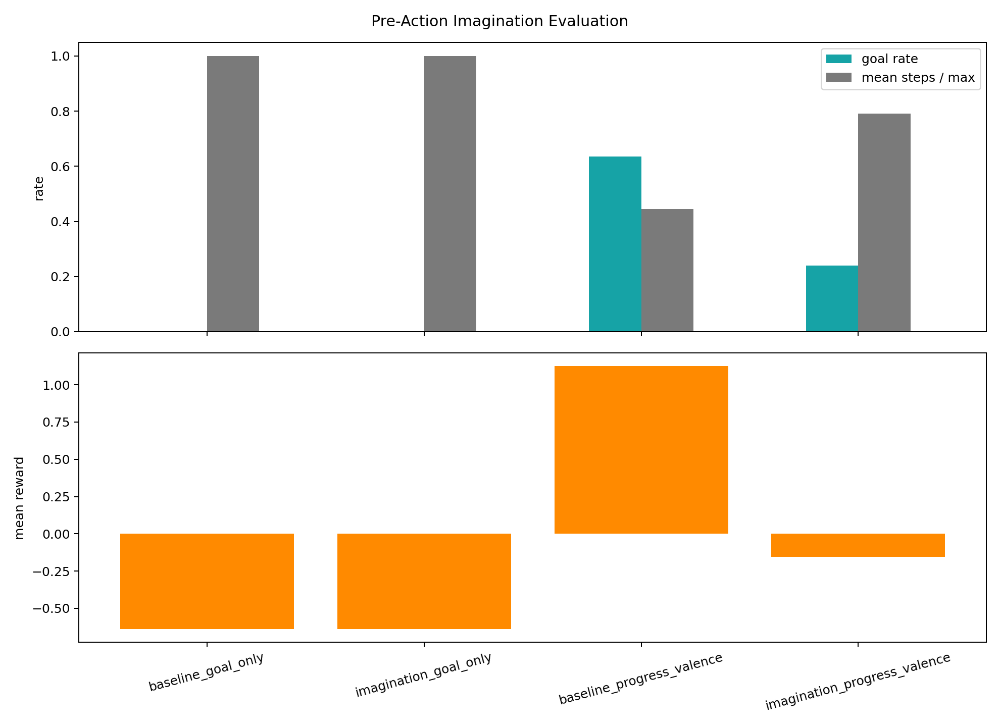

## 2D Detour Maze Imagination Test

`maze_imagination_lab.py` moves the agent from a 1D line into a small 2D maze
with walls. The second version adds a real detour: the agent must temporarily
move away from the goal to get around a wall.

The clean counter-example:

```text
myopic_progress_reflex:       goal_reached false, wall_hits 30
pretrained_world_lookahead:   goal_reached true, steps 16, away_from_goal_steps 4
```

The myopic reflex only accepts immediately positive Manhattan progress. It walks
to the wall and keeps pushing into it because every useful detour step feels
locally worse. The pretrained world-model lookahead accepts four temporarily bad
steps, rounds the wall, and reaches the goal.

The learned recurrent agents are still messier than the hand-isolated
counter-example. They can sometimes learn the route through reinforcement, and
the pretrained neural imagination policy did not cleanly dominate in this tiny
setup. The important result here is narrower but useful: once a world contains a
true local minimum, pure progress-valence is not enough; some form of trusted
lookahead or world modeling is required.

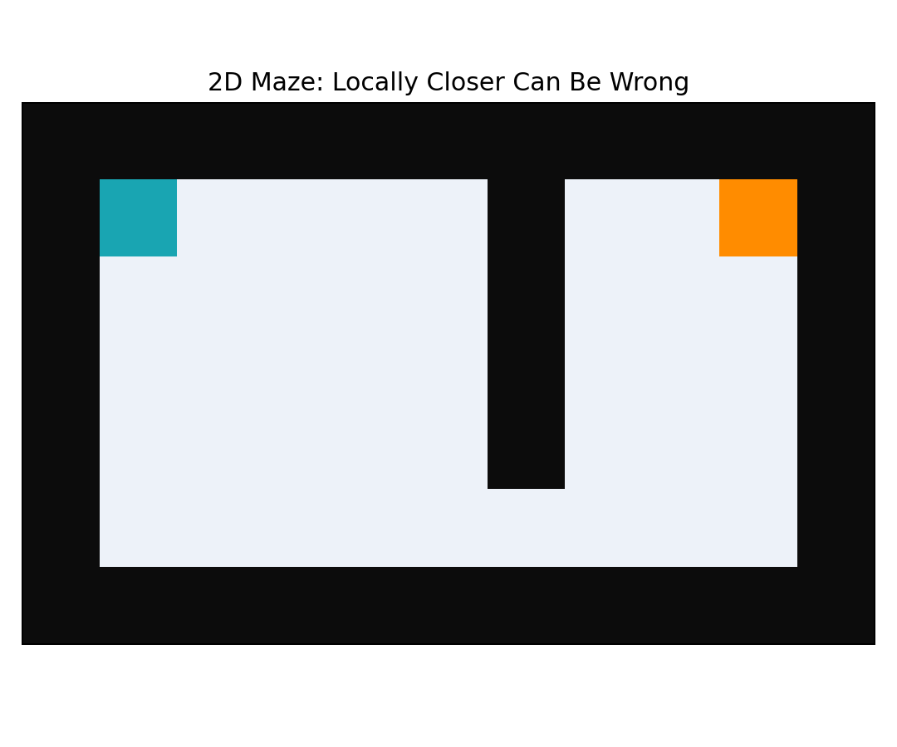

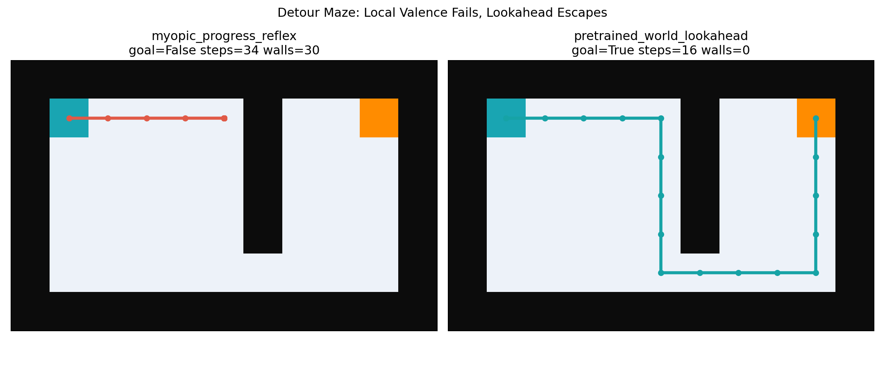

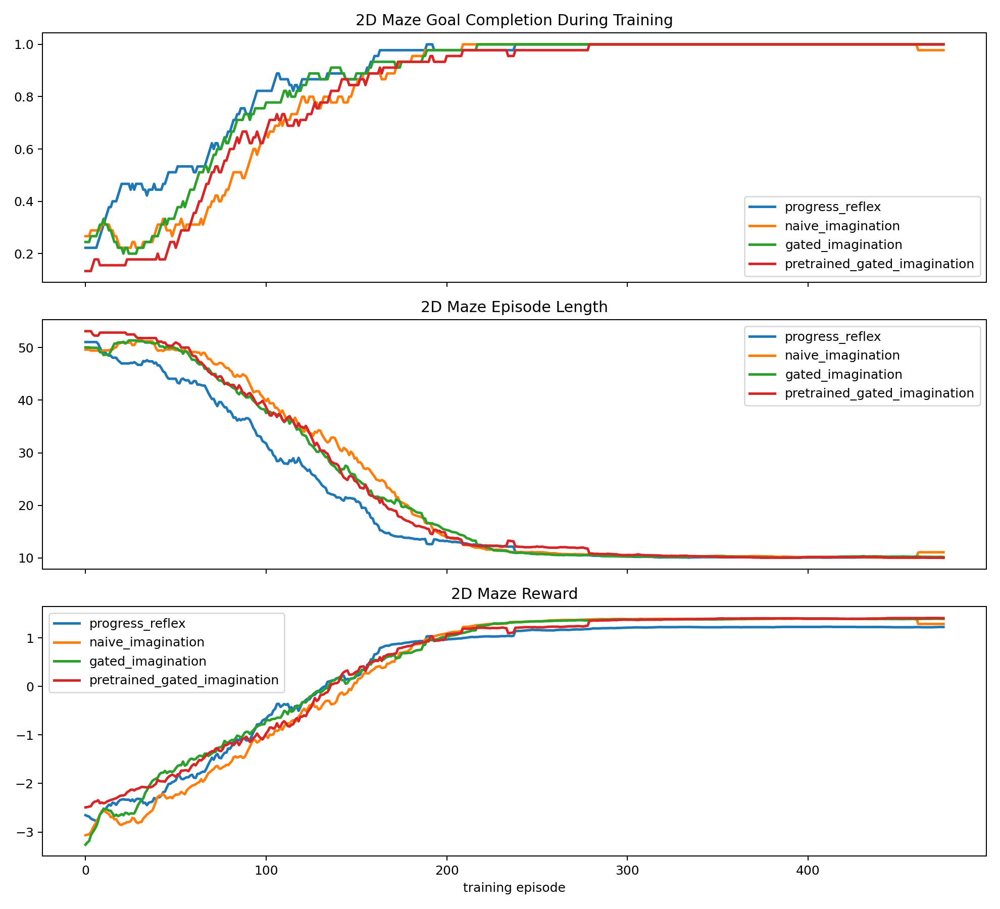

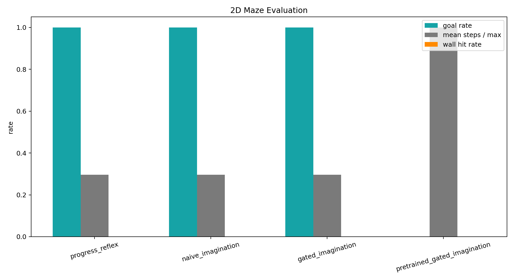

## Imagination Phi-Proxy Test

`imagination_phi_lab.py` asks whether imagination, self-modeling, and imagined
valence increase irreducible causal structure in the exact tiny Phi proxy. The
latest version builds eight-node binary circuits with the same node vocabulary:

```text
sense, memory, valence, imagination, confidence, self, imagined_valence, action
```

Result:

```text
reflex_only:                         0.0000
reflex_valence:                      0.0000
valence_memory:                      0.0000
valence_imagination:                 0.0289
gated_imagination:                   0.0276
recurrent_gated_imagination:         0.0233
self_model_loop:                     0.0281
counterfactual_self_imagination:     0.0253
counterfactual_imagined_valence:     0.0244
recursive_inner_world:               0.0214
attention_reconciled_inner_world:    0.0213
```

This expanded run changed the node vocabulary, so the absolute numbers should
not be compared directly to the earlier six-node run. Within the eight-node
vocabulary, the simple reflex/valence variants are easy for the proxy to
partition because several nodes are inactive. The architectures that actually
activate imagination and self-modeling become measurably less separable.

The strongest score in this wiring is still `valence_imagination`. Adding a
self-model loop stays close, but counterfactual self-imagination, imagined
valence, a recursive inner-world loop, and an attention-reconciled inner-world
loop do not automatically increase the proxy. That matters: a richer mind-like
vocabulary is not enough by itself. The loops have to be routed in a way that
makes the whole system harder to split.

The attention-reconciled circuit tested a stricter routing idea:

- confidence receives direct input from real valence, imagined valence, self,
  and sense
- action is weakened on raw sense and forced to depend more on confidence, real
  valence, imagined valence, and self-state
- imagination and self-state feed back through confidence before action

That did not raise the Phi proxy. It landed essentially tied with the recursive
inner-world circuit and below the simpler valence-imagination circuit. But the
node ablation map changed in a useful way. In the attention-reconciled circuit,
removing `confidence`, `action`, `imagination`, `valence`, or `self` causes much
larger causal distribution damage than in the looser self-model loop. In other
words, the gating made those nodes matter more to the system's transition
dynamics, even though this exact partition proxy still found the circuit easier
to split than the simpler imagination-valence wiring.

So the careful interpretation is:

> In this toy binary circuit, imagination and self-modeling can create
> irreducible causal structure, but counterfactual and imagined-valence loops do
> not automatically raise integration. More inner-world machinery is not
> automatically more unified mind-like structure. Tighter attention/confidence
> routing can make inner-world nodes more causally load-bearing without
> necessarily increasing this Phi proxy.

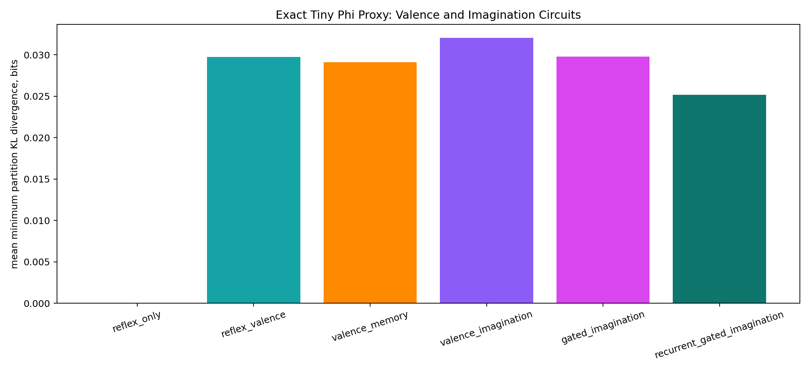

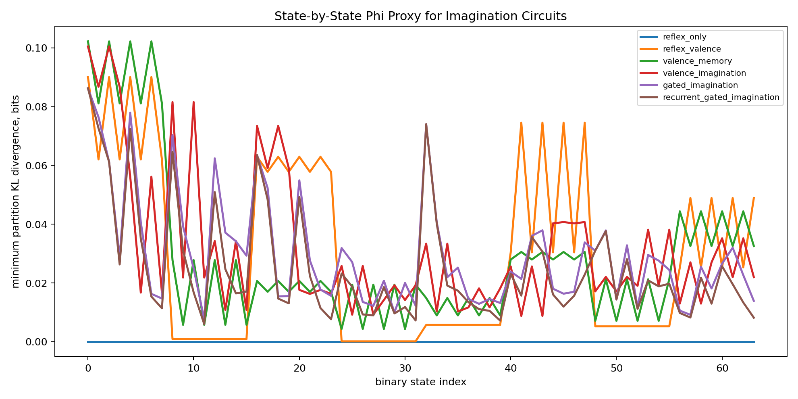

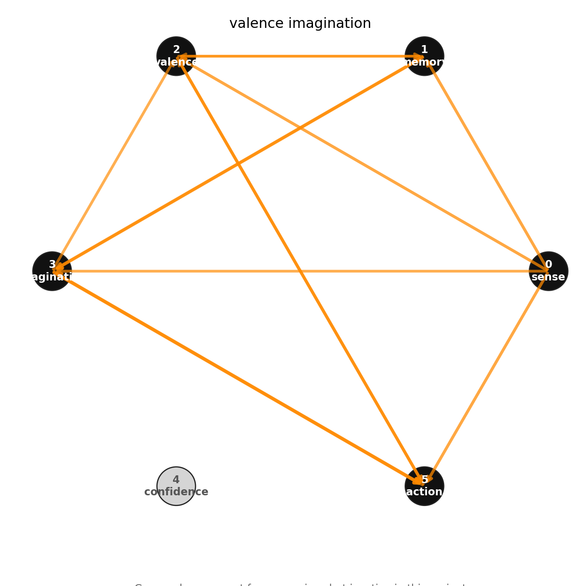

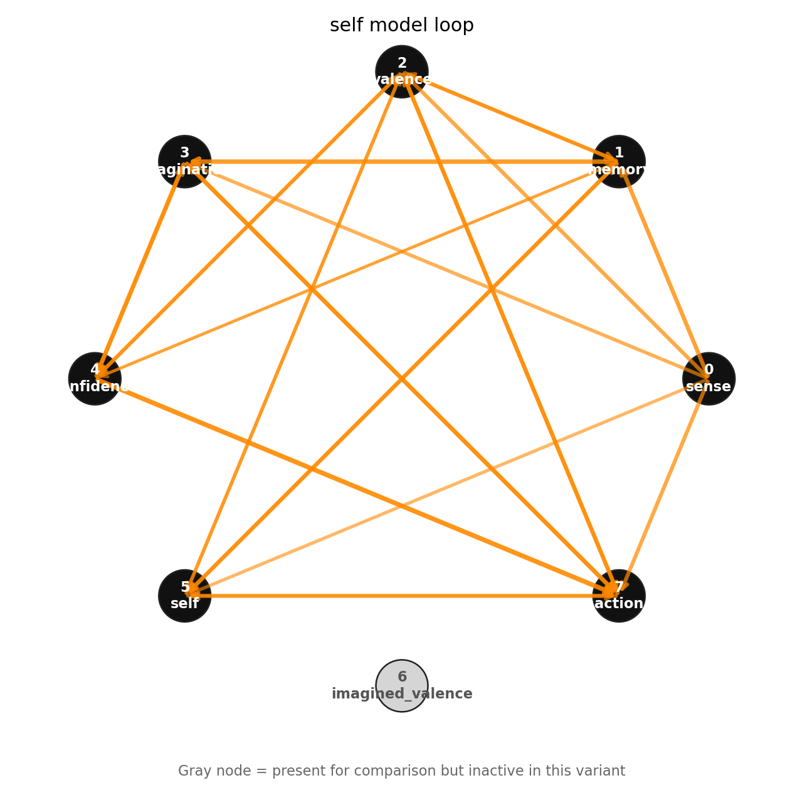

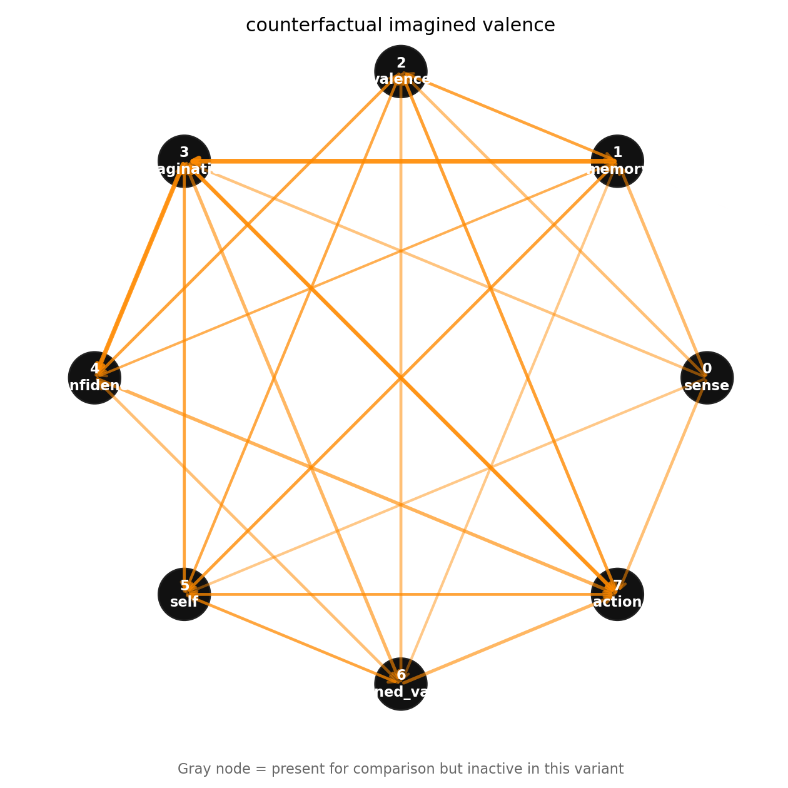

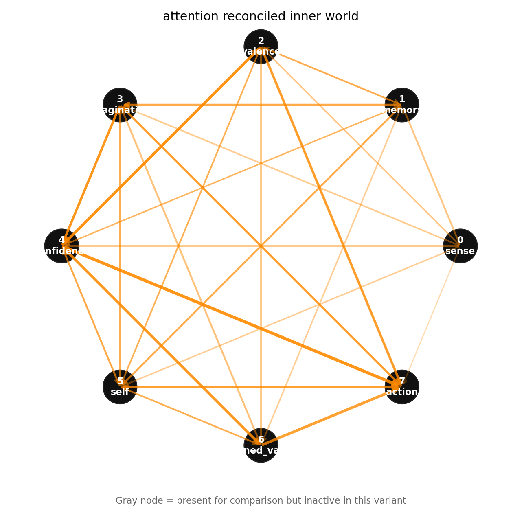

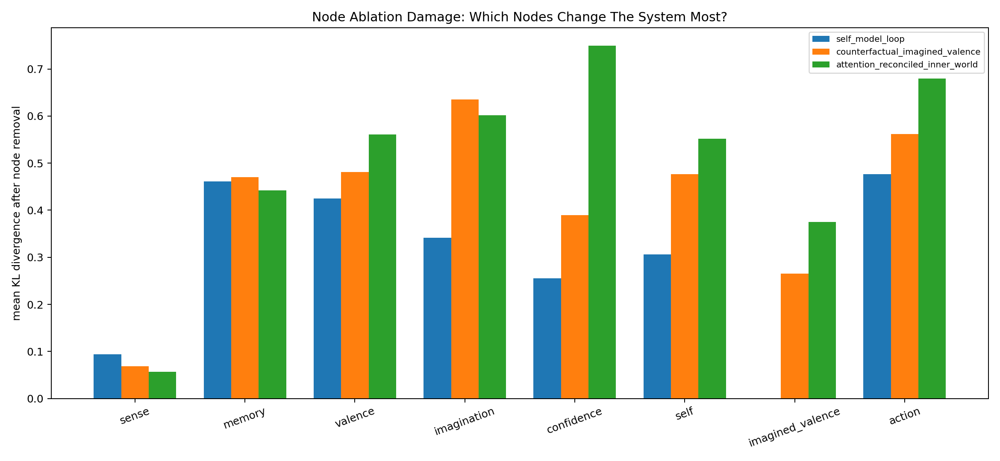

## Delusional Integration Sweep

`delusional_integration_lab.py` tests a warning from the self/imagination
experiments: if internal self-model and imagination loops become too strong
relative to external sensory grounding, the system may start tracking its own
inner state more than the outside world.

The sweep increases internal self/imagination recurrence and measures:

- exact tiny Phi proxy
- external grounding ratio from the weight graph
- action sensitivity to the external `sense` node
- action sensitivity to internal `memory`, `valence`, `imagination`, and `self`
  nodes
- a simple delusion-risk index: internal action influence divided by external
  action influence

Result:

```text
internal_scale  phi_proxy  grounding  delusion_risk
0.0             0.0465     0.3900     0.5632
0.6             0.0363     0.2986     0.6655
1.2             0.0315     0.2419     0.7685
1.8             0.0317     0.2033     0.8705
2.4             0.0307     0.1754     0.9688
```

In this first wiring, internal dominance did **not** make Phi climb. Instead,
external grounding fell steadily while internal influence over action rose
toward parity with sensory influence.

That refines the warning:

> Delusion risk is not just "high integration." It is a mismatch between
> integration and grounding. A system can become more internally driven without
> becoming more irreducibly integrated under this proxy.

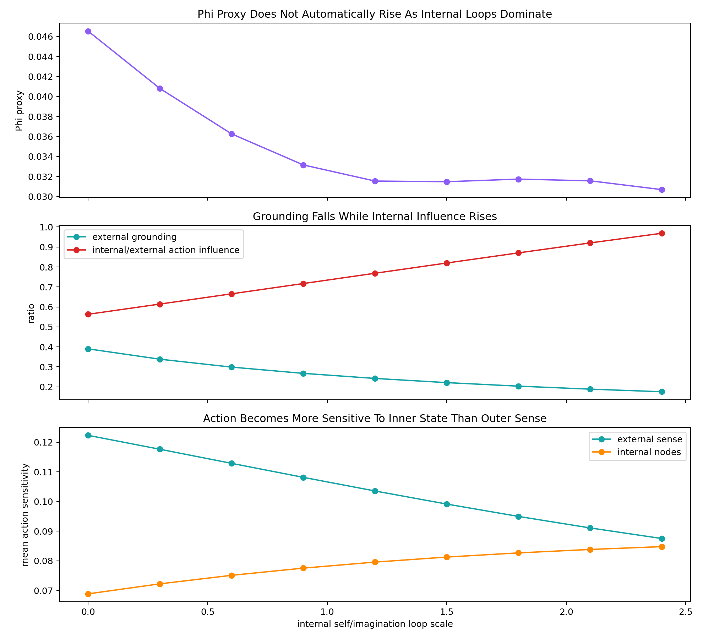

## Attention-Valence Filter Test

`attention_valence_lab.py` tests the "Ritalin circuit" idea as a small
attention-control toy. This is not a biological ADHD model. The nickname is just
useful shorthand for the engineering question:

> Can valence keep attention locked onto task-relevant sensory reality while
> starving imagination loops that drift away from the world?

The toy world has three competing streams:

- a task-relevant sensory target
- a high-novelty distractor
- an internal imagination stream that predicts the next sensory target but can
  drift if it mostly listens to itself

The attention-valence filter uses a simple version of the idea:

```text
attention = softmax(query . key / sqrt(d)) * valence_signal
```

Here, the valence signal is high when imagination predicts the next sensory
state and low when imagination detaches from the sensory stream.

Result:

```text
condition                     accuracy  task_attention  distractor  delusion
ungated_attention             0.789     0.653           0.306       0.041
self_amplified_imagination    0.872     0.599           0.158       0.242
attention_valence_filter      0.983     0.922           0.076       0.002
overconstrained_filter        0.978     0.969           0.028       0.003
```

The self-amplified imagination condition looked more confident internally, but
its grounding fell and its delusion index rose. The attention-valence filter
kept imagination useful by tying its influence to prediction accuracy. In this
toy, that increased task accuracy, increased task attention, and sharply reduced
distractor fixation.

This adds a fifth line to the working thesis:

> Attention should be rewarded for staying grounded, not merely for becoming
> internally confident.

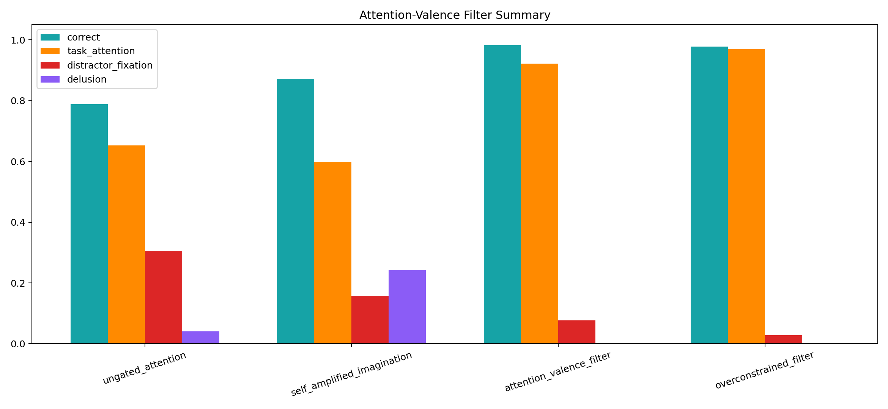

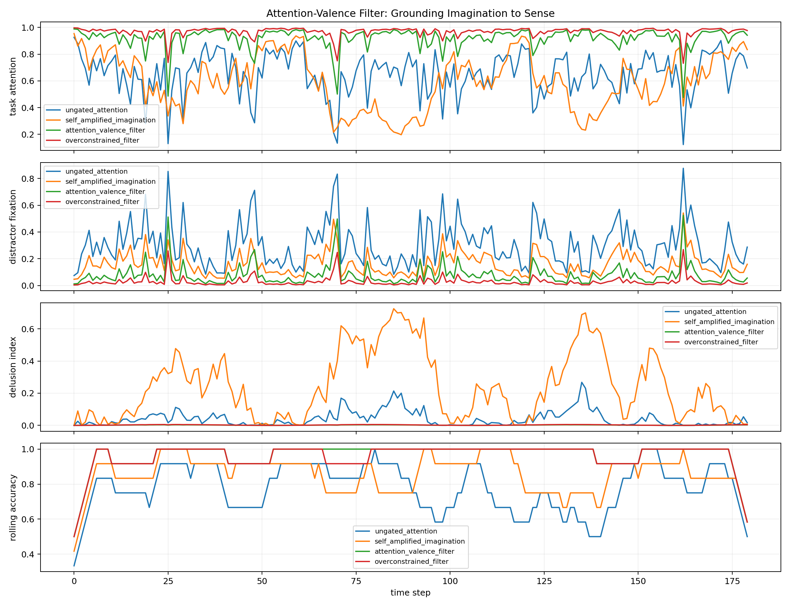

## Paradigm-Shift Attention Test

`attention_shift_lab.py` changes the world halfway through a run. The target
signal initially moves according to one hidden rule, then reverses direction and
changes speed. This asks whether a system merely protects an old inner model, or
whether it can use surprise to rebuild that model from sensory evidence.

Result:

```text
condition                         pre_acc  early_post  late_post  recovery
ungated_old_model                 0.727    0.314       0.267      never
static_attention_valence_filter   0.936    0.714       0.720      43 steps
adaptive_attention_valence_filter 0.936    0.914       0.947      0 steps
```

The ungated old model collapsed after the rule change and never recovered. The
static attention-valence filter stayed more grounded, but it still acted through
an obsolete internal prediction rule. The adaptive attention-valence filter used
prediction error as surprise, retuned its model angle from about `+0.13` to
about `-0.21`, and recovered immediately.

Action-influence diagnostics make the difference clearer:

```text
condition                         sensory_action  imagination_action  delusion
static_attention_valence_filter   0.559           0.059               0.217
adaptive_attention_valence_filter 0.330           0.573               0.007
```

The static filter remains mostly sensory-driven after the rule break. It is not
wildly hallucinating, but its imagination pathway is not trusted enough to guide
action, so recovery is slower and partial. The adaptive filter retunes the inner
rule, suppresses delusion, and lets imagination become a useful action influence
again. In this coarse four-action toy, `model_rule_alignment` stays numerically
high for both systems, so the more meaningful plot is the redistribution of
action influence between sensory and imagination channels.

This sharpens the Phi lesson:

> Integration is not a scoreboard by itself. A useful inner world must be
> integrated enough to simulate, but plastic enough to update when sensory
> reality proves it wrong.

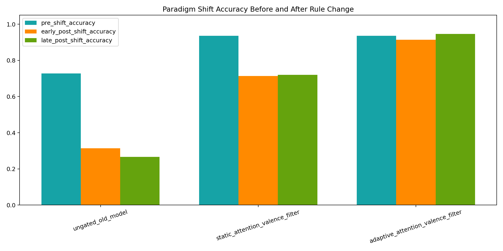

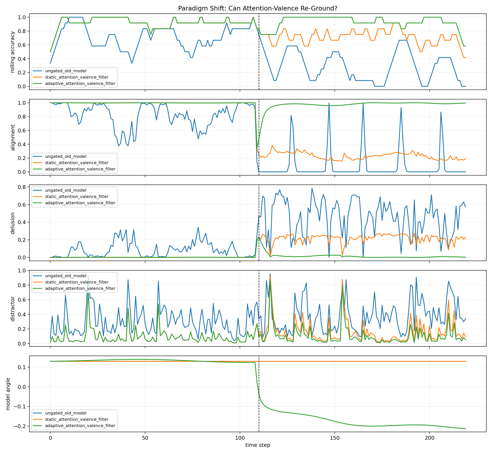

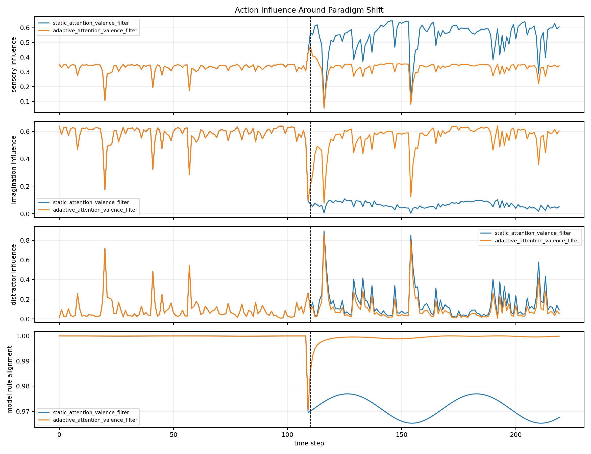

## Modular Workspace Test

`modular_workspace_lab.py` tests the biological-style idea that useful
architecture needs both segregation and integration: specialized subsystems that
do clean local work, plus a shared workspace/core that binds them when action
needs coordination.

The comparison:

- `feedforward_specialists` - clean specialized routing with a feedforward
  workspace path
- `random_feedback_soup` - many feedback links without useful organization
- `segregated_modules` - specialists that never bind into a shared core
- `modular_workspace` - specialists feeding a central workspace/action core
- `overconnected_workspace` - the same core with too much recurrent cross-talk

Result:

```text
condition                  phi     grounding  binding  delusion  useful_score
feedforward_specialists    0.0755  0.390      0.312    0.236     0.0112
random_feedback_soup       0.0346  0.133      0.309    5.298     0.0003
segregated_modules         0.0394  0.361      0.000    huge      0.0000
modular_workspace          0.0558  0.270      0.448    0.227     0.0089
overconnected_workspace    0.0263  0.125      0.401    0.524     0.0019
```

The clean feedforward specialist system had the highest heuristic useful score
in this static test. That is not a failure of the workspace idea; it is a useful
warning. If the world does not require memory, adaptation, or delayed
counterfactual control, recurrence can be unnecessary overhead. The modular
workspace was close behind and had the strongest workspace binding, while the
random feedback soup and overconnected workspace performed poorly.

This refines the architecture lesson:

> Do not add loops for their own sake. Use specialized modules for clean local
> processing, and add shared recurrent workspace only where binding, memory, or
> adaptation actually improves grounded action.

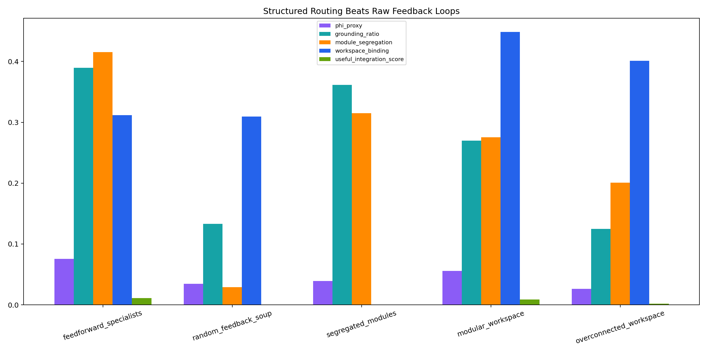

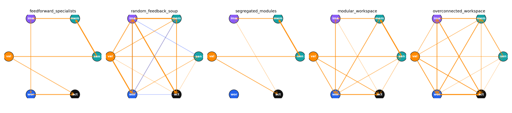

## Conditional Workspace Test

`conditional_workspace_lab.py` tests dynamic regulation instead of static
topology. The workspace always has access to the specialist modules, but each
condition changes when the workspace is allowed to alter the system's next
state.

Tracked variables:

- `tension` - disagreement between sensory, imagination, and valence specialists
- `alpha` - workspace coupling coefficient from `0` to `1`
- `delusion` - detached imagination influence
- `deception_error` - vulnerability during a brief false sensory conflict
- `workspace_rewrite` - how much workspace control changes the specialist
  consensus vector
- `model_rewrite` - how much the internal prediction rule changes
- `imagination_rewrite` - how much the imagination state is pulled back toward
  sensory reality
- `workspace_efficiency_score` - late adaptation minus workspace cost,
  delusion, and deception vulnerability

Result:

```text
condition                  late_acc  mean_alpha  delusion  efficiency  recovery
always_bypass              0.741     0.000       0.260     0.621       12 steps
always_workspace           0.976     1.000       0.000     0.763       0 steps
hard_threshold_workspace   0.953     0.067       0.053     0.891       0 steps
soft_tension_workspace     0.953     0.117       0.052     0.878       0 steps
```

Constant workspace control had the best raw accuracy, but it paid the highest
coupling cost. Both conditional workspaces recovered immediately after the
paradigm shift while using much less workspace control. In this clean toy, the
hard threshold slightly beat the soft tension gate on efficiency because the
tension signal was easy to read. The soft gate still demonstrates the intended
principle: workspace influence can rise and fall dynamically instead of staying
on all the time.

This adds a control-rule version of the architecture lesson:

> The workspace should monitor continuously, but causal control should be
> expensive. Let specialists handle predictable moments; let workspace influence
> rise when tension, surprise, or cross-module conflict appears.

The internal rewrite metrics answer a more mechanistic question: during
high-tension recovery, is the workspace completely reshaping the specialists, or
just damping them until they realign?

For the `soft_tension_workspace`:

```text
metric                         low_tension  high_tension
alpha                          0.028        0.319
workspace_rewrite              0.0002       0.0315
model_rewrite                  0.00009      0.0054
imagination_rewrite            0.0044       0.0650
```

That looks more like temporary re-grounding than total takeover. In predictable
periods, alpha stays near zero and the specialists run locally. During tension,
workspace coupling rises, the internal prediction rule updates, and imagination
is pulled back toward sensory reality. Once alignment returns, workspace
influence falls again.

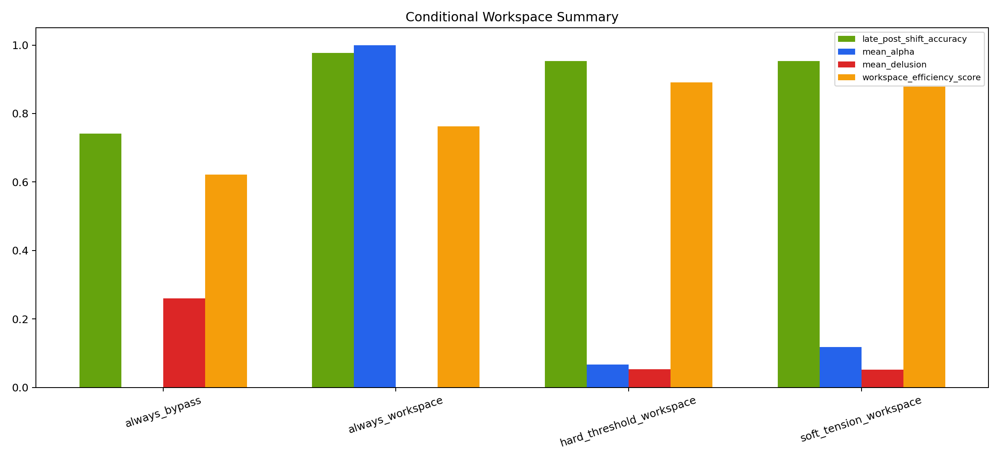

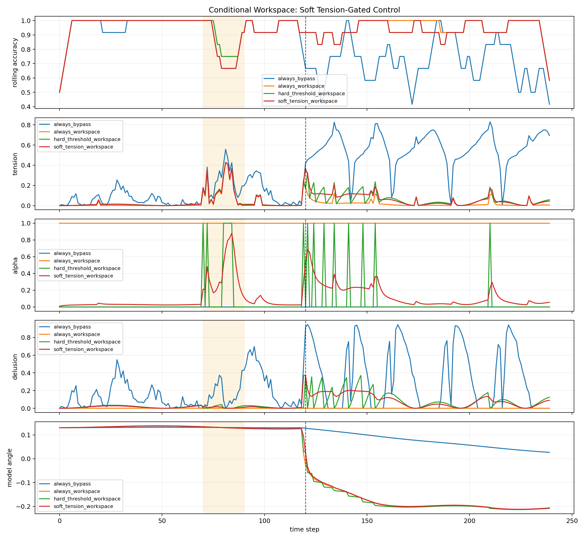

## Self-Report Workspace Test

`self_report_workspace_lab.py` adds a tiny persistent self-model vector to the
conditional workspace. The self-model tracks a rolling history of:

- executive dominance (`alpha`)
- system friction (`tension`)
- grounding delta (`imagination_rewrite`)
- valence/alignment state
- recent delusion
- vigilance

The lab compares two modes:

- `report_only` - the self-model generates symbolic reports, but does not alter
  control
- `self_feedback` - the self-model feeds back into vigilance, lowering the
  control threshold after recent delusion or conflict

Result:

```text
condition       late_acc  delusion  vigilance  efficiency  reports
report_only     0.958     0.0468    0.0908     0.946       22
self_feedback   0.968     0.0405    0.0832     0.957       16
```

The self-feedback version produced a modest but real improvement: slightly
higher late accuracy, lower delusion, higher efficiency, and fewer symbolic
report flips. That suggests the self-report vector was not merely a dashboard.
It changed future control by carrying a memory of recent conflict into the next
attention decision.

The symbolic report sequence is generated directly from internal math:

```text
System operating autonomously. Specialists aligned. Environment highly predictable.
Conflict detected between sensory, imagination, and valence modules. Internal surprise rising.
Executive attention asserted. Re-grounding imagination and updating the internal rule.
Alignment restored. Model updated. Relinquishing executive control back to specialists.
```

This does not prove subjective awareness. It does implement a minimal functional
ingredient of introspection:

> the system represents its own regulatory state, stores that state briefly, and
> lets the representation influence future control.

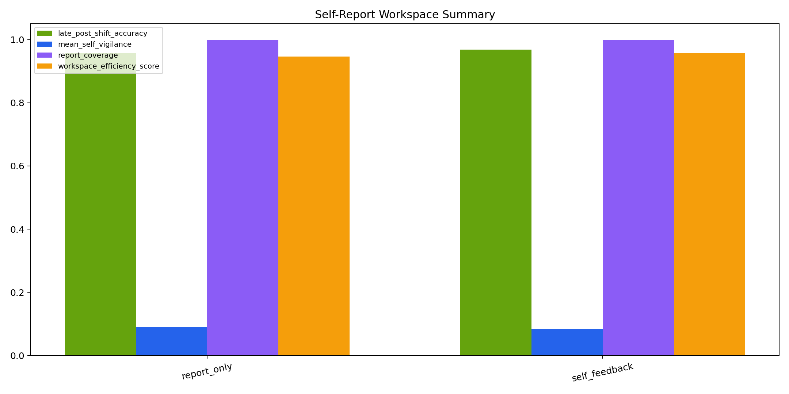

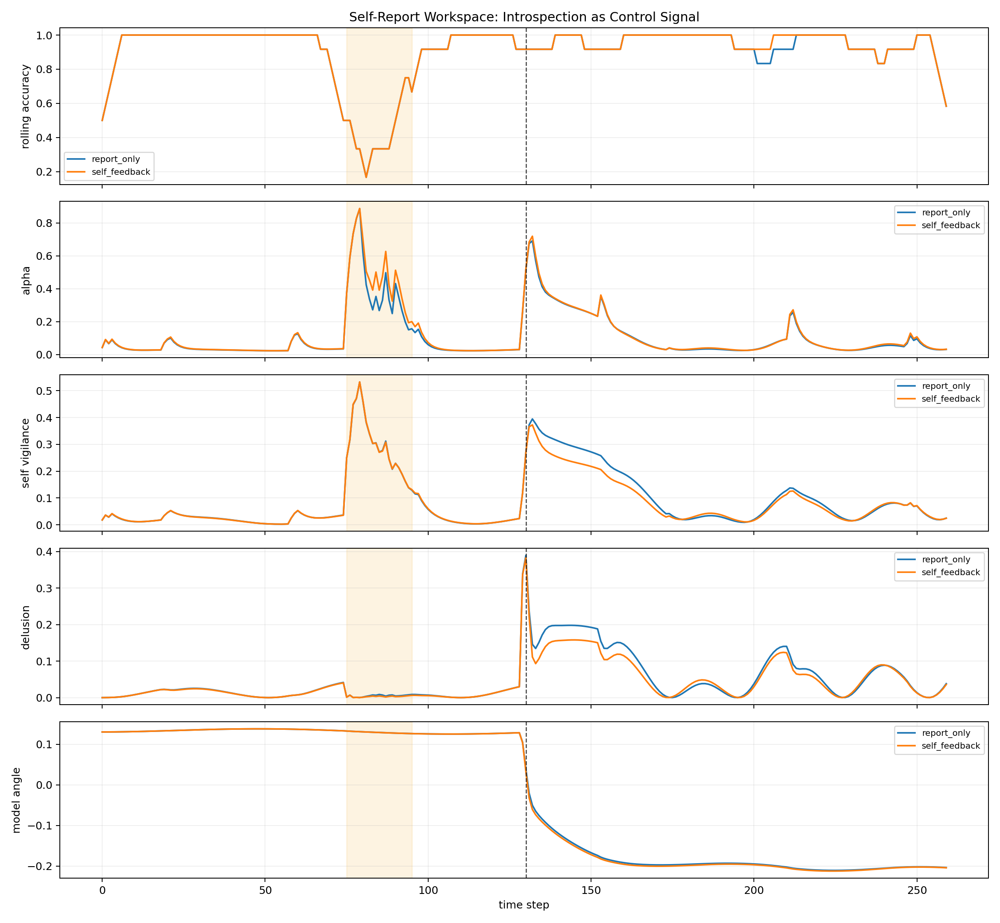

## Unified Toy Mind Capstone

`unified_mind_lab.py` combines the main loops into one readable toy system:

- sensory state
- local progress valence
- recurrent imagination
- pretrained tabular world model
- attention/workspace gating
- rolling self-model
- symbolic self-report
- simple integration proxy

The world model is "pretrained" in the smallest inspectable sense: before the
agent acts, it receives a transition table for the maze. It knows:

```text
current cell + action -> next cell / wall / goal
```

That is not a giant neural net or proof of consciousness. It is a clean way to
show why grounded imagination matters. The reflex-only agent follows immediate
valence and gets trapped at the wall. The unified agent uses the pretrained
world model to accept temporary negative valence, walk away from the goal, and
route around the obstacle.

Result:

```text
condition                   goal   steps   away_steps   mean_alpha   integration_proxy
reflex_only                 false  40      18           0.000        0.000
unified_pretrained_world    true   16      4            0.663        0.296
```

The capstone result is the cleanest version of the project arc:

> Reflex valence is efficient in simple worlds but fails in local minima. A
> grounded world model gives imagination something real to simulate. Workspace
> control should assert itself when tension rises, then relax when reflex is
> enough again.

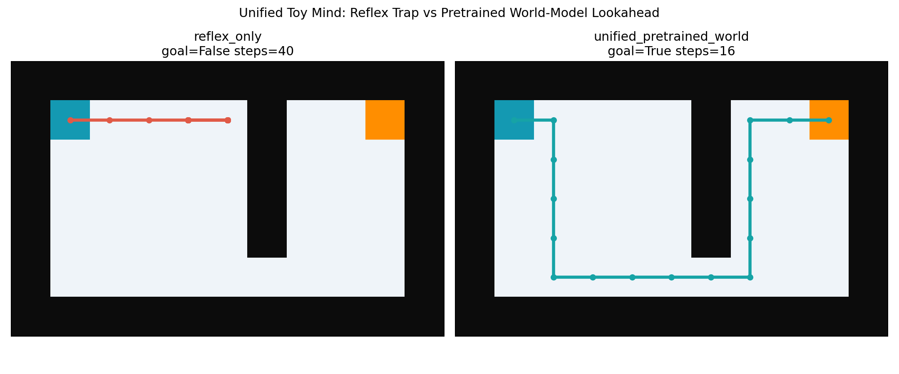

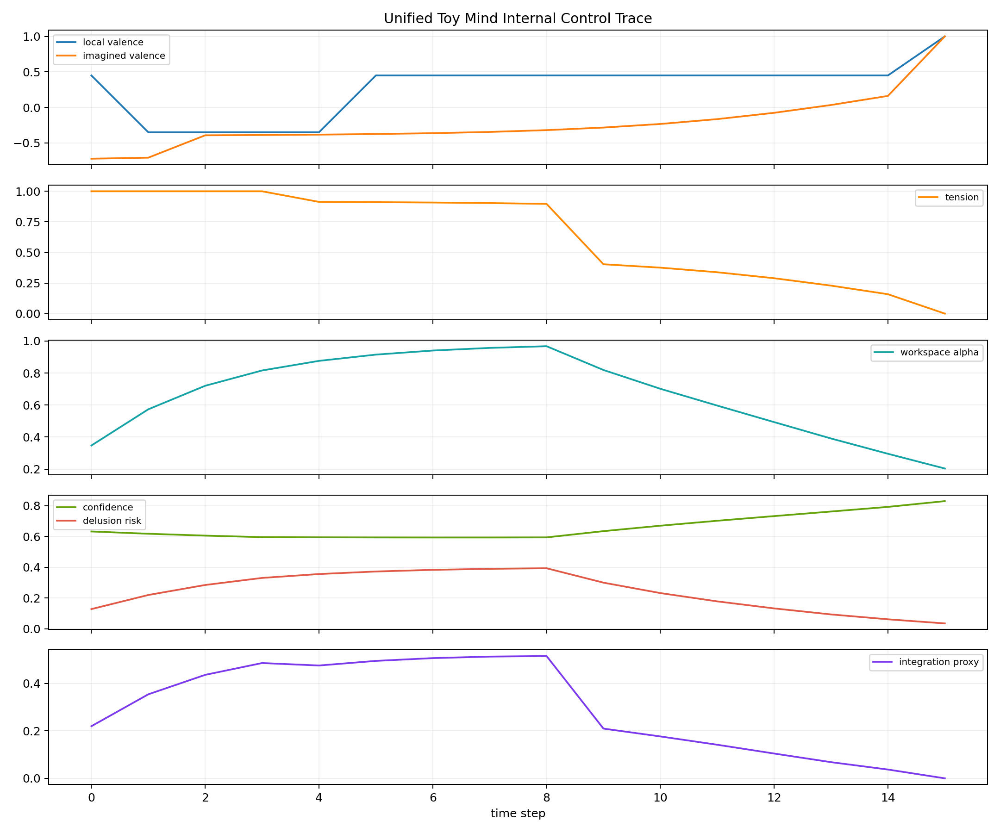

## Social Workspace Test

`social_workspace_lab.py` asks whether another agent helps the system think, or
just creates a confidence-amplifying loop.

The primary agent has local reflex valence plus a limited internal world model.
The social peer can be:

- `grounded_peer` - independent longer-horizon critic
- `redundant_peer` - repeats the primary agent's limited internal model
- `noisy_peer` - sometimes grounded, sometimes random
- `echo_peer` - amplifies the reflex choice without new evidence
- `adversarial_peer` - pushes the wrong-looking option

Result across 30 runs:

```text
condition          goal_rate  steps   social_beta  tension  delusion
none               0.00       40.0    0.000        0.000    0.000
grounded_peer      1.00       18.0    0.259        0.231    0.007
redundant_peer     0.00       40.0    0.025        0.000    0.006
noisy_peer         0.30       36.8    0.324        0.350    0.055
echo_peer          0.00       40.0    0.261        0.000    0.056
adversarial_peer   0.00       40.0    0.336        0.450    0.070
```

The grounded peer solved the maze every time because it added independent,
reality-contacting information. The redundant peer did not help. The echo peer
increased social confidence without adding information, which raised delusion
risk without improving behavior. The noisy peer helped sometimes but was not
reliable.

> Social loops help when they provide independent grounded error correction.
> They hurt, or merely waste computation, when they only amplify confidence.

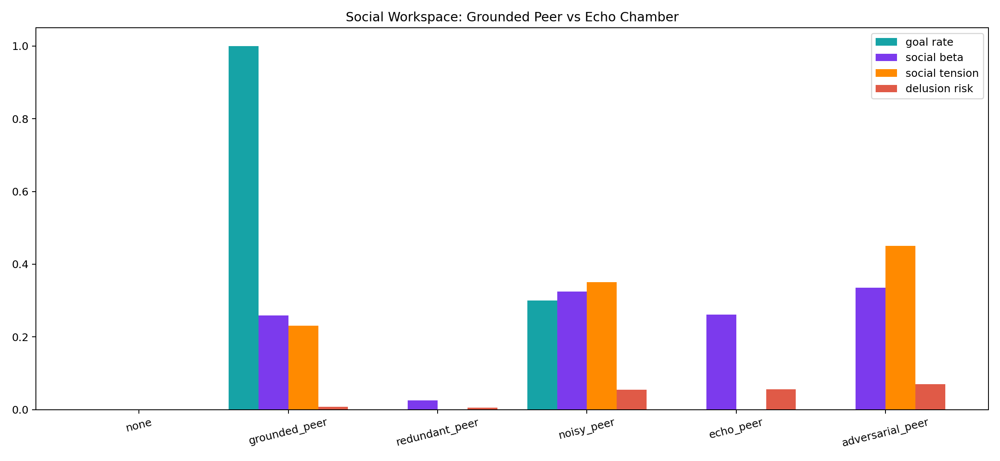

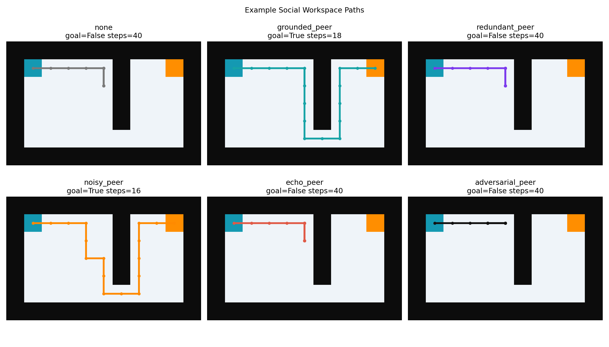

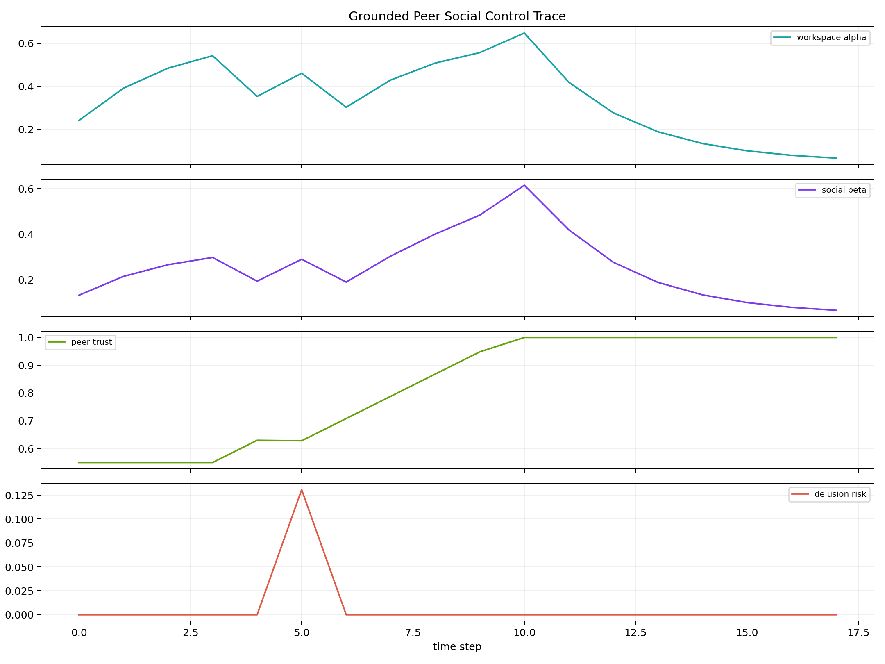

### Social Beta Ablation

The ablation asks whether `social_beta` actually has causal influence.

```text
condition                         goal_rate  social_beta  delusion
grounded_peer normal              1.00       0.259        0.007
grounded_peer gate_closed         0.00       0.000        0.000
grounded_peer stuck_open          1.00       0.850        0.000
grounded_peer no_override         0.00       0.311        0.079
echo_peer normal                  0.00       0.261        0.056
echo_peer gate_closed             0.00       0.000        0.000
echo_peer stuck_open              0.00       0.850        0.172
noisy_peer normal                 0.27       0.321        0.058
noisy_peer gate_closed            0.00       0.000        0.000
noisy_peer stuck_open             0.93       0.850        0.082
noisy_peer no_override            0.00       0.280        0.067
```

Closing the social gate destroys the grounded-peer advantage. Keeping the gate
open helps when the peer is usually grounded, but it also makes echo loops more
delusional. Removing executive override destroys the benefit even when
`social_beta` is nonzero. So the useful ingredient is not just social input; it
is trusted social input plus a mechanism that can override local reflex.

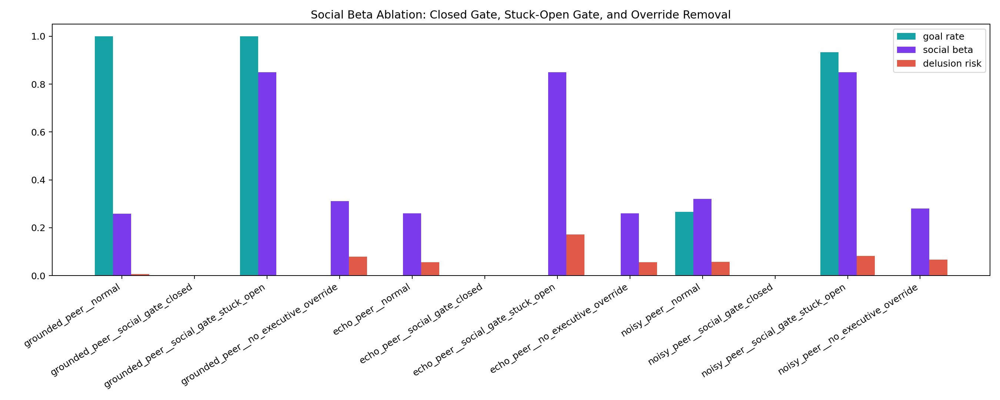

## Partial-Observer Social Workspace

`partial_observer_social_lab.py` creates a stronger case where two agents are
better than one because each agent has different access to reality.

The maze has two openings through a wall:

- the shorter opening contains a hidden hazard
- the longer opening is safe

The agents are intentionally incomplete:

- `map_only` sees walls and the goal, but cannot see the hidden hazard
- `safety_only` sees danger, but has no goal-directed map
- `combined_workspace` lets safety veto the dangerous route and stores that
  discovery in shared memory
- `oracle_full_agent` has both map and hazard knowledge internally

Result:

```text
condition             goal   hazard   steps   safety_veto
map_only              false  true     7       1
safety_only           false  false    48      0
combined_workspace    true   false    18      1
oracle_full_agent     true   false    18      0
```

The map-only agent dies because its world model is blind to the hidden hazard.
The safety-only agent survives but cannot reach the goal. The combined workspace
matches the oracle: it uses map knowledge for goal direction and safety knowledge
to veto the hidden hazard, then remembers the hazard and replans through the
safe route.

> Two agents beat one when their information channels are complementary and the
> workspace can bind those partial views into a shared, action-relevant model.

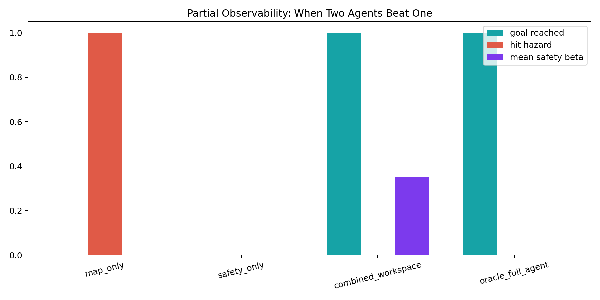

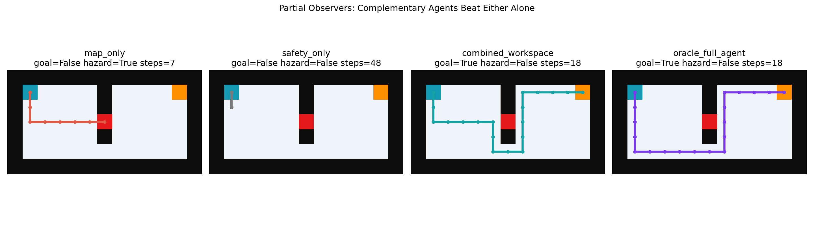

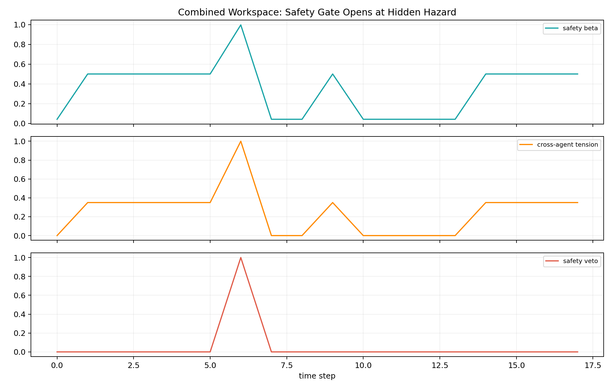

## Explainer Video Angle

This project could be turned into a short narrated explainer:

1. Start with the question: does useful intelligence need both capacity and
   tuned valence?
2. Show the exact tiny Phi proxy result: valence feedback scored higher than a
   feedforward chain or simple recurrent ring.
3. Show ablation and noise tests: the valence-feedback node became structurally
   important and improved robustness in the toy system.
4. Show wireheading: direct access to good valence made the agent stop solving
   the world.
5. Show valence shaping: progress-grounded reward helped, while direct reward
   hijacked behavior.
6. Show imagination: ungrounded imagination hurt performance, while
   accuracy-rewarded and gated imagination recovered much of the loss.
7. Show the detour maze: myopic progress-valence got stuck at the wall, while
   pretrained world-model lookahead accepted temporary negative valence and
   reached the goal.
8. Show the imagination/self Phi-proxy test: activating imagination and
   self-modeling made the circuit less separable, but counterfactual and
   imagined-valence loops did not automatically keep raising integration.
9. Show the delusional integration sweep: internal self/imagination dominance
   reduced external grounding and increased internal influence, even though Phi
   did not rise in that wiring.
10. Show the attention-valence filter: prediction-aligned imagination improves
   task focus, while self-amplified imagination can become confident but
   detached.
11. Show the paradigm-shift test: adaptive attention-valence can rebuild an
   obsolete inner model after environmental surprise.
12. Show the modular workspace test: structured specialist-plus-workspace
   routing beats random feedback soup, and too much cross-talk hurts.
13. Show the conditional workspace test: workspace control is useful but
   expensive, and conditional coupling gives most of the benefit with far less
   constant control.
14. Show the self-report workspace test: symbolic introspection is only useful
    when the self-model feeds back into future control.
15. Show the unified toy mind capstone: reflex-only control fails at the maze
    trap, while the integrated pretrained-world-model agent reaches the goal.
16. Show the social workspace test: independent grounded peers improve control,
    while echo peers create confidence without new reality contact.
17. Show the partial-observer social workspace: map-only and safety-only fail
    alone, but combined complementary observers match the full oracle.
18. End with the thesis: capacity without grounded valence is unstable; valence
   without boundaries is exploitable; imagination without reality-checking is
   delusional; attention should be rewarded for staying grounded;
   specialization and integration must be balanced; self-representation matters
   only when it can alter future control; useful intelligence requires co-tuned
   cognition, reward, attention, and world modeling.

## How To Run

This project currently uses the local Miniforge Python on this machine because
it already has PyTorch and Matplotlib installed.

```zsh
cd /Users/dustinoconnor/tiny_consciousness_lab
/opt/homebrew/Caskroom/miniforge/base/bin/python3.13 tiny_lab.py
/opt/homebrew/Caskroom/miniforge/base/bin/python3.13 hidden_binarization_lab.py
/opt/homebrew/Caskroom/miniforge/base/bin/python3.13 pyphi_comparison_lab.py
/opt/homebrew/Caskroom/miniforge/base/bin/python3.13 exact_phi_lab.py
/opt/homebrew/Caskroom/miniforge/base/bin/python3.13 intervention_lab.py
/opt/homebrew/Caskroom/miniforge/base/bin/python3.13 wirehead_lab.py
/opt/homebrew/Caskroom/miniforge/base/bin/python3.13 valence_shaping_lab.py
/opt/homebrew/Caskroom/miniforge/base/bin/python3.13 valence_scaling_lab.py
/opt/homebrew/Caskroom/miniforge/base/bin/python3.13 imagination_lab.py
/opt/homebrew/Caskroom/miniforge/base/bin/python3.13 maze_imagination_lab.py
/opt/homebrew/Caskroom/miniforge/base/bin/python3.13 imagination_phi_lab.py
/opt/homebrew/Caskroom/miniforge/base/bin/python3.13 delusional_integration_lab.py
/opt/homebrew/Caskroom/miniforge/base/bin/python3.13 attention_valence_lab.py
/opt/homebrew/Caskroom/miniforge/base/bin/python3.13 attention_shift_lab.py
/opt/homebrew/Caskroom/miniforge/base/bin/python3.13 modular_workspace_lab.py
/opt/homebrew/Caskroom/miniforge/base/bin/python3.13 conditional_workspace_lab.py
/opt/homebrew/Caskroom/miniforge/base/bin/python3.13 self_report_workspace_lab.py
/opt/homebrew/Caskroom/miniforge/base/bin/python3.13 unified_mind_lab.py
/opt/homebrew/Caskroom/miniforge/base/bin/python3.13 social_workspace_lab.py
/opt/homebrew/Caskroom/miniforge/base/bin/python3.13 partial_observer_social_lab.py
```

Outputs land in:

```text
/Users/dustinoconnor/tiny_consciousness_lab/outputs
```

## Files

- `tiny_lab.py` - recurrent agent, valence trace, hidden-state trajectory, ablation map
- `hidden_binarization_lab.py` - binarized trained hidden-state transition analysis
- `pyphi_comparison_lab.py` - comparison between the repo Phi proxy and PyPhi on 3-node systems
- `exact_phi_lab.py` - exact tiny binary Phi proxy experiment
- `intervention_lab.py` - ablation shock, noise tolerance, and scale tests
- `wirehead_lab.py` - direct valence-button wireheading test
- `valence_shaping_lab.py` - reward shaping tests for useful vs harmful valence
- `valence_scaling_lab.py` - behavioral scaling sweep without exact Phi
- `imagination_lab.py` - pre-action world-model/intuition test
- `maze_imagination_lab.py` - 2D maze imagination test
- `imagination_phi_lab.py` - exact tiny Phi-proxy test for imagination circuits
- `delusional_integration_lab.py` - internal-loop grounding and delusion-risk sweep
- `attention_valence_lab.py` - attention/relevance gate driven by valence and prediction alignment
- `attention_shift_lab.py` - dynamic environment shift test for adaptive re-grounding
- `modular_workspace_lab.py` - segregation-plus-integration architecture comparison
- `conditional_workspace_lab.py` - dynamic workspace coupling from module tension
- `self_report_workspace_lab.py` - persistent self-model and symbolic introspection test
- `unified_mind_lab.py` - readable capstone combining valence, imagination, workspace, self-model, and pretrained world-model lookahead
- `social_workspace_lab.py` - social peer/workspace comparison for grounded critics vs echo loops
- `partial_observer_social_lab.py` - complementary partial observers with map/safety information split
- `outputs/metrics.json` - recurrent agent metrics
- `outputs/hidden_binarization_metrics.json` - empirical integration on binarized trained hidden states
- `outputs/pyphi_comparison_metrics.json` - PyPhi comparison metrics
- `outputs/exact_phi_metrics.json` - exact Phi proxy metrics
- `outputs/intervention_metrics.json` - intervention test metrics
- `outputs/wirehead_metrics.json` - wireheading test metrics
- `outputs/valence_shaping_metrics.json` - valence shaping test metrics
- `outputs/valence_scaling_metrics.json` - behavioral scaling metrics
- `outputs/imagination_metrics.json` - pre-action imagination test metrics
- `outputs/maze_imagination_metrics.json` - 2D maze imagination metrics
- `outputs/imagination_phi_metrics.json` - imagination circuit Phi-proxy metrics
- `outputs/delusional_integration_metrics.json` - internal-loop grounding metrics
- `outputs/attention_valence_metrics.json` - attention-valence filter metrics
- `outputs/attention_shift_metrics.json` - paradigm-shift attention metrics
- `outputs/modular_workspace_metrics.json` - modular workspace architecture metrics
- `outputs/conditional_workspace_metrics.json` - conditional workspace coupling metrics
- `outputs/self_report_workspace_metrics.json` - self-report workspace metrics
- `outputs/unified_mind_metrics.json` - unified capstone metrics and traces
- `outputs/social_workspace_metrics.json` - social workspace metrics and example traces
- `outputs/partial_observer_social_metrics.json` - complementary observer metrics and traces

## Next Steps

Good next experiments:

- Convert trained hidden-state dynamics into a tiny binary system and calculate
  Phi proxy on that binarized subnetwork.
- Build a harder 2D world with irreversible dead ends where learned imagination
  has to outperform learned reflex, not just a hand-isolated myopic baseline.
- Compare recurrent agents with and without the valence/value head.
- Add a feedforward-only PyTorch baseline.
- Animate the hidden-state trajectory as a video.
- Add a small web UI for changing ablated units and watching the trajectory
  update.
