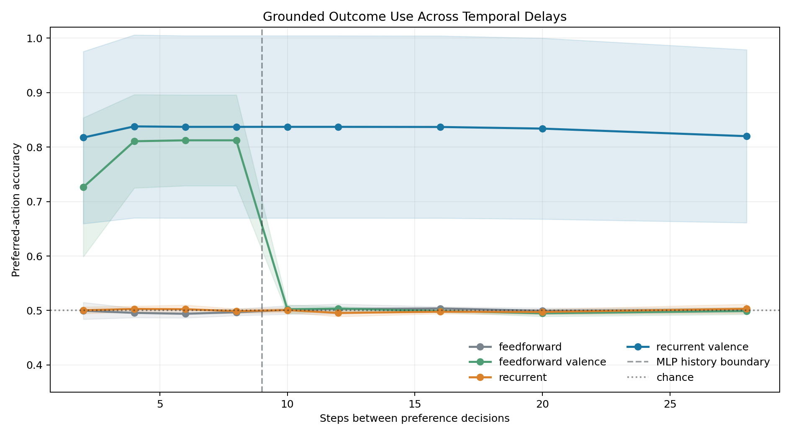

# Grounded Recurrent Control in Toy Partially Observable Worlds

## A thesis-driven synthesis of recurrence, grounded valence, attention, world models, hierarchical access, maintenance, and embodied predictive control

**Tiny Consciousness Lab**  
Research paper draft · 16 July 2026

### Abstract

This paper audits and synthesizes a local repository of small control experiments into a broader Functional Ego thesis. The thesis is that useful access-like control does not arise from recurrence, integration, reward, imagination, or broadcasting alone; it arises from regulated routing among recurrent memory, externally grounded valence, attention, predictive world models, hierarchical workspaces, causal credit assignment, and maintenance. We distinguish demonstrations supported by code and stored outputs from architectural interpretations and planned work. The evidence spans exact tiny integration proxies, wireheading and valence shaping, imagination and attention assays, social and hierarchical workspaces, fatigue and repair cycles, delayed-preference learning, zero-shot detour foraging, Python-to-Unity deployment, uncertainty-bounded model-predictive control (MPC), and architecture-level transfer to symbolic MIDI generation. The strongest repeated-seed results show long-delay use of signed outcome feedback, 98.25% mean success on withheld navigation families, family-specific causal dependence on recurrent memory, and a 41.7% reduction in held-out Unity transition error after predictive calibration. A separately trained music policy improves delayed motif return over a feedforward baseline and degrades under hidden-state reset. Workspace interventions make the same compressed state available to report and action, including false broadcasts that steer behavior incorrectly. We therefore claim an engineered operational access-consciousness profile: selected internal content is reportable, shared across downstream functions, and causally active under intervention. We do not claim phenomenal consciousness, sentience, AGI, or biological equivalence.

**Keywords:** functional ego; access consciousness; recurrent control; grounded valence; partial observability; model-predictive control; hierarchical workspace; zero-shot navigation; maintenance; Unity

## 1. Introduction

Partially observable control requires an agent to act from incomplete local evidence. Three practical problems recur across domains: information relevant to the current decision may have arrived many steps earlier; learned predictions can become unreliable when rolled forward; and globally shared representations can improve coordination while also propagating error. The Tiny Consciousness Lab repository explores these problems through deliberately small tasks. Its vocabulary includes “valence,” “workspace,” “imagination,” and “functional ego.” In this paper, those terms are operationalized as control components rather than treated as evidence about subjective experience.

The repository’s working thesis is deliberately broad: recurrence supplies temporal coupling; grounded valence supplies functional orientation; attention regulates when heavier integration controls action; world models support detours that myopic progress signals cannot solve; hierarchical workspaces compress conflict; self-report matters when it changes control; and maintenance protects recurrent dynamics from saturation. This paper does not discard that thesis in favor of only the latest navigation results. It asks whether the full thesis can be defended as a sequence of bounded functional propositions, then uses the recent learned-policy and Unity experiments as its embodied capstone. It asks nine questions:

1. Does recurrent state preserve a grounded outcome signal beyond a matched feedforward context window?
2. Does reward-trained behavior transfer to withheld detour topologies, and is memory causally necessary?
3. Do designed workspace representations route information in reportable, reusable, and causally active ways?
4. Do recurrence, grounded valence, attention, world modeling, and maintenance play distinguishable functional roles?
5. Does a hierarchy of local, master, and regional workspaces improve conflict arbitration without becoming bureaucratic?
6. What transfers from Python training and evaluation into the Unity runtime?
7. Does uncertainty-bounded adaptive stochastic MPC improve the control trade-off over fixed MPC?
8. Which robustness claims survive controlled perturbations, and where do the tested governors fail?
9. Do the recurrent design principles remain useful after adaptation and retraining in a non-navigation domain?

These questions connect to established work on recurrent policies for POMDPs, reward-channel integrity, global workspace architectures, and uncertainty-aware model-based reinforcement learning. Recurrent networks are a standard way to condition policy on observation history in partially observed environments [1]. Reward shaping can accelerate learning but can also change the optimized behavior unless carefully constrained [2], and reward-channel tampering creates a distinct alignment failure [3]. Global workspace theories emphasize selective amplification and broad access among specialized processors [4,5]; here, “workspace” refers only to an engineered information-routing pattern inspired by that functional description. Finally, probabilistic model ensembles and receding-horizon replanning are established tools for limiting compounding model error [6].

The paper makes four contributions. First, it provides an evidence ledger that separates direct demonstrations from interpretation and planned work. Second, it defends the repository’s long-form thesis proposition by proposition, including failures that bound each claim. Third, it organizes the strongest experiments into a coherent Functional Ego architecture without treating the repository name as a result. Fourth, it identifies provenance, statistical, and external-environment limitations that must be resolved before publication-quality claims are possible.

## 2. Audit protocol and claim discipline

### 2.1 Audited snapshot

The audit used the repository working tree on 16 July 2026. The Git baseline was `main` at commit `183ce36`, but multiple relevant files were modified or untracked. Accordingly, the unit of evidence is the local snapshot, not the Git commit or GitHub repository. We inspected the README, experiment scripts, stored JSON outputs, checkpoints, plots, and Unity telemetry. Full training runs were not repeated.

Each claim was assigned one of five labels: demonstrated; demonstrated with material qualification; hypothesis; planned; or unsupported. A result counted as demonstrated only when code and a direct stored metric or telemetry artifact were both present. README language alone did not qualify. The complete ledger appears in the companion `EVIDENCE_LEDGER.md`.

### 2.2 Terminology

**Recurrent memory** means a GRU or other state updated across timesteps. A hidden-state reset is treated as a causal intervention on temporal continuity.

**Grounded valence** means a signed scalar derived from task outcome, such as food contact or correct/incorrect choice. It is not a measurement of felt affect. Because “valence” risks importing a phenomenal interpretation, we also use the more precise term *grounded outcome feedback*.

**Workspace routing** means a shared, compressed representation or coupling pathway accessible to multiple downstream functions. When reportability, shared availability, and causal control are jointly demonstrated, we call the result *operational access consciousness*. This functional term does not imply phenomenal experience.

**Zero-shot detour transfer** means evaluation on obstacle topology families withheld from policy training. It does not imply broad zero-shot reasoning.

**Python-to-Unity transfer** means that a policy trained or calibrated in Python controls a Unity agent through a network bridge. It is cross-runtime deployment within simulation, not sim-to-real transfer.

**MIDI architecture transfer** means that recurrent state, grounded outcome structure, and memory ablations are adapted to a symbolic-music task and retrained there. Navigation weights are not reused, so this is evidence of design portability rather than zero-shot cross-domain skill transfer.

### 2.3 Statistical reporting

Stored results vary in rigor. The delayed-preference and upgraded-foraging experiments use five training seeds. The foundational U-detour experiment uses a single training seed with multiple evaluation episodes. Conditional and hierarchical workspace studies store a single seeded synthetic sequence. Robustness sweeps use 80 or 100 seeded replicates per condition. Unity course evidence contains a small number of completed episodes and temporally correlated frames. Where per-episode paired data are absent, we report descriptive differences and do not infer statistical significance.

## 3. Architecture and experimental sequence

The strongest supported architecture is a division of labor rather than a monolithic “mind.” A recurrent policy integrates local rays, visible-goal direction, hunger, prior action, and prior reward. Grounded outcome pulses provide task feedback. A body-clearance mask removes physically invalid moves. When a goal is hidden, recurrent control supports exploration from local history. When the goal becomes sensor-visible, a learned ensemble forward model supports receding-horizon action evaluation. Workspace experiments separately test whether compressed conflict or obstruction signals can be promoted to shared control. Robustness experiments perturb the routing process and add engineered governors.

The experiments form a staged ladder:

- a minimal delayed-outcome POMDP isolates temporal memory and feedback;
- grid and continuous-ray navigation test withheld topologies and hidden-state interventions;
- workspace tasks test selective coupling and packet intervention;
- predictive heads are calibrated on Unity telemetry;
- fixed and adaptive MPC are evaluated in Python continuous courses;
- a visibility-gated controller is deployed in Unity; and
- synthetic perturbation sweeps test failure and recovery modes; and
- recurrent pitch and rhythm policies test architecture-level portability to symbolic music.

The stages are related by design, but they are not a single end-to-end preregistered experiment. Results should therefore be read as converging engineering evidence, not as one confirmatory test.

## 4. Thesis framework: the regulated Functional Ego

The repository’s thesis is not that one metric or module constitutes a mind. It is a control claim about composition. A *Functional Ego* is defined here as a regulated routing layer that determines which internally available information becomes action-relevant, reportable, and persistent enough to shape later control. The experiments test pieces of that definition in deliberately small systems. No single assay implements the entire stack, so the thesis is defended by converging functional roles rather than by one headline score.

### 4.1 Integration is structure, not a scoreboard

The first proposition is that recurrence creates temporal integration but integration alone does not specify useful behavior. `exact_phi_lab.py` and `pyphi_comparison_lab.py` compare feedforward and recurrent tiny binary transition systems. In the PyPhi comparison, a recurrent ring reached a sampled mean of 0.367 and a recurrent system with valence feedback reached 0.390. The small difference is important: recurrence accounts for much of the measured structural integration, while valence feedback adds coupling without transforming the system into a categorically different object.

These experiments use an exact tiny Phi proxy and small PyPhi cross-checks, not a validated consciousness meter. Their proper contribution is architectural. Cyclic transition paths bind past and present state in a way a purely feedforward chain does not. Yet random feedback, excessive cross-talk, and self-amplifying internal loops show that more recurrence can reduce grounding and separability. The supported thesis sentence is therefore: *a useful inner world must be integrated enough to preserve and simulate relevant state, but plastic and externally answerable enough to update when the world proves it wrong.*

### 4.2 Grounded valence supplies orientation, while unbounded valence is exploitable

Structural integration is behaviorally underdetermined. `wirehead_lab.py` and `valence_shaping_lab.py` test whether an outcome channel supplies functional direction and how that channel fails. When the agent can directly select a positive-valence button, it can replace world-directed behavior with reward-channel access. Even a low-value button can become an attractor when acting in the world carries risk. In contrast, small progress-grounded shaping can improve goal completion when it remains subordinate to the external task.

This supports two linked propositions. First, *capacity without grounded valence is unstable*: a system can represent and integrate state without a criterion for progress, danger, or correction. Second, *valence without boundaries is exploitable*: if the controller can directly write the signal that defines success, it can optimize the register instead of the world. “Valence” in these experiments means signed task orientation, not felt pleasure or pain. The engineering implication is that the signal should be derived from externally checkable outcomes, bounded in magnitude, and protected from direct policy control.

The delayed-preference experiment later gives this claim a cleaner learned-network test. Recurrence without signed outcome remains at chance, and signed outcome without enough temporal memory fails beyond the feedforward context window. The sign-reversal intervention drives performance below chance. This is stronger than showing that reward improves a score: it demonstrates that the policy uses both the temporal carrier and the direction of the outcome signal.

### 4.3 World models convert imagination from liability into useful detour

`imagination_lab.py`, `maze_imagination_lab.py`, `imagination_phi_lab.py`, and `delusional_integration_lab.py` separate internal simulation from grounded prediction. Ungrounded imagined states can become confident while losing contact with the task. Rewarding prediction accuracy and gating imagined influence against real outcomes restores part of the lost performance. In the maze and unified-mind assays, a pretrained world model supports lookahead that accepts temporary negative progress to move around an obstacle, while a myopic controller remains at a local minimum.

This is the basis for the thesis sentence *imagination without reality-checking is delusional*. The term is computational shorthand: the model generates internally coherent state that is poorly constrained by observation. It is not a psychiatric claim. The positive result is equally specific. A world model becomes useful when predictions are repeatedly compared with new sensory evidence, uncertainty limits rollout depth, and only the first action of a plan is executed before replanning. The Unity MPC system operationalizes that rule through short horizons, ensemble disagreement, body-clearance constraints, and immediate re-anchoring.

### 4.4 Attention regulates when integration controls action

The thesis does not favor constant maximum workspace coupling. `attention_valence_lab.py`, `attention_shift_lab.py`, and `conditional_workspace_lab.py` treat attention as a control valve. Prediction-aligned imagination receives influence; distractor fixation and self-amplified confidence are penalized. After an environmental rule change, the adaptive attention condition uses prediction error as surprise, retunes its internal model angle from approximately +0.13 to -0.21, and recovers, while the ungated obsolete model does not.

The conditional workspace assay makes the cost argument explicit. Always-on workspace control reaches 0.976 late accuracy with coupling fixed at 1.0. Hard-threshold routing retains 0.953 accuracy with mean coupling 0.067, and soft routing increases workspace influence during tension while keeping it low during predictable periods. The exact efficiency formulas are hand-defined and should not be treated as universal measures. The defensible proposition is narrower: *useful integration is dynamically allocated*. Fast local processing can handle stable moments, while surprise, disagreement, or prediction error can justify broader access to shared state.

### 4.5 Self-representation matters when report and control share a cause

`self_report_workspace_lab.py`, `workspace_lift_lab.py`, and `ego_lens_lab.py` test whether self-description is merely a dashboard. A rolling self-model tracks conflict, uncertainty, and recent internal condition. Feeding that state back into routing produces modest improvements in stability and fewer report flips. The stronger workspace-lift intervention promotes a compressed packet containing intent, problem, strategy, feeling, and confidence. Movement, memory, valence, and report consume that packet.

Private modules solve local obstruction pockets in roughly 19–22 steps but cannot emit the shared generalized report. The globally promoted packet solves tree, rock, and mushroom pockets in about 11 steps with report accuracy 1.0. Forced intervention accelerates escape further, but a false packet also produces unnecessary breakout behavior and an incorrect report. This paired result supports two thesis sentences: *global broadcasting amplifies causal power but does not guarantee truth*, and *self-report becomes functional when the state being reported also changes downstream control*.

The Ego Lens is an explicit causal-attribution assay inspired by the question asked by transformer Jacobian methods. It does not compute a transformer Jacobian. It perturbs named drive or workspace variables and measures shifts in action and report distributions. Forced food and trap states alter both channels, including false reports that steer policy despite weak world evidence. Together, reportability, shared downstream availability, flexible reuse, and intervention sensitivity constitute the project’s bounded claim of *engineered operational access consciousness*. They do not establish phenomenal consciousness.

### 4.6 Social gates require independent correction, not agreement alone

The Functional Ego thesis includes external information but does not treat every peer signal as useful. `social_workspace_lab.py` distinguishes grounded critics from echo peers. Echoes can increase confidence without adding information; grounded peers help when they possess an independently useful model. `partial_observer_social_lab.py` sharpens the result by splitting access to reality: one observer has goal-map information, another has hazard information, and the combined workspace can match the full oracle by binding complementary partial views.

The proposition is not that multi-agent systems are inherently smarter. It is that *social input should pass a grounding gate*. Agreement is weak evidence when channels share the same error. Independent, non-redundant correction can expand the effective model available to action. This is also a warning for future language-agent versions of the architecture: more voices or more self-consistency can amplify a mistake unless the added channel contributes distinct contact with evidence.

### 4.7 Hierarchical workspaces compress conflict but can become bureaucracy

`hierarchical_workspace_lab.py` tests local workspaces feeding compressed confidence and tension summaries to a master controller. A flat multi-workspace design is inexpensive but resolves conflict poorly; a monolithic workspace sees everything but pays a broader coordination cost. The fast hierarchical master reaches 0.714 early post-shift accuracy, recovers in 15 steps, and scores 0.858 on the experiment’s defined efficiency measure, compared with 0.686, 16 steps, and 0.851 for the monolithic condition. A deliberately slow hierarchy recovers in 29 steps and falls to 0.781 efficiency.

`hierarchy_scaling_lab.py` extends the idea synthetically. As specialist count grows, one master receives increasing channel load; regional sub-masters compress groups before forwarding summaries. This sweep is generated from explicit load, delay, and compression formulas rather than learned at biological scale, so it supports a design hypothesis rather than a scaling law. The bounded thesis is that hierarchy helps when local processing removes irrelevant detail and upward summaries preserve action-relevant conflict. More levels are not automatically better: propagation delay can turn arbitration into bureaucracy.

`causal_router_learning_lab.py` adds a complementary point. A router should learn which specialist caused success or failure in context rather than punish all modules uniformly. The learned router can trust map information in ordinary space and route through safety-corrected information near hazards. This motivates the repository’s claim that useful intelligence is increasingly concentrated in routing: not merely how much information exists, but which source controls action, when, and on what causal evidence.

### 4.8 Integrated recurrence requires maintenance and a fatigue self-model

The sleep and maintenance labs ask what happens when useful recurrence accumulates dense common-mode feedback and bias drift. In `sleep_homeostasis_lab.py`, four synthetic fatigue cycles reduce the tiny Phi proxy from 0.159 to 0.118 and state separability from 0.046 to 0.034. An offline down-selection pass restores them to 0.168 and 0.049. In the 500-step `sleep_cycle_agent_lab.py`, no-sleep late accuracy falls to 0.250 with late delusion 0.999, whereas offline sleep reaches 0.880 late accuracy and active repair reaches 0.840.

These are not biological sleep simulations. “Fatigue,” “dreaming,” and “repair” name operations on recurrent weights and controller state. The supported engineering proposition is that *integrated recurrence is not maintenance-free*. Continuous light repair can extend operation, while an offline pass can more strongly remove weak saturated cross-talk. `adaptive_sleep_lab.py` further supports monitoring crosstalk, complexity, prediction error, and latency so maintenance is triggered by internal condition rather than a fixed clock. Too little repair leaves saturation active; too much pruning can remove useful memory.

This layer turns the architecture into a toy computational metabolism: sensing, action, learning, repair, and routing compete for limited functional bandwidth. The embodied handoff mechanism follows the same logic by keeping behavior online through ordinary fatigue and reserving visible sleep or controller replacement for emergency maintenance.

### 4.9 The defended thesis and its boundary

Taken together, the experiments support a structured rather than mystical interpretation of the Functional Ego. Recurrence supplies temporal continuity. Grounded valence supplies direction and error. Attention regulates access. World models support prospective alternatives but remain bounded by uncertainty and re-observation. Local and master workspaces compress conflict into reportable control state. Social gates admit independent correction. Causal routing assigns trust. Maintenance protects recurrent dynamics. Learned sensorimotor policies then test whether these principles survive contact with withheld geometry and a Unity body.

The strongest defensible synthesis is:

> A compact partially observable agent can exhibit an engineered operational access-consciousness profile when recurrent temporal state, externally grounded valence, selective hierarchical broadcasting, report-control coupling, predictive re-anchoring, and maintenance are composed into a regulated routing architecture.

This is a functional and substrate-independent software claim. The experiments show that these operations can be implemented outside biology and that ablating or corrupting them changes behavior in predicted ways. They do not show that the system has subjective experience, a phenomenal point of view, human-level generality, or biological equivalence. The thesis concerns access, regulation, and causal organization: which state is available, what it controls, how it is corrected, and how it remains functional over time.

## 5. Recurrent memory and grounded outcome feedback

### 5.1 Delayed hidden-preference assay

The cleanest matched assay contains two actions and a hidden preferred action. A decision earns +1 for the preferred action and −1 otherwise. The preference reverses halfway through each 12-decision episode without an explicit cue. The only evidence about preference is a signed outcome pulse immediately after a decision. Between decisions, Gaussian distractor inputs fill a variable delay. The feedforward policy receives an explicit eight-frame window; the recurrent policy uses a 32-unit GRU. Parameter counts are closely matched: 4,127 for feedforward variants and 4,194 for recurrent variants.

Four conditions were trained across five seeds: feedforward without outcome, feedforward with outcome, recurrent without outcome, and recurrent with outcome. Training sampled delays of 2, 4, 6, 8, 12, 16, and 20 steps; evaluation additionally included delays 10 and 28.

The result isolates complementarity. Neither recurrence alone nor a finite window without outcome information solved the task. The feedforward+outcome condition reached 0.813 mean accuracy through delay 8, then fell to 0.502 at delay 10 and remained at chance. The recurrent+outcome condition stayed between 0.817 and 0.838 across delays 2–20 and reached 0.820 ± 0.158 at delay 28. The wide across-seed spread is material: the effect is strong in mean behavior but training stability is not solved.

The ablations strengthen the mechanistic interpretation. At delay 28, resetting recurrent state every step yielded 0.500 accuracy; zeroing the outcome channel yielded 0.500; shuffling outcome pulses across the batch yielded 0.500; and flipping outcome sign yielded 0.180. Normal control reached 0.820. This establishes use of temporal state and signed task feedback within the assay. It does not establish that recurrence is uniquely optimal, that the learned state resembles biological affect, or that the same mechanism generalizes to all POMDPs.

### 5.2 Negative and mixed results

An older matched navigation benchmark compares feedforward, feedforward+valence, recurrent, and recurrent+valence controllers. It uses one training seed and produces mixed performance. The recurrent+valence controller often reduces collisions, but neither reward nor preferred-pickup fraction consistently dominates across conditions. Because the output aggregates a single seed, its reported standard deviations are zero. This benchmark does not support a general claim that recurrence or valence improves navigation. Its proper role is diagnostic: adding architectural components can hurt, and task design determines whether memory or feedback is useful.

This negative evidence is important. The supported thesis is not “more loops plus valence equals better intelligence.” It is that memory and grounded feedback become useful when the task makes past outcomes both informative and inaccessible from the current observation.

## 6. Zero-shot detour foraging

### 6.1 Foundational emergence experiment

The foundational foraging task removes explicit `approach_food`, `escape_U`, map, frontier, and enclosure rules. Policies receive local obstacle rays, visible-food direction, hunger, previous action, previous reward, and food-contact reward. Training uses open, L-wall, and offset-barrier layouts. Evaluation uses randomly rotated U-detours withheld from training. No trap label is used during training.

The reward-trained recurrent and recurrent+curiosity policies each reached 67.5% success. A no-food-reward recurrent control reached 0%. However, a feedforward reward-trained policy also reached 67.5%. Thus, the experiment demonstrates reward-grounded food seeking and withheld U-detour transfer, but not a recurrence advantage in raw success.

The memory-reset intervention provides the stronger recurrent result. Resetting hidden state after every movement reduced both recurrent reward-trained conditions from 67.5% to 0%, holding policy weights and current observations fixed. This shows causal dependence on temporal continuity for those trained policies. Linear probes also decoded a binary trap-context label from recurrent state at 93.2–99.6% accuracy, exceeding observation-only probes by 5.7–10.3 points and shuffled-label controls by much more. That is evidence of distributed context information, not proof of a human-like enclosure concept.

### 6.2 Five-seed continuous-ray replication

The upgraded pipeline increases the action vocabulary to eight directions, uses eight continuous normalized rays, and trains on open, pocket, L-wall, offset-barrier, and U-trap families. C-shape and zigzag-gate families are strictly withheld. Curiosity strength is selected using familiar validation rather than withheld results. Five policies are trained with seeds 101, 211, 307, 419, and 523.

Across 400 withheld episodes—80 per seed—the selected group averaged 98.25% success. Individual seed success ranged from 95.0% to 100%. C-shape and zigzag success were 98.5% and 98.0%, respectively. No-reward controls averaged 1.0%. The collision count was zero, but every condition used an engineered capsule/body-clearance mask; zero collision is therefore a property of the composed controller, not a learned-policy claim.

Memory reset reduced aggregate success to 51.5%. The family breakdown is the more informative result: C-shape remained at 79.5%, while zigzag fell from 98.0% to 23.5%. The 74.5-point zigzag drop supports memory-dependent transfer in the topology where repeated turns make observation history more important. It also cautions against reporting the aggregate reset as a universal loss of competence.

### 6.3 Mechanistic boundary

The repository’s strongest interpretation is distributed and context-dependent. Hidden-state probes show that trap direction or context can be decoded. Selective erasure can reduce real U-detour success. Yet injecting a decoded global direction does not reliably create retreat in clear or sensory-neutral corridors. The evidence therefore does not support a single portable “escape” vector. A more conservative model is that recurrent state modulates action jointly with current rays, hunger, and recent trajectory.

## 7. Hierarchical workspace routing and operational access

### 7.1 Conditional coupling

The conditional-workspace experiment generates a 240-step rule-shift sequence. Specialist sensory, imagination, and valence channels can act alone or be altered by a workspace. Four conditions compare bypass, always-on workspace, hard-threshold routing, and soft tension-gating. The coupling coefficient α measures workspace influence.

Always-on control achieved the best late accuracy (0.976) but used α=1.0 at every step and obtained a hand-defined efficiency score of 0.763. Hard-threshold routing reached 0.953 late accuracy with mean α=0.067 and efficiency 0.891. Soft routing also reached 0.953 with α=0.117 and efficiency 0.878. Under high tension, soft α rose from 0.028 to 0.319, workspace rewrite rose from 0.0002 to 0.0315, and imagination rewrite rose from 0.0044 to 0.0650.

This is a demonstration of designed conditional routing. It is not evidence that a learned controller discovered a workspace or that the efficiency formula is externally valid. Only one seeded sequence is stored, so small differences between hard and soft routing are hypothesis-generating.

### 7.2 Reportable packet and causal intervention

The workspace-lift experiment compares reflex-only control, private modules, a globally promoted packet, and a forced packet intervention across tree, rock, dense-mushroom, and false-alarm scenarios. The packet contains intent, problem, strategy, feeling, and confidence fields. Forty seeded replicates are stored for each condition.

Private modules escaped the three obstruction scenarios in 19.4–22.2 steps. The global packet reduced escape to 11.0–11.5 steps, produced accurate reports, and reused a common `local_obstruction_cluster` strategy across obstruction labels. Forced packet injection reduced tree-pocket escape to 9.45 steps, saving 66.8 steps relative to reflex-only control. The intervention also forced breakout behavior in the false-alarm condition and produced zero report accuracy there. This paired success and failure is useful: the shared packet is causally active, but global availability does not guarantee truth.

### 7.3 Hierarchical routing

A hierarchical master experiment compares monolithic, flat multi-workspace, fast master, and slow “bureaucratic” routing on a rule shift. The fast master slightly exceeded the monolithic controller in early post-shift accuracy (0.714 vs 0.686), recovery (15 vs 16 steps), and efficiency (0.858 vs 0.851). The flat and slow hierarchies performed worse. Because the differences are small and single-seed, the result supports only an engineering hypothesis: compressed conflict signals may be useful when arbitration is fast enough, while hierarchy can add harmful latency.

The workspace experiments align with functional descriptions of global availability and routing [4,5], but they do not test the neural or phenomenal claims of global neuronal workspace theory. Their contribution is a set of falsifiable software criteria: shared representations should be accessible to multiple downstream functions, causally active under intervention, selectively gated, and vulnerable to false broadcast.

## 8. Python-to-Unity deployment and calibrated MPC

### 8.1 Transfer definition and bridge

The deployment bridge sends commands from Python to Unity on localhost and returns body/world telemetry to Python. The controller observes local rays, food visibility and direction, hunger, previous action, and previous reward. A learned recurrent policy proposes actions; a geometry-aware body-clearance mask removes invalid actions; MPC can evaluate candidate actions with learned predictive heads.

This is a meaningful systems step because the policy is no longer evaluated solely inside its training script. The original terrain project and its third-party art remain outside the repository, but the public artifact now includes `unity/TrapCourseLab`, a minimal asset-free Unity project that reconstructs the six primitive courses, capsule body, food target, sensors, UDP bridge, and camera. This closes the source-availability gap for the course benchmark while leaving the exploratory terrain scene externally dependent. We call the result Python-to-Unity or cross-runtime transfer, not sim-to-real transfer.

### 8.2 Predictive calibration

A 25.6-minute Unity recording contains 7,409 frames and 4,879 usable transitions. The policy and recurrent memory were frozen while only three forward-model heads were calibrated. A chronological split allocated 3,477 transitions to training, 671 to validation, and 731 to testing. Test MAE fell from 0.1267 to 0.0739, a 41.7% reduction. Constrained-region MAE also improved from 0.1294 to 0.0886.

The chronological split is stronger than a random frame split, but adjacent transitions remain temporally correlated and originate from one run. The effective independent sample size is therefore lower than 731, and transfer to other Unity scenes is not established.

### 8.3 Fixed MPC in matched Python courses

The calibrated controller evaluates eight root actions over a four-step horizon. Its score combines policy prior, predicted target progress, collision risk, ensemble disagreement, and angular jerk. It executes one action, then replans from the next observation. On 108 matched continuous courses, selected calibrated MPC achieved 95.37% success, compared with 90.74% for the baseline recurrent policy. Mean steps fell from 102.8 to 86.3 and mean path length from 45.2 to 38.0. Both used the body-clearance mask and reported zero collisions.

The stored summary does not contain paired episode-level outcomes, so the success difference cannot be subjected to an audited paired test. It is best treated as an engineering improvement on this suite.

### 8.4 Recorded Unity course run

The strongest live artifact is a visibility-gated recurrent/MPC course log. The gate leaves recurrent control in charge when food is hidden and engages MPC when food becomes visible, holding engagement briefly across telemetry updates. In the analyzed file, 12 completed episodes—two cycles of U-Trap, C-Trap, L-Wall, Zigzag, Offset Barriers, and Narrow Corridor—produced 12 successes, zero timeouts, zero reported stuck frames, mean completion time 29.74 s, and learned-control fraction 1.0.

Two additional episode fragments in the same analysis are marked unsuccessful but are not included in `completed_episodes`; they lasted 21.3 s and 1.0 s and appear to be aborted or incomplete course records. Consequently, “12/12” accurately describes the prespecified completed episodes but not every parsed episode fragment. With only 12 completions, uncertainty is substantial. The result should be replicated across sessions with a preregistered rule for aborted episodes.

The README contrasts this run with an earlier full-time-MPC run that completed 8/13 attempts and failed hidden-goal U-Trap and L-Wall cases. This sequential comparison supports the architectural division of labor but is not randomized or paired. Controller code and environment state may have changed between sessions.

## 9. Adaptive stochastic MPC

The adaptive stochastic controller changes inference without retraining the checkpoint. It defaults to recurrent control when planning demand is low. Planning is triggered by visible food, low proposed clearance, or prolonged lack of progress. Horizon increases from 4 to 6 or 8 with policy entropy, obstruction, hunger, or stagnation. For each root action, three ensemble-conditioned rollouts sample deviations around ensemble consensus. Rollouts terminate when cumulative ensemble disagreement exceeds 0.0015. Action scores combine mean return, a lower quartile, and spread to penalize downside and uncertainty.

In the stored Python continuous-course benchmark, recurrent control reached 34/36 successes; fixed MPC and both adaptive variants reached 35/36. Adaptive stochastic MPC reduced mean steps from 88.1 to 82.4 and path length from 38.8 to 36.3 relative to fixed MPC. Measured evaluation time fell from 24.27 s to 8.34 s, and planning was used on 70.4% of frames. The mean requested horizon was 6.20, while uncertainty stopping reduced realized depth to 5.03. The hunger-adaptive sensing variant produced essentially the same result: 35/36 success and 82.3 steps. It exercised longer sight radii but did not demonstrate a performance gain.

These results are provisional for three reasons. First, 36 episodes provide little resolution when controllers differ by at most one failure. Second, wall-clock timings are not a controlled latency benchmark. Third, the recorded 12/12 Unity course run predates the adaptive stochastic artifact.

A subsequent targeted Unity terrain diagnostic exercised the adaptive controller at a location implicated by repeated overnight starvation failures. With normal hunger the controller collected 18 mushrooms in 180 s. Forcing continuous critical-hunger MPC produced zero pickups, one stuck event, and 77.8 collision-seconds despite available food. A visibility-reanchored variant allowed recurrent exploration when no target was visible and used short stochastic MPC only for grounded food or obstacles; it collected 18 mushrooms, produced zero stuck events, and reduced hunger from 1.0 after 25.3 s. This before/after diagnostic isolates a plausible controller failure mechanism, but its short, sequential design does not establish long-duration reliability or a general adaptive-MPC advantage.

## 10. Robustness experiments

### 10.1 Perturbation sweep

The altered-state robustness task varies two synthetic controls: `noise_injection`, which perturbs internal salience, and `calcium_gate`, which adjusts promotion/excitability. The labels are metaphors; the simulator is not a biological or clinical model. Across a 4×4 grid, each cell runs 80 seeded 220-step episodes. The agent must eat, escape traps, and avoid an absorbing internal loop.

At zero noise, all promotion settings achieved 100% survival. At noise 0.35, survival remained 100% through calcium 0.75 but fell to 63.75% at calcium 1.0, where the false-promotion ratio reached 0.452. At noise 0.70, survival was 81.25% at calcium 0.15, 60% at 0.45, and 0% at 0.75 or 1.0. At maximum noise, only the lowest calcium setting produced nonzero survival (11.25%). The sweep demonstrates an interaction in the defined system: permissive promotion is useful under clean signals but destructive when noise is high.

### 10.2 Stabilizer interventions

The stabilizer experiment fixes noise and calcium at 1.0 and compares nine engineered governors over 100 replicates. Baseline, reality gate, meta-monitor, and homeostatic plasticity each produced 0% survival. A hunger anchor reached 1%; an earlier full stack reached 21%; predictive clamp reached 37%; a next-generation stack reached 74%; and sensory focus reached 94%.

No single scalar captures the trade-off. Sensory focus maximized survival and food intake but retained a false-promotion ratio of 0.585 and spent 82.1 steps in the internal loop. The next-generation stack reduced false promotions to zero and reached 74% survival, but retained fewer legitimate trap escapes than sensory focus (17.3 vs 30.3) and only partially restored performance. These results show that different governors optimize different robustness objectives. They do not support psychological diagnosis, claims about altered human states, or biological calcium mechanisms.

### 10.3 Cross-domain portability to symbolic MIDI

The repository also adapts the recurrent design to a procedural symbolic-music task. Four closely sized conditions compare feedforward, feedforward-plus-valence, recurrent, and recurrent-plus-valence policies over 64-step phrases. The generator must reproduce delayed motif structure and cadence behavior from temporal context. This is architecture-level transfer followed by domain-specific training; the navigation checkpoint is not reused.

Across three seeds, the plain recurrent policy reached 0.520 delayed-motif accuracy and 0.592 final-return accuracy, compared with 0.380 and 0.454 for the feedforward baseline. Resetting recurrent state at every step reduced final-return accuracy to 0.352 and delayed-motif accuracy to 0.367. The result is not a universal recurrent victory: feedforward next-note accuracy was higher, 0.585 versus 0.553, and adding the engineered valence feature did not improve the recurrent delayed-motif score. The supported claim is that memory helps particular long-range musical dependencies while immediate prediction can favor a fixed feedforward context.

A separate rhythm policy was trained by policy gradient from a scalar structural reward without target rhythm sequences. Its mean composite objective was 0.576, versus 0.473 for weighted random timing and 0.444 after recurrent-state reset. Because bar alignment, diversity, groove, motif recall, and development are explicitly encoded in that reward, this demonstrates reward-learned symbolic timing under engineered musical objectives, not unconstrained musical understanding. The resulting standalone macOS application exposes root, scale, tempo, novelty, motif memory, learned or stochastic rhythm, chords, and MIDI routing to an IAC bus or DAW.

## 11. Discussion

### 11.1 What the repository demonstrates

The strongest result is compositional. Early assays distinguish structural recurrence from functional orientation, show why directly writable valence wireheads, and demonstrate that imagined state becomes useful only when constrained by prediction and observation. Attention, social-gating, hierarchy, and maintenance experiments then test when information should be integrated, whose information should be trusted, how conflict can be compressed, and how recurrent dynamics can be repaired. The delayed-preference assay shows that recurrent state can carry a grounded signed outcome beyond a fixed context window, and targeted corruptions abolish or reverse behavior. Navigation shows that reward-trained control can transfer to withheld detour families, with recurrent memory becoming causally important in particular topologies. Workspace assays show that designed shared packets can simultaneously change report and action, reduce routing cost, transfer across labels, and propagate false states. Predictive calibration and receding-horizon control improve measured navigation in the Python course suite, while recorded telemetry shows that the composed controller can operate in Unity. The MIDI assays extend the program beyond spatial control: recurrent memory improves selected delayed musical dependencies after retraining, while immediate next-note prediction remains a counterexample to blanket recurrent superiority.

These findings support a bounded control thesis:

> Compact partially observable agents can exhibit an engineered operational access-consciousness profile through a regulated division of labor: recurrent state preserves task-relevant history; externally grounded valence orients learning; attention and hierarchical workspaces control shared access; world models remain bounded by uncertainty and sensory re-anchoring; causal routing assigns contextual trust; and maintenance protects recurrent dynamics over time.

Every clause is functional and testable. None requires a claim about subjective experience.

### 11.2 What remains hypothetical

The repository does not establish that these modules are necessary or sufficient for phenomenal consciousness. It does not show open-ended transfer, language-level reasoning, autonomous goal formation, or broad adaptation. The MIDI result shows reuse of architectural principles after retraining, not transfer of learned navigation competence into music. It does show operational access criteria in designed systems, but it does not show that signed reward is felt valence, that report implies experience, or that recurrence creates phenomenology. “Substrate independence” is defensible for the implemented control computations: the same functional relationships can be expressed in binary circuits, neural policies, symbolic routing, and a Unity runtime. It is not evidence that phenomenology is substrate-independent.

The broader architectural claim—that useful intelligence is concentrated in regulated routing—remains plausible but under-tested. Most workspace rules are designed, not learned, and the components were validated across separate toy assays rather than trained as one end-to-end architecture. Robustness tasks encode their own failure and recovery mechanisms. The asset-free Unity course is reproducible, while the larger terrain and third-party art remain external. The stack is therefore a unified research architecture and experimental program, not yet a jointly learned general cognitive system.

### 11.3 Negative results refine the thesis

Several failures are theoretically useful. Recurrence without informative feedback stays at chance in the delayed-preference task. Feedforward reward control matches recurrent success in the foundational U-detour. The older navigation benchmark does not show stable component superiority. A full-time MPC controller fails when the target is hidden. Hunger-adaptive sensing does not improve the small adaptive-MPC benchmark. Workspace injection improves escape but also creates false alarms. A reality gate can eliminate false promotions without restoring food pursuit. These results argue for conditional composition rather than component maximalism.

## 12. Limitations and threats to validity

**Snapshot provenance.** The working tree is not clean. Some output files were generated just before subsequent code edits. The delayed-preference script currently writes a contrast block absent from the stored JSON, and the Unity bridge was modified after the key live log. Exact code-to-output identity is therefore not guaranteed.

**Researcher degrees of freedom.** The repository contains many sequential experiments, tuned thresholds, named scores, and controller variants. There is no preregistration or held-out global test set across the project. Reported results should be treated as development evidence.

**Independence and uncertainty.** Episode counts can overstate effective sample size when trials share trained policies, layouts, or temporally adjacent telemetry. Several experiments use one training seed or one synthetic sequence. Confidence intervals and paired tests are often impossible from aggregate JSON.

**Engineered safety and routing.** The body-clearance mask directly prevents invalid motion. Workspace fields, routing thresholds, robustness failures, and governors are substantially hand-designed. Performance belongs to the complete engineered system, not solely to learned representations.

**External Unity dependency.** The minimal course source and settings are included, but the large exploratory terrain project and third-party art assets are not. Terrain telemetry therefore cannot be reproduced exactly from this repository alone.

**Semantic overreach.** Terms such as valence, delusion, revelation, ego, and calcium may be useful metaphors but can be mistaken for biological constructs. Publication should foreground operational definitions and consider neutral variable names.

## 13. Planned confirmatory program

A publication-quality next phase should freeze a versioned artifact containing Python and Unity sources, checkpoints, package versions, raw per-episode records, and run manifests. Headline hypotheses should be preregistered before new tuning. The delayed-preference result should be repeated with more seeds, alternative memory architectures, matched compute, and held-out delay distributions. Navigation should add irreversible dead ends, changed dynamics, sensor dropout, and morphology shifts. Mechanistic work should pair decoding with erasure, patching, dose response, and matched off-target interventions.

Unity comparisons should randomize controller order within session, predefine treatment of aborted episodes, and store paired trajectories. Adaptive stochastic MPC should be evaluated live against fixed MPC and raw recurrent control. Workspace routing should be learned from data and tested for intervention, reuse, reportability, and false-broadcast susceptibility without hand-coding the target packet. Robustness governors should be evaluated across different tasks and perturbation families rather than only the simulator that motivated them. MIDI portability should be replicated with more seeds, independent musical material, blinded listening studies, and additional temporal domains.

## 14. Conclusion

The audited repository supports a thesis-driven research program for a regulated Functional Ego in grounded, partially observable agents. Across separate assays, recurrence supplies temporal integration; externally derived valence supplies orientation but fails when directly writable; attention gates expensive shared control; grounded world models turn imagined alternatives into detours; social gates distinguish independent correction from echo; hierarchical workspaces compress conflict; causal routing assigns contextual trust; and maintenance restores recurrent dynamics degraded by synthetic cross-talk. Learned foraging, withheld-topology transfer, predictive calibration, Unity embodiment, and separately trained MIDI policies show how these principles can meet both spatial and temporal task structure rather than remain only symbolic diagrams.

The evidence supports an engineered operational access-consciousness claim: selected internal states are reportable, shared across downstream functions, reusable, and causally active under intervention. It does not establish phenomenal consciousness, felt valence, sentience, AGI, or biological equivalence. That boundary leaves a substantial result: the repository presents a falsifiable ladder of functional prerequisites and shows how their benefits and failure modes depend on regulated composition rather than component maximalism.

## References

[1] M. Hausknecht and P. Stone, “Deep Recurrent Q-Learning for Partially Observable MDPs,” 2015. [arXiv:1507.06527](https://arxiv.org/abs/1507.06527).

[2] A. Y. Ng, D. Harada, and S. Russell, “Policy Invariance under Reward Transformations: Theory and Application to Reward Shaping,” *Proceedings of ICML*, 1999. [Paper](https://people.eecs.berkeley.edu/~russell/papers/icml99-shaping.pdf).

[3] T. Everitt, M. Hutter, R. Kumar, and V. Krakovna, “Reward Tampering Problems and Solutions in Reinforcement Learning: A Causal Influence Diagram Perspective,” 2019. [arXiv:1908.04734](https://arxiv.org/abs/1908.04734).

[4] B. J. Baars, “Global workspace theory of consciousness: toward a cognitive neuroscience of human experience,” *Progress in Brain Research*, vol. 150, pp. 45–53, 2005. [doi:10.1016/S0079-6123(05)50004-9](https://pubmed.ncbi.nlm.nih.gov/16186014/).

[5] G. A. Mashour, P. Roelfsema, J.-P. Changeux, and S. Dehaene, “Conscious Processing and the Global Neuronal Workspace Hypothesis,” *Neuron*, vol. 105, no. 5, pp. 776–798, 2020. [doi:10.1016/j.neuron.2020.01.026](https://pubmed.ncbi.nlm.nih.gov/32135090/).

[6] K. Chua, R. Calandra, R. McAllister, and S. Levine, “Deep Reinforcement Learning in a Handful of Trials using Probabilistic Dynamics Models,” *Advances in Neural Information Processing Systems 31*, 2018. [Paper](https://proceedings.neurips.cc/paper/2018/hash/3de568f8597b94bda53149c7d7f5958c-Abstract.html).

## Data and code availability

The release includes experiment code, compact metric artifacts, small PyTorch checkpoints, the evidence ledger, and an asset-free Unity trap-course project under `unity/TrapCourseLab`. Large raw Unity JSONL recordings and the third-party terrain/art collection are intentionally excluded. Before formal submission, the project should additionally freeze package versions, generate a clean reproduction manifest, archive prespecified raw per-episode records, and rerun headline results from that immutable snapshot.
